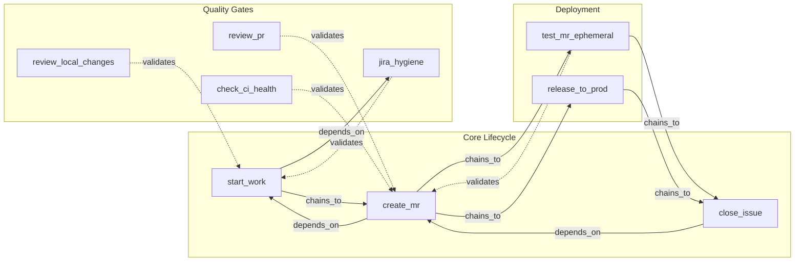
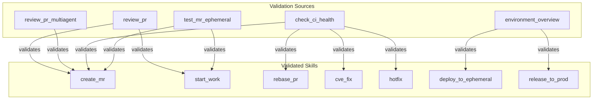
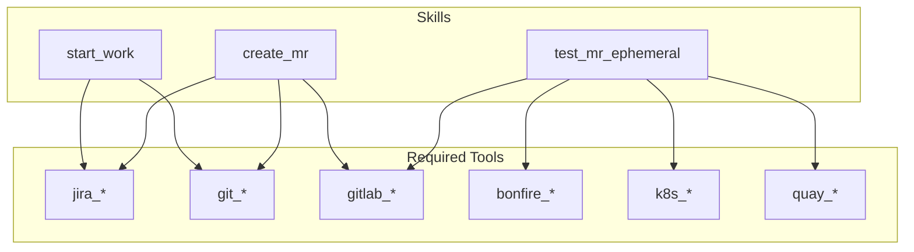
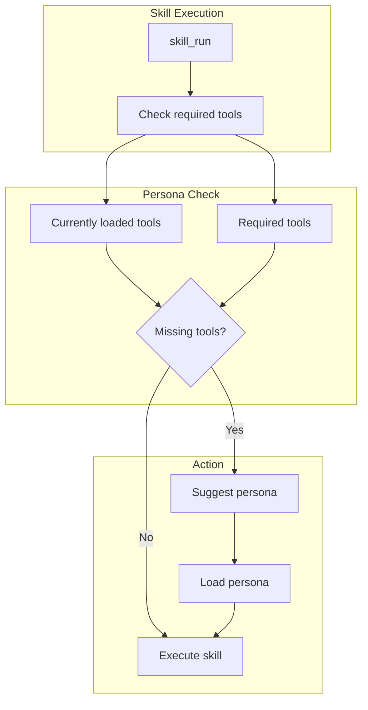

# Skill Dependencies

> Inter-skill relationships, validation links, and tool dependencies

## Link Types

Every skill has an optional `links:` metadata block with five relationship types:

| Link Type | Meaning | Example |
|-----------|---------|---------|
| `depends_on` | Must run before this skill | `create_mr` depends on `start_work` |
| `validates` | Running this skill validates the linked skill worked | `review_pr` validates `create_mr` |
| `validated_by` | These skills validate this one | `create_mr` is validated by `review_pr` |
| `chains_to` | Natural next steps after this skill | `start_work` chains to `create_mr` |
| `provides_context_for` | Output feeds into these skills | `start_work` provides context for `create_mr` |

## Development Lifecycle



## Validation Web

Skills validate each other in a web of trust. If a downstream skill succeeds, it
validates that upstream skills produced correct output:



## Tool Dependencies



## Dependency Matrix

| Skill | jira | git | gitlab | bonfire | k8s | quay | slack |
|-------|------|-----|--------|---------|-----|------|-------|
| start_work | X | X | | | | | |
| create_mr | X | X | X | | | | |
| test_mr_ephemeral | | | X | X | X | X | |
| release_to_prod | | | | | | X | |
| coffee | X | | | | | | X |
| beer | X | X | | | | | X |
| investigate_alert | | | | | X | | X |

## Persona Requirements



## Skill Chains

| Chain | Skills | Use Case |
|-------|--------|----------|
| Development | start_work → create_mr → close_issue | Full issue lifecycle |
| Deploy | create_mr → test_mr_ephemeral → release_to_prod | MR to production |
| Quality | review_local_changes → create_mr → review_pr | Pre-commit to review |
| Incident | investigate_alert → debug_prod → hotfix → release_to_prod | Alert to fix |
| Research | gather_context → research_topic → plan_implementation → start_work | Research to code |
| Daily | coffee → (work) → beer | Daily workflow |
| Knowledge | bootstrap_knowledge → knowledge_refresh → gather_context | Knowledge lifecycle |
| CVE | cve_fix → review_pr → test_mr_ephemeral → release_to_prod | Security fix pipeline |

## Cross-Validation Rules

The `validate_skills.py` script enforces these consistency rules:

1. **Bidirectional validates/validated_by**: If A validates B, B should list A in validated_by
2. **Bidirectional depends_on/chains_to**: If A depends_on B, B should list A in chains_to
3. **No self-references**: Skills cannot link to themselves
4. **Reference validity**: All linked skill names must exist as real skills

Run validation:
```bash
python scripts/validate_skills.py --verbose
```

## Components

| Component | File | Description |
|-----------|------|-------------|
| skill_info | `tools_basic.py` | Get skill dependencies |
| SkillEngine | `skill_engine.py` | Dependency checking |
| validate_skills | `scripts/validate_skills.py` | Link validation |
| generate_skill_graph | `scripts/generate_skill_graph.py` | Graph with link types |

## Related Diagrams

- [Skill Categories](./skill-categories.md)
- [Persona Tool Mapping](../05-personas/persona-tool-mapping.md)
- [Common Skills](./common-skills.md)
