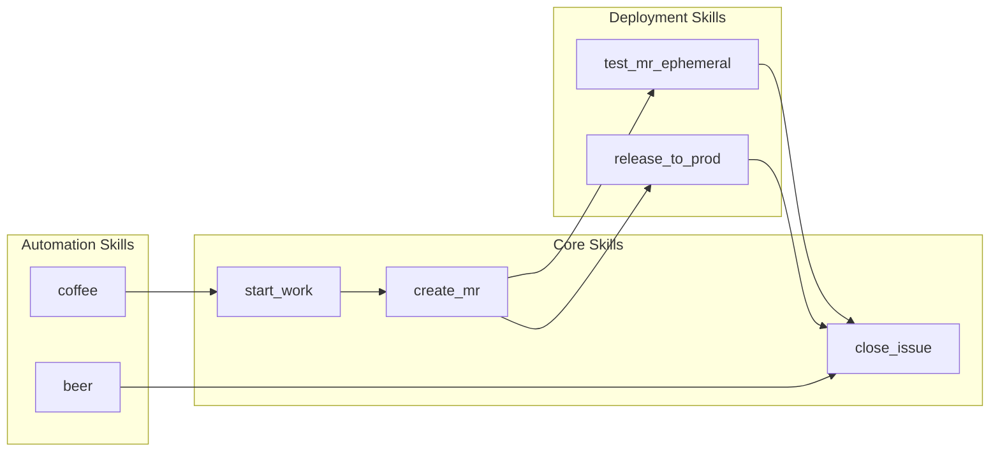
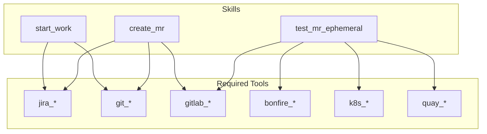
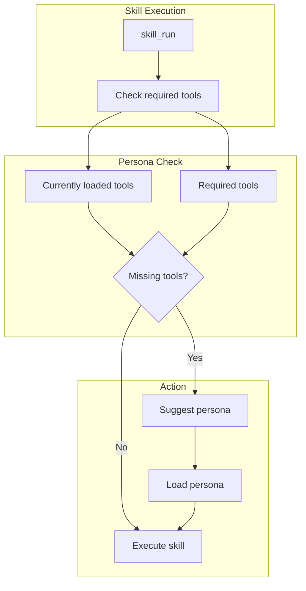

# Skill Dependencies

> Inter-skill relationships and tool dependencies

## Diagram

## Tool Dependencies

## Dependency Matrix

| Skill | jira | git | gitlab | bonfire | k8s | quay | slack |
|-------|------|-----|--------|---------|-----|------|-------|
| start_work | X | X | | | | | |
| create_mr | X | X | X | | | | |
| test_mr_ephemeral | | | X | X | X | X | |
| release_to_prod | | | | | | X | |
| coffee | X | | | | | | X |
| beer | X | X | | | | | X |
| investigate_alert | | | | | X | | X |

## Persona Requirements

## Skill Chains

| Chain | Skills | Use Case |
|-------|--------|----------|
| Development | start_work → create_mr → close_issue | Full issue lifecycle |
| Deploy | create_mr → test_mr_ephemeral → release_to_prod | MR to production |
| Daily | coffee → (work) → beer | Daily workflow |

## Components

| Component | File | Description |
|-----------|------|-------------|
| skill_info | `tools_basic.py` | Get skill dependencies |
| SkillEngine | `skill_engine.py` | Dependency checking |

## Related Diagrams

- [Skill Categories](./skill-categories.md)
- [Persona Tool Mapping](../05-personas/persona-tool-mapping.md)
- [Common Skills](./common-skills.md)
