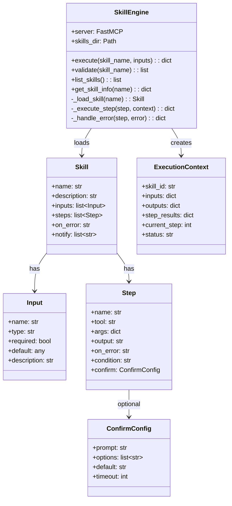
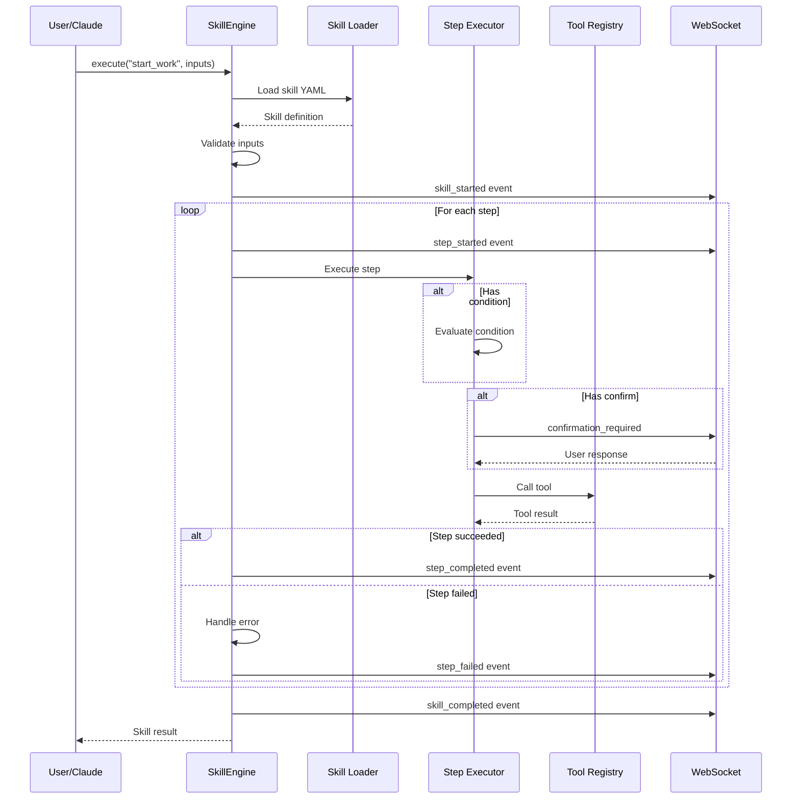

# Skill Engine Architecture

> Core skill execution engine internals

## Diagram

## Execution Flow

## Components

| Component | File | Description |
|-----------|------|-------------|
| SkillEngine | `tool_modules/aa_workflow/src/skill_engine.py` | Main engine class |
| skill_run | `tool_modules/aa_workflow/src/tools_core.py` | MCP tool wrapper |
| skill_list | `tool_modules/aa_workflow/src/tools_basic.py` | List skills |
| skill_info | `tool_modules/aa_workflow/src/tools_basic.py` | Get skill info |

## Related Diagrams

- [Skill YAML Schema](./skill-yaml-schema.md)
- [Skill Execution Flow](./skill-execution-flow.md)
- [Skill State Machine](./skill-state-machine.md)
