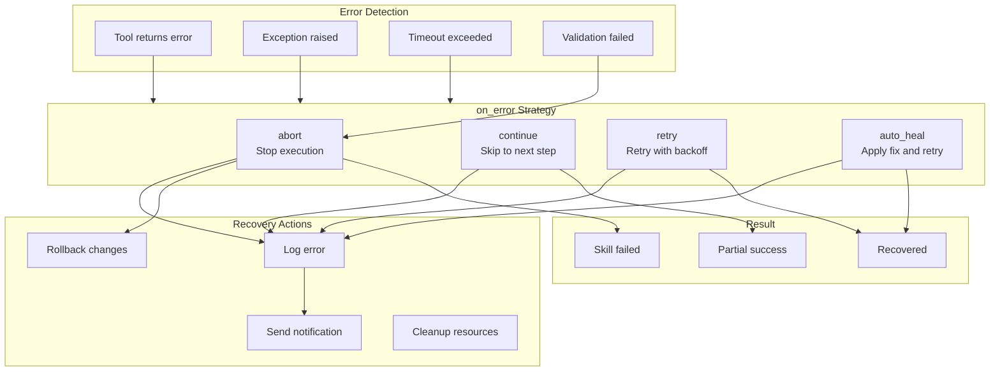
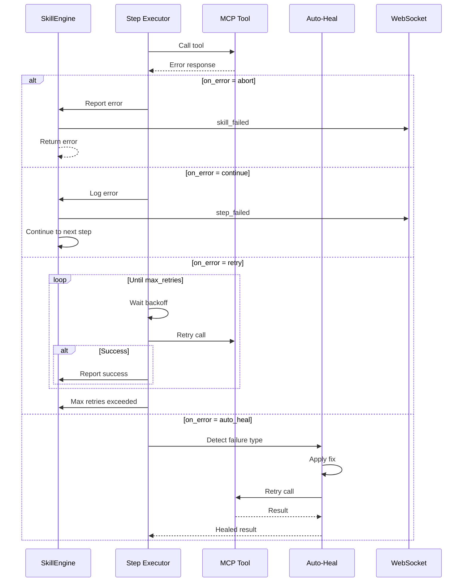
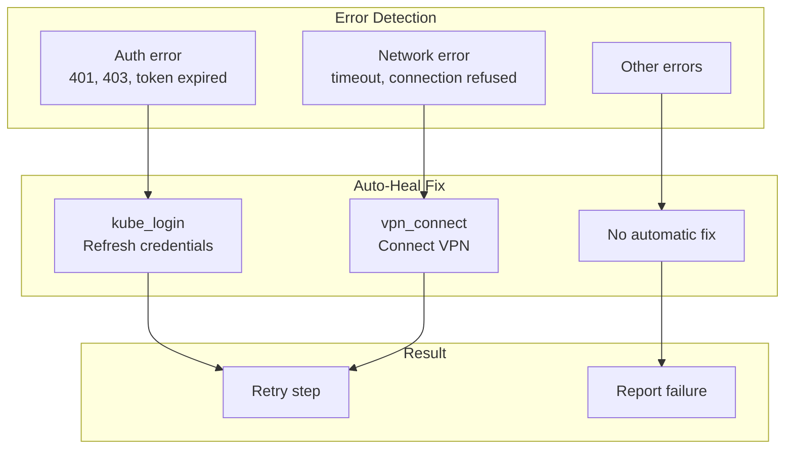

# Skill Error Handling

> Error detection, recovery, and on_error strategies

## Diagram



## Error Strategies



## Strategy Details

| Strategy | Behavior | Use Case |
|----------|----------|----------|
| `abort` | Stop execution, return error | Critical failures |
| `continue` | Log error, skip to next step | Non-critical steps |
| `retry` | Retry with exponential backoff | Transient failures |
| `auto_heal` | Apply fix and retry | Auth/network errors |

## Retry Configuration

```yaml
steps:
  - name: deploy
    tool: bonfire_deploy
    args:
      namespace: "{{ inputs.namespace }}"
    on_error: retry
    retry:
      max_attempts: 3
      initial_delay: 1
      max_delay: 30
      backoff_multiplier: 2
```

## Auto-Heal Integration



## Components

| Component | File | Description |
|-----------|------|-------------|
| _handle_error | `skill_engine.py` | Error handling |
| auto_heal | `auto_heal_decorator.py` | Auto-heal decorator |
| retry logic | `skill_engine.py` | Retry implementation |

## Error Logging

```yaml
# memory/learned/tool_failures.yaml
failures:
  - skill: start_work
    step: create_branch
    tool: git_create_branch
    error: "branch already exists"
    on_error: continue
    timestamp: "2024-01-15T10:30:00"
    recovered: false
```

## Related Diagrams

- [Skill State Machine](./skill-state-machine.md)
- [Auto-Heal Decorator](../01-server/auto-heal-decorator.md)
- [Skill Execution Flow](./skill-execution-flow.md)
