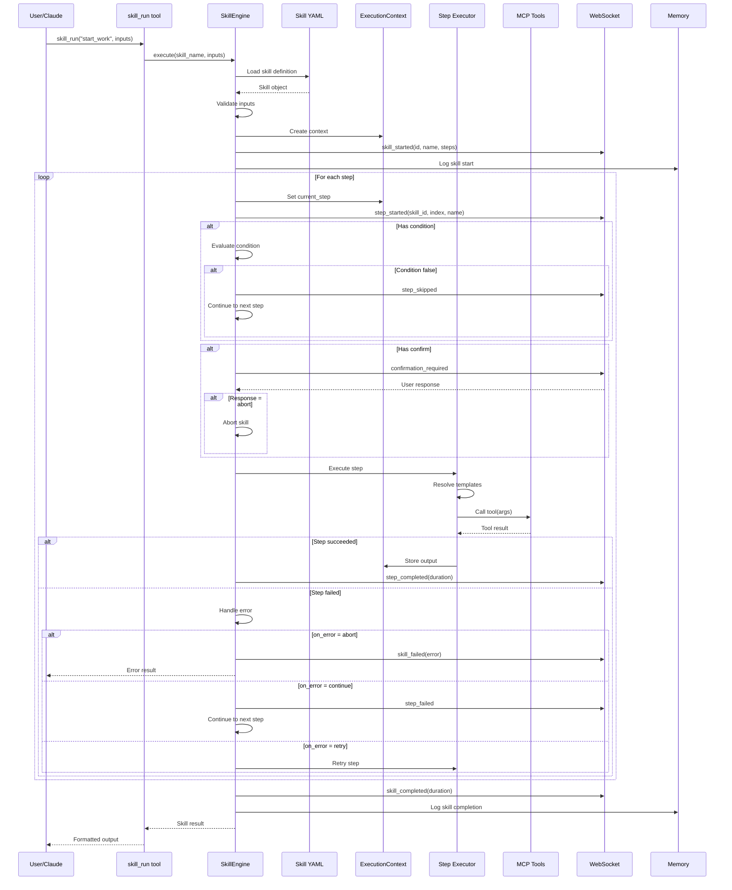
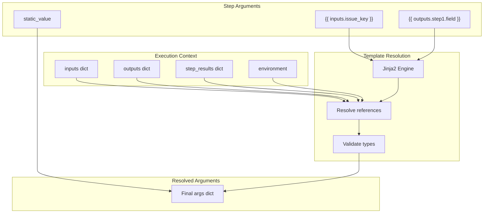

# Skill Execution Flow

> Step-by-step skill execution process

## Diagram

## Template Resolution

## Components

| Component | File | Description |
|-----------|------|-------------|
| SkillEngine.execute | `skill_engine.py` | Main execution method |
| _execute_step | `skill_engine.py` | Step execution |
| _resolve_templates | `skill_engine.py` | Template resolution |
| _handle_error | `skill_engine.py` | Error handling |

## Step Execution Details

| Phase | Description |
|-------|-------------|
| 1. Load | Load step definition |
| 2. Condition | Evaluate condition (if present) |
| 3. Confirm | Request confirmation (if present) |
| 4. Resolve | Resolve template variables |
| 5. Execute | Call MCP tool |
| 6. Store | Store result in context |
| 7. Notify | Send WebSocket event |

## Related Diagrams

- [Skill Engine Architecture](./skill-engine-architecture.md)
- [Skill State Machine](./skill-state-machine.md)
- [Skill Error Handling](./skill-error-handling.md)
