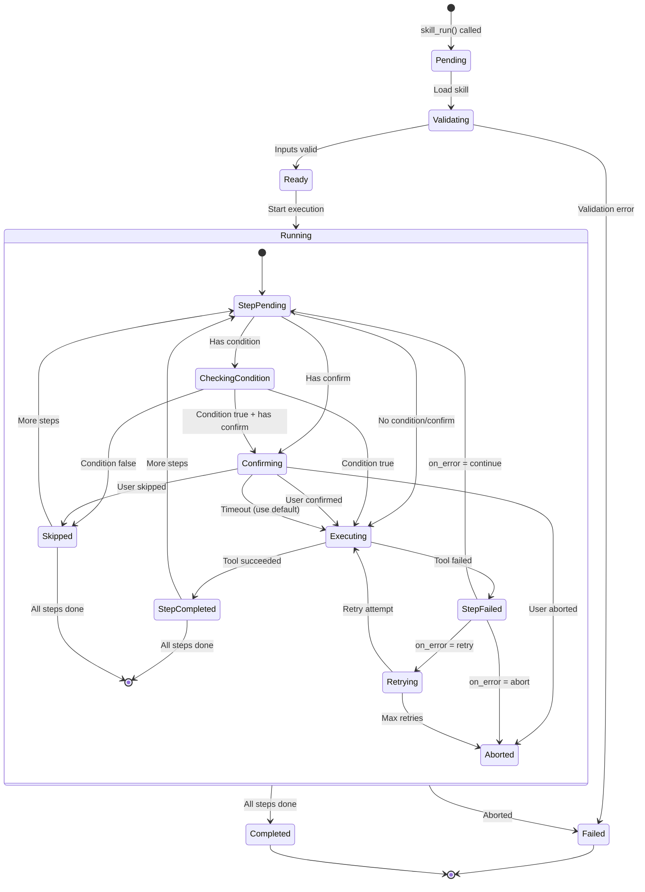
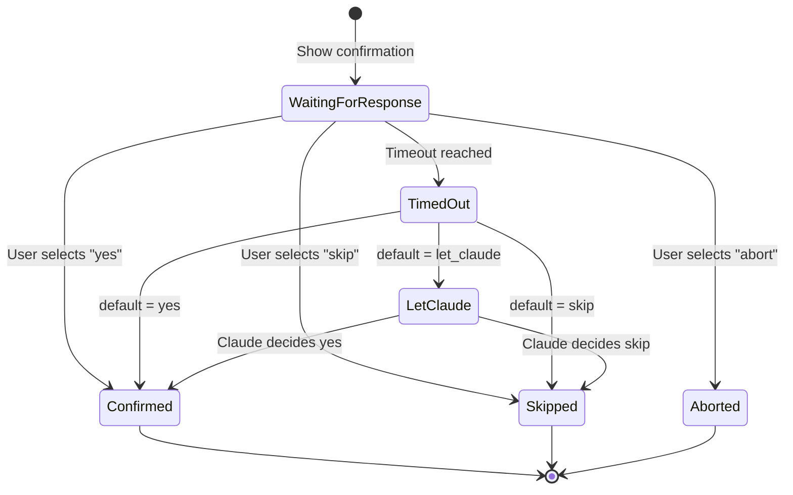
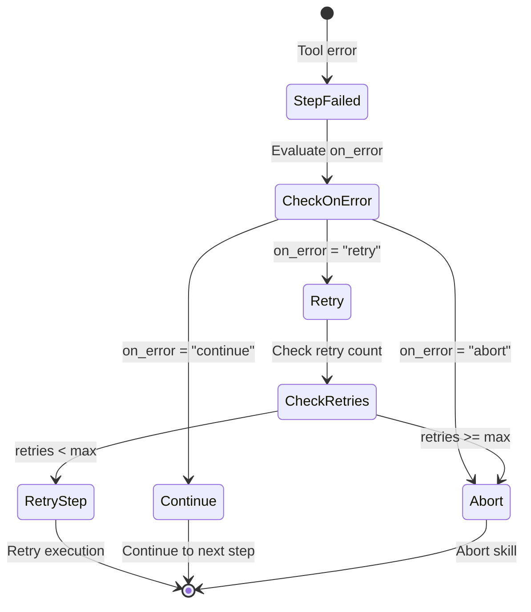

# Skill State Machine

> Execution states and transitions

## Diagram

## State Descriptions

| State | Description |
|-------|-------------|
| Pending | Skill execution requested |
| Validating | Validating inputs and loading skill |
| Ready | Ready to execute steps |
| Running | Executing steps |
| StepPending | Waiting to execute next step |
| CheckingCondition | Evaluating step condition |
| Confirming | Waiting for user confirmation |
| Executing | Calling MCP tool |
| StepCompleted | Step finished successfully |
| StepFailed | Step failed |
| Retrying | Retrying failed step |
| Skipped | Step skipped (condition false or user skip) |
| Aborted | Execution aborted |
| Completed | All steps completed successfully |
| Failed | Execution failed |

## Confirmation States

## Error Handling States

## Components

| Component | File | Description |
|-----------|------|-------------|
| SkillState | `skill_engine.py` | State tracking |
| ExecutionContext | `skill_engine.py` | Context with state |

## Related Diagrams

- [Skill Engine Architecture](./skill-engine-architecture.md)
- [Skill Execution Flow](./skill-execution-flow.md)
- [Skill Error Handling](./skill-error-handling.md)
