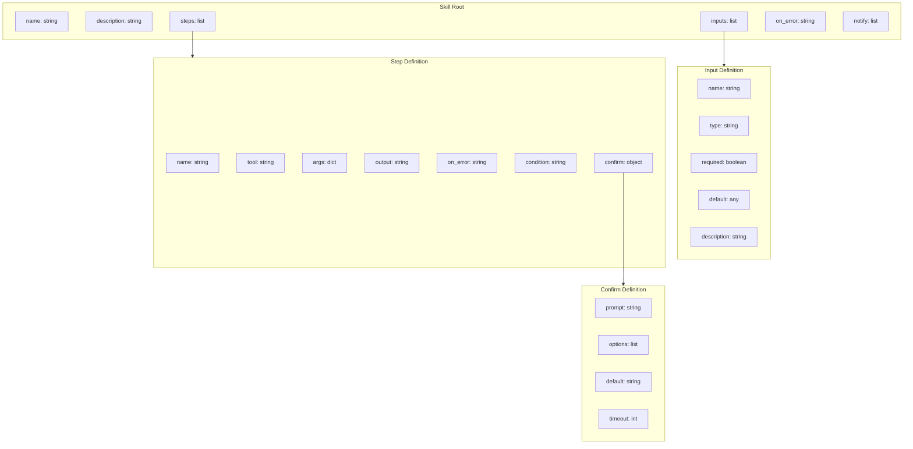
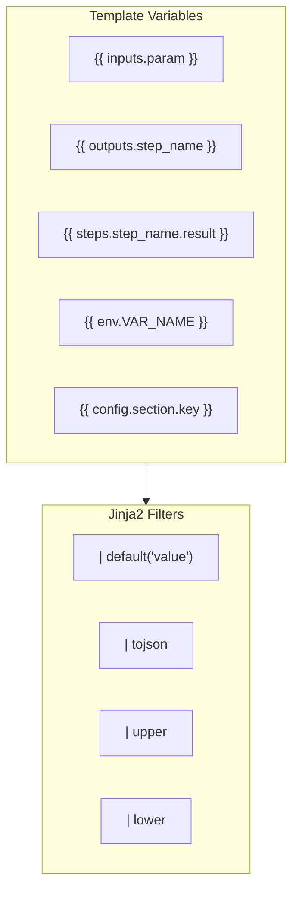

# Skill YAML Schema

> Structure and components of skill definition files

## Diagram



## Complete Schema

```yaml
# Skill definition schema
name: string                    # Unique skill identifier
description: string             # Human-readable description

inputs:                         # Input parameters
  - name: string               # Parameter name
    type: string               # Type: string, int, bool, list, dict
    required: boolean          # Is required (default: false)
    default: any               # Default value
    description: string        # Parameter description

steps:                          # Execution steps
  - name: string               # Step name
    tool: string               # MCP tool to call
    args:                      # Tool arguments
      key: value               # Static or templated values
      key: "{{ inputs.param }}"  # Template reference
    output: string             # Variable name for result
    on_error: string           # Error handling: abort, continue, retry
    condition: string          # Jinja2 condition
    confirm:                   # Optional confirmation
      prompt: string           # Confirmation message
      options: list            # Available options
      default: string          # Default option
      timeout: int             # Timeout in seconds

on_error: string               # Global error handling
notify: list                   # Notification channels
```

## Template Syntax



## Example Skill

```yaml
name: start_work
description: Start work on a Jira issue

inputs:
  - name: issue_key
    type: string
    required: true
    description: Jira issue key (e.g., AAP-12345)

steps:
  - name: fetch_issue
    tool: jira_view_issue
    args:
      issue_key: "{{ inputs.issue_key }}"
    output: issue

  - name: create_branch
    tool: git_create_branch
    args:
      name: "{{ inputs.issue_key | lower }}-{{ outputs.fetch_issue.summary | slugify }}"
    output: branch
    condition: "{{ outputs.fetch_issue.status == 'Open' }}"

  - name: transition_issue
    tool: jira_transition
    args:
      issue_key: "{{ inputs.issue_key }}"
      status: "In Progress"
    confirm:
      prompt: "Transition issue to In Progress?"
      options: [yes, no, skip]
      default: yes
      timeout: 30

on_error: abort
notify: [memory]
```

## Components

| Component | Location | Description |
|-----------|----------|-------------|
| Skill files | `skills/*.yaml` | Skill definitions |
| SkillEngine | `tool_modules/aa_workflow/src/skill_engine.py` | YAML parser |

## Related Diagrams

- [Skill Engine Architecture](./skill-engine-architecture.md)
- [Skill Execution Flow](./skill-execution-flow.md)
- [Common Skills](./common-skills.md)
