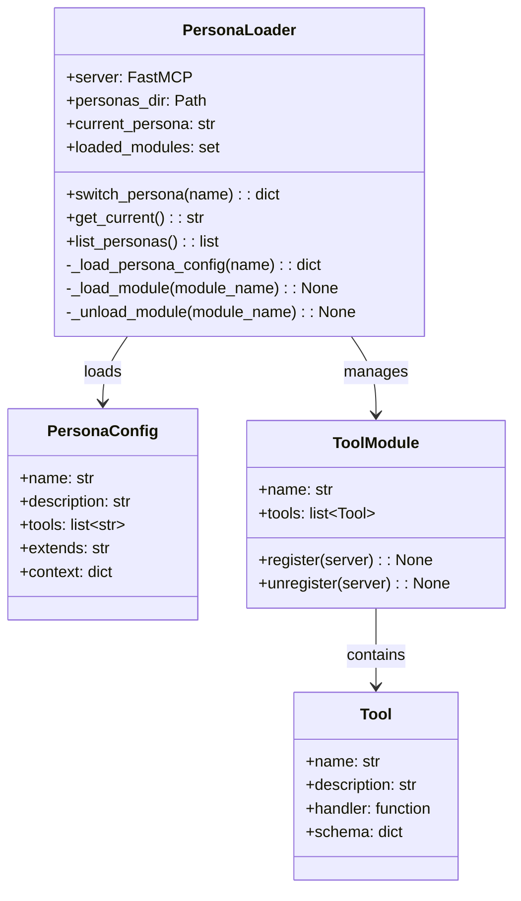
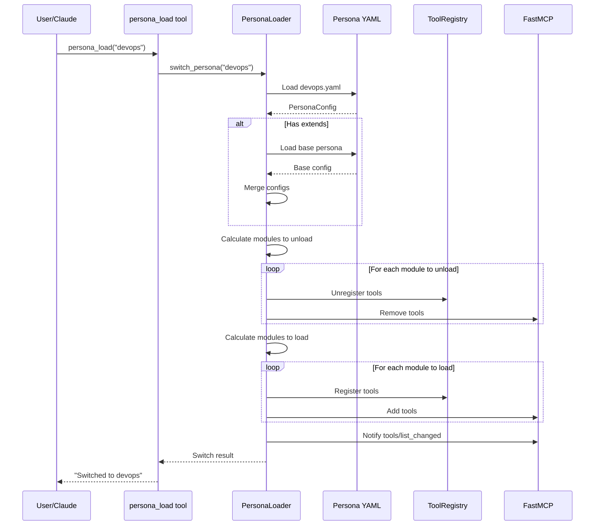
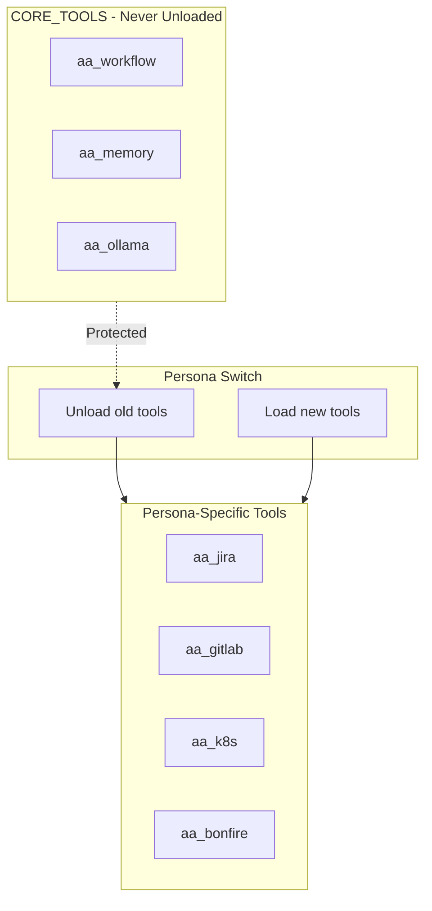

# Persona Architecture

> Dynamic persona system for tool loading

## Diagram

## Loading Flow

## Components

| Component | File | Description |
|-----------|------|-------------|
| PersonaLoader | `server/persona_loader.py` | Main loader class |
| persona_load | `tool_modules/aa_workflow/src/tools_core.py` | MCP tool |
| persona_list | `tool_modules/aa_workflow/src/tools_basic.py` | List personas |
| Persona files | `personas/*.yaml` | Persona definitions |

## Core Tools Protection

## Related Diagrams

- [Persona Tool Mapping](./persona-tool-mapping.md)
- [Persona Definitions](./persona-definitions.md)
- [Persona Loading Flow](./persona-loading-flow.md)
