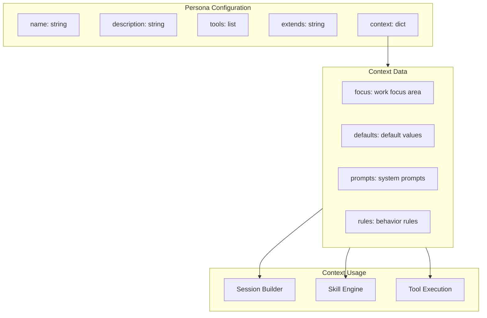
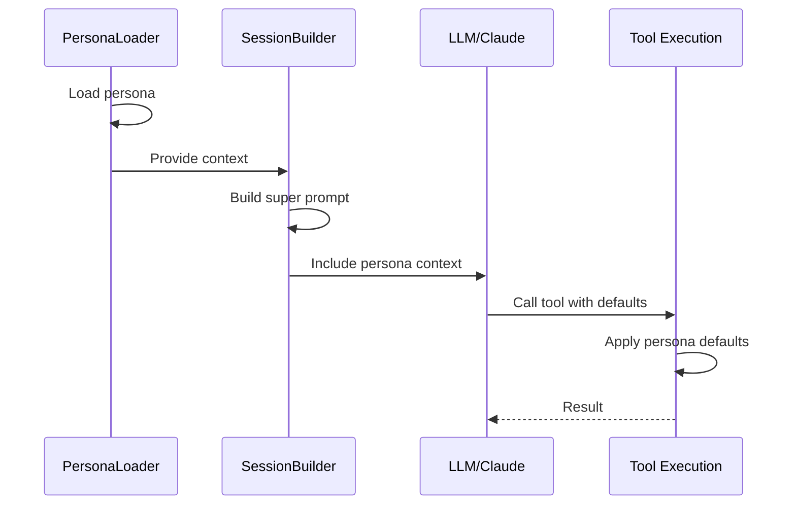

# Persona Context

> Context and configuration provided by personas

## Diagram



## Context Structure

```yaml
# Example persona context
context:
  # Work focus for LLM guidance
  focus: "code development and review"

  # Default values for tools
  defaults:
    branch: "main"
    project: "automation-analytics-backend"
    cluster: "ephemeral"

  # System prompt additions
  prompts:
    intro: "You are a developer assistant focused on..."
    rules:
      - "Always create branches from main"
      - "Run tests before committing"

  # Behavioral rules
  rules:
    confirm_destructive: true
    auto_push: false
    lint_before_commit: true
```

## Context Flow



## Context Merging

```mermaid
flowchart TB
    subgraph Base[Base Persona Context]
        B_FOCUS[focus: general]
        B_DEFAULTS[defaults: {...}]
        B_RULES[rules: {...}]
    end

    subgraph Extended[Extended Persona Context]
        E_FOCUS[focus: specific]
        E_DEFAULTS[defaults: {...}]
        E_RULES[rules: {...}]
    end

    subgraph Merged[Merged Context]
        M_FOCUS[focus: specific<br/>Override]
        M_DEFAULTS[defaults: merged<br/>Deep merge]
        M_RULES[rules: merged<br/>Deep merge]
    end

    B_FOCUS --> M_FOCUS
    E_FOCUS --> M_FOCUS
    B_DEFAULTS --> M_DEFAULTS
    E_DEFAULTS --> M_DEFAULTS
    B_RULES --> M_RULES
    E_RULES --> M_RULES
```

## Per-Persona Context Examples

### developer

```yaml
context:
  focus: "code development"
  defaults:
    branch: "main"
    commit_format: "{issue_key} - {type}({scope}): {description}"
  rules:
    lint_before_commit: true
    require_tests: true
```

### devops

```yaml
context:
  focus: "deployments and infrastructure"
  defaults:
    cluster: "ephemeral"
    namespace_duration: "4h"
  rules:
    confirm_namespace_release: true
    check_image_exists: true
```

### incident

```yaml
context:
  focus: "incident investigation"
  defaults:
    log_window: "1h"
    alert_priority: "P1"
  rules:
    notify_on_action: true
    preserve_evidence: true
```

## Components

| Component | File | Description |
|-----------|------|-------------|
| PersonaConfig | `persona_loader.py` | Context loading |
| SessionBuilder | `session_builder.py` | Context usage |
| Persona files | `personas/*.yaml` | Context definitions |

## Related Diagrams

- [Persona Architecture](./persona-architecture.md)
- [Session Builder](../01-server/session-builder.md)
- [Persona Use Cases](./persona-use-cases.md)
