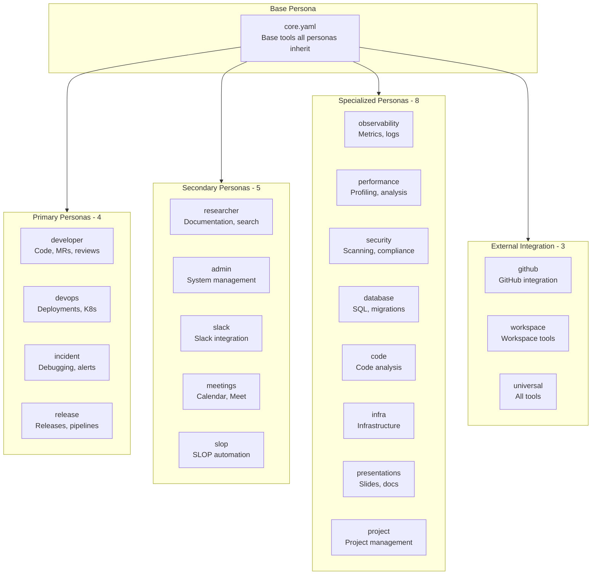

# Persona Definitions

> Complete inventory of all 21 personas and their configurations

## Diagram



## Complete Persona Inventory (21)

### Core Persona

| Persona | Description |
|---------|-------------|
| `core` | Base tools inherited by all personas - workflow, memory, session tools |

### Primary Personas (4)

| Persona | Description | Focus |
|---------|-------------|-------|
| `developer` | Development workflow tools | Code, MRs, reviews, Jira |
| `devops` | DevOps and deployment tools | K8s, bonfire, containers |
| `incident` | Incident response tools | Alerts, logs, debugging |
| `release` | Release management tools | Konflux, pipelines, quay |

### Secondary Personas (5)

| Persona | Description | Focus |
|---------|-------------|-------|
| `researcher` | Research and documentation | Search, analysis, docs |
| `admin` | System administration | Config, management |
| `slack` | Slack integration | Messaging, channels |
| `meetings` | Meeting management | Calendar, Meet, notes |
| `slop` | SLOP automation | Autonomous workflows |

### Specialized Personas (8)

| Persona | Description | Focus |
|---------|-------------|-------|
| `observability` | Observability tools | Prometheus, Kibana, metrics |
| `performance` | Performance analysis | Profiling, benchmarks |
| `security` | Security scanning | Vulnerabilities, compliance |
| `database` | Database operations | SQL, PostgreSQL, MySQL |
| `code` | Code analysis | Search, patterns, review |
| `infra` | Infrastructure management | Libvirt, systemd, SSH |
| `presentations` | Presentations | Google Slides, PDFs |
| `project` | Project management | Jira, planning, tracking |

### External Integration Personas (3)

| Persona | Description | Focus |
|---------|-------------|-------|
| `github` | GitHub integration | GitHub-specific workflows |
| `workspace` | Workspace tools | Multi-project management |
| `universal` | All available tools | Full toolset (may exceed limits) |

## Persona Configuration Structure

Each persona is defined in a YAML file with this structure:

```yaml
# personas/<name>.yaml
name: persona_name
description: Human-readable description
extends: core  # Optional parent persona

tools:
  - module_basic  # Tool module name
  - module_extra

# Optional: Custom persona prompt
persona: |
  You are specialized for...

# Optional: Append to persona prompt
persona_append: |
  Additional context...
```

## Example Configurations

### developer

```yaml
name: developer
description: Development workflow tools
extends: core

tools:
  - git_basic
  - git_extra
  - gitlab_basic
  - gitlab_extra
  - jira_basic
  - jira_extra
  - lint_basic
  - code_search_basic
  - dev_workflow_basic
```

### devops

```yaml
name: devops
description: DevOps and deployment tools
extends: core

tools:
  - k8s_basic
  - k8s_extra
  - bonfire_basic
  - bonfire_extra
  - quay_basic
  - konflux_basic
  - docker_basic
  - jira_basic
  - git_basic
```

### incident

```yaml
name: incident
description: Incident response and debugging
extends: core

tools:
  - k8s_basic
  - k8s_extra
  - prometheus_basic
  - kibana_basic
  - alertmanager_basic
  - jira_basic
  - slack_basic
  - git_basic
```

## Persona Inheritance

```mermaid
flowchart TB
    CORE[core.yaml]

    CORE --> DEV[developer]
    CORE --> DEVOPS[devops]
    CORE --> INCIDENT[incident]
    CORE --> RELEASE[release]
    CORE --> RESEARCHER[researcher]
    CORE --> ADMIN[admin]
    CORE --> SLACK[slack]
    CORE --> MEETINGS[meetings]
    CORE --> OBSERVABILITY[observability]
    CORE --> PERFORMANCE[performance]
    CORE --> SECURITY[security]
    CORE --> DATABASE[database]
    CORE --> CODE[code]
    CORE --> INFRA[infra]
    CORE --> PRESENTATIONS[presentations]
    CORE --> PROJECT[project]
    CORE --> GITHUB[github]
    CORE --> WORKSPACE[workspace]
    CORE --> SLOP[slop]
    CORE --> UNIVERSAL[universal]

    style CORE fill:#f9f,stroke:#333
```



## Summary

| Category | Count | Personas |
|----------|-------|----------|
| Core | 1 | core |
| Primary | 4 | developer, devops, incident, release |
| Secondary | 5 | researcher, admin, slack, meetings, slop |
| Specialized | 8 | observability, performance, security, database, code, infra, presentations, project |
| External | 3 | github, workspace, universal |
| **Total** | **21** | |

## Components

| Component | Location | Description |
|-----------|----------|-------------|
| Persona files | `personas/*.yaml` | Persona YAML definitions |
| PersonaLoader | `server/persona_loader.py` | Dynamic persona loading |
| persona_load tool | `tool_modules/aa_workflow/` | Switch persona at runtime |
| persona_list tool | `tool_modules/aa_workflow/` | List available personas |

## Related Diagrams

- [Persona Architecture](./persona-architecture.md)
- [Persona Tool Mapping](./persona-tool-mapping.md)
- [Persona Loading Flow](./persona-loading-flow.md)
- [Persona Use Cases](./persona-use-cases.md)
