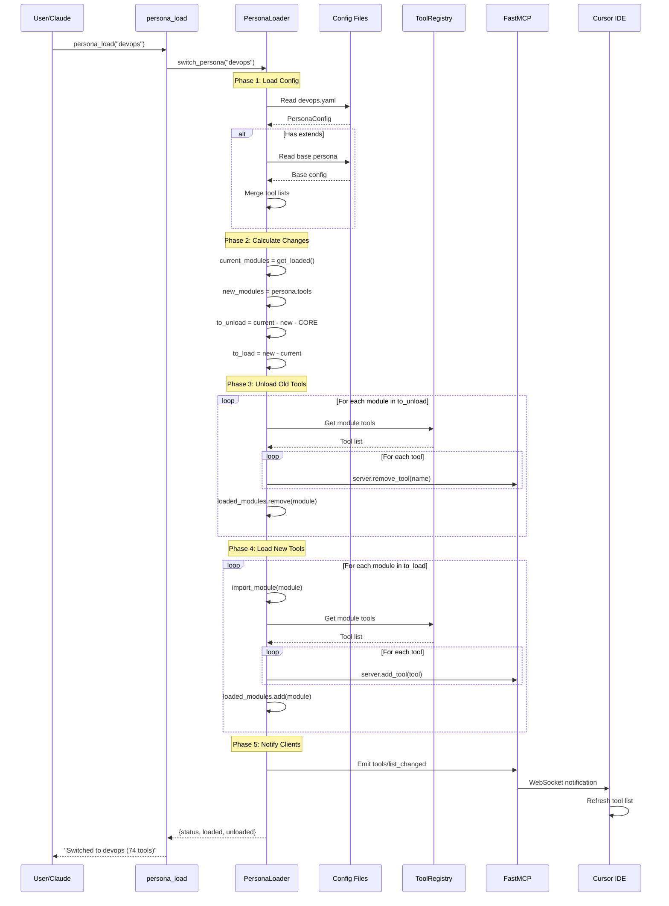
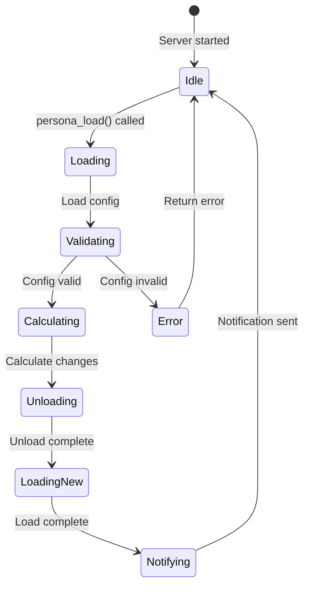
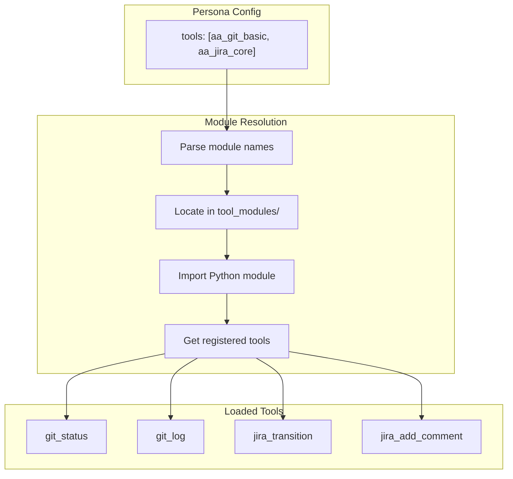

# Persona Loading Flow

> Detailed persona switch process

## Diagram

## State Changes

## Module Resolution

## Components

| Component | File | Description |
|-----------|------|-------------|
| switch_persona | `persona_loader.py` | Main switch method |
| _load_module | `persona_loader.py` | Module import |
| _unload_module | `persona_loader.py` | Module removal |
| CORE_TOOLS | `persona_loader.py` | Protected modules |

## Performance Considerations

| Phase | Typical Duration | Notes |
|-------|-----------------|-------|
| Load config | <10ms | YAML parsing |
| Calculate changes | <5ms | Set operations |
| Unload modules | 50-200ms | Per module |
| Load modules | 100-500ms | Per module |
| Notify clients | <50ms | WebSocket |

## Related Diagrams

- [Persona Architecture](./persona-architecture.md)
- [Tool Registry](../01-server/tool-registry.md)
- [Persona Tool Mapping](./persona-tool-mapping.md)
