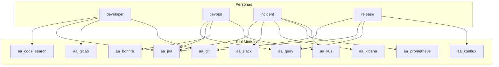
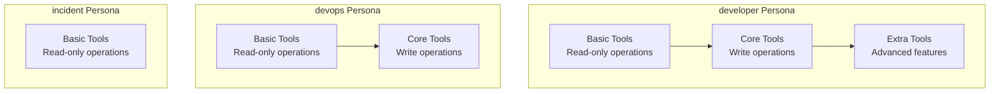
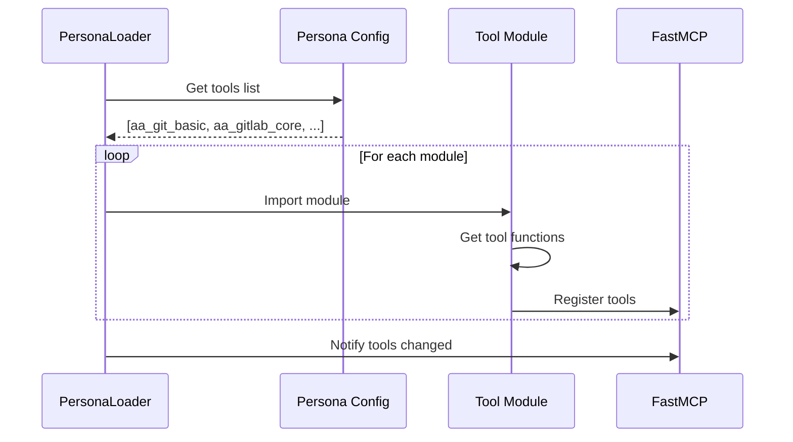

# Persona Tool Mapping

> Which tools are loaded by each persona

## Diagram

## Tool Matrix

| Module | developer | devops | incident | release |
|--------|-----------|--------|----------|---------|
| aa_workflow | ✓ | ✓ | ✓ | ✓ |
| aa_memory | ✓ | ✓ | ✓ | ✓ |
| aa_ollama | ✓ | ✓ | ✓ | ✓ |
| aa_jira_basic | ✓ | ✓ | ✓ | ✓ |
| aa_jira_core | ✓ | | | |
| aa_git_basic | ✓ | | | ✓ |
| aa_git_core | ✓ | | | |
| aa_gitlab_basic | ✓ | | | |
| aa_gitlab_core | ✓ | | | |
| aa_k8s_basic | | ✓ | ✓ | |
| aa_k8s_core | | ✓ | ✓ | |
| aa_bonfire_basic | | ✓ | | |
| aa_bonfire_core | | ✓ | | |
| aa_prometheus_basic | | | ✓ | |
| aa_kibana_basic | | | ✓ | |
| aa_alertmanager_basic | | | ✓ | |
| aa_konflux_basic | | | | ✓ |
| aa_konflux_core | | | | ✓ |
| aa_quay_basic | | ✓ | | ✓ |
| aa_slack_basic | | | ✓ | |
| aa_code_search_basic | ✓ | | | |

## Tool Tiers per Persona

## Module Loading

## Components

| Component | File | Description |
|-----------|------|-------------|
| PersonaLoader | `server/persona_loader.py` | Tool loading |
| Persona configs | `personas/*.yaml` | Tool lists |

## Related Diagrams

- [Persona Architecture](./persona-architecture.md)
- [Tool Tiers](../03-tools/tool-tiers.md)
- [Persona Use Cases](./persona-use-cases.md)
