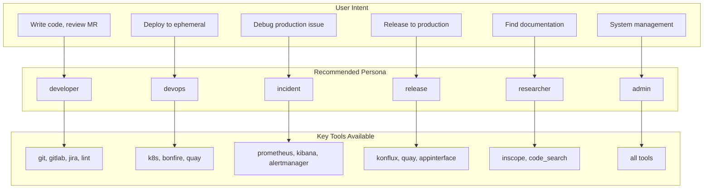
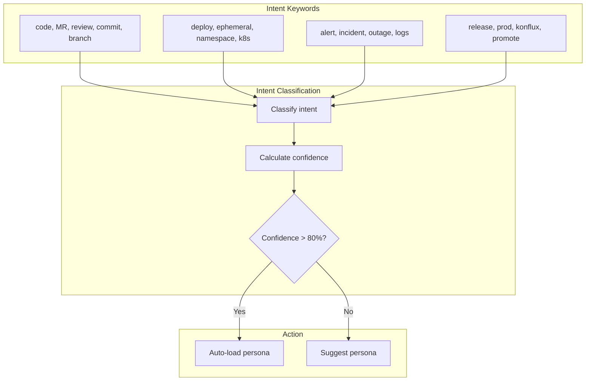
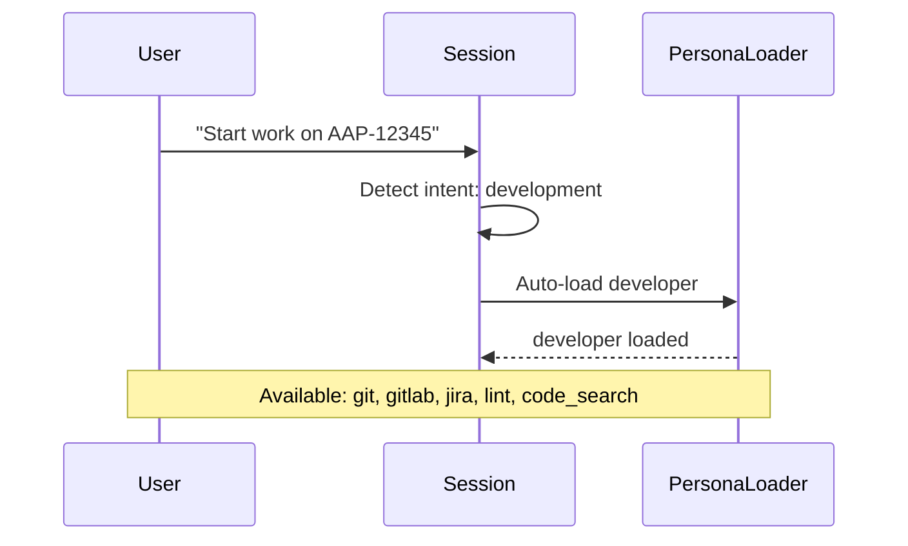
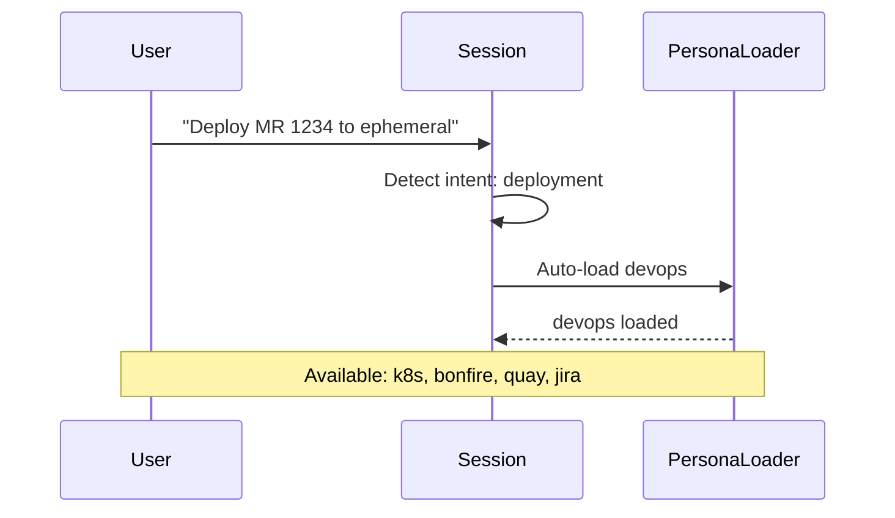
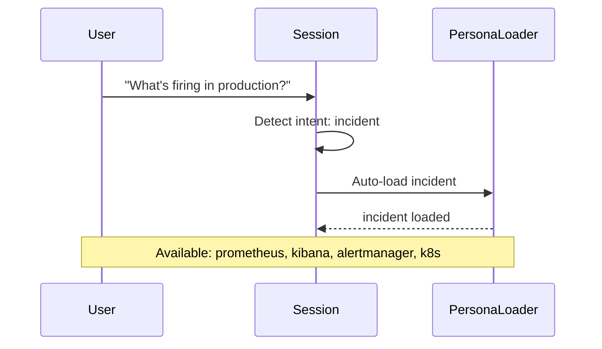
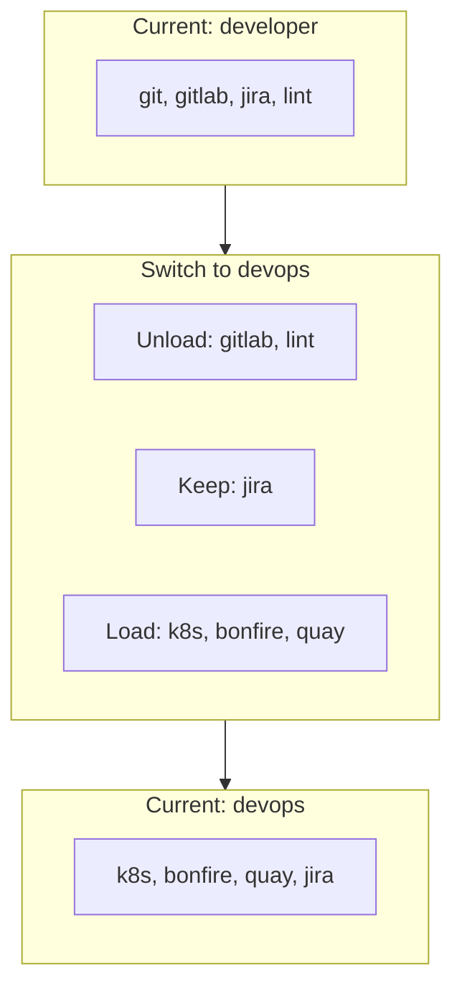

# Persona Use Cases

> When and how to use each persona

## Diagram

## Intent Detection

## Use Case Examples

### Development Workflow

### Deployment Workflow

### Incident Response

## Persona Selection Guide

| Scenario | Persona | Why |
|----------|---------|-----|
| Fix a bug | developer | Need git, gitlab, jira |
| Test MR in ephemeral | devops | Need bonfire, k8s |
| Alert investigation | incident | Need prometheus, kibana |
| Ship to production | release | Need konflux, quay |
| Find documentation | researcher | Need inscope, code_search |
| System configuration | admin | Need all tools |

## Switching Personas

## Components

| Component | File | Description |
|-----------|------|-------------|
| Intent classifier | `session_builder.py` | Detect intent |
| PersonaLoader | `persona_loader.py` | Load persona |
| Bootstrap | `tools_core.py` | Auto-load logic |

## Related Diagrams

- [Persona Architecture](./persona-architecture.md)
- [Session Bootstrap](../08-data-flows/session-bootstrap.md)
- [Skill Dependencies](../04-skills/skill-dependencies.md)
