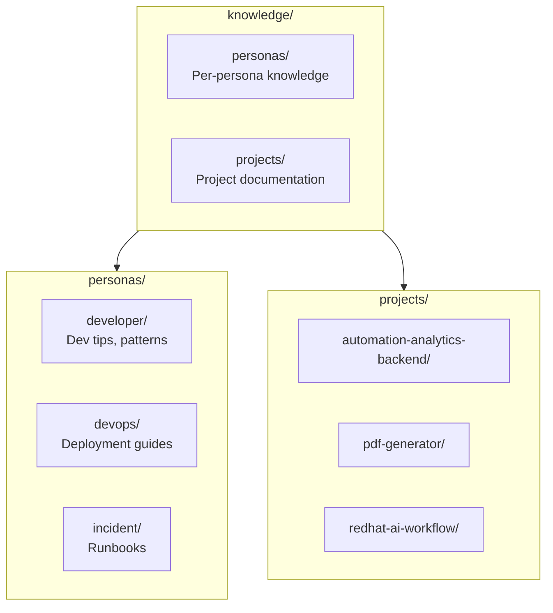
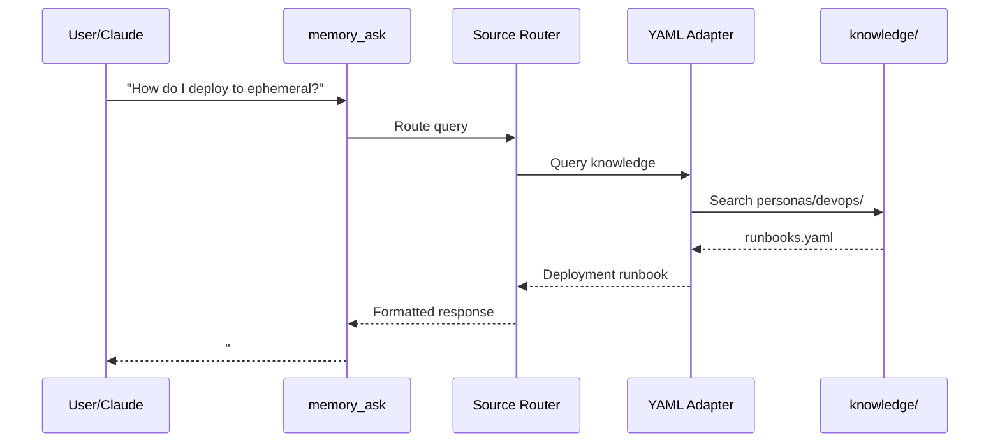
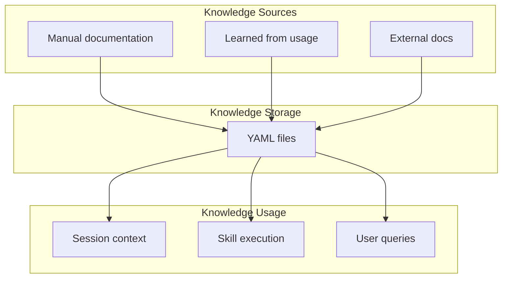

# Knowledge Storage

> Domain knowledge and documentation storage

## Diagram



## Knowledge Structure

```yaml
# knowledge/personas/developer/tips.yaml
tips:
  - context: git_commit
    tip: "Use conventional commit format: {issue_key} - {type}({scope}): {description}"
    priority: high

  - context: mr_create
    tip: "Always link Jira issue in MR description"
    priority: high

  - context: code_review
    tip: "Check for test coverage before approving"
    priority: medium

# knowledge/personas/devops/runbooks.yaml
runbooks:
  - name: ephemeral_deploy
    steps:
      - "Reserve namespace with bonfire"
      - "Build image from MR"
      - "Deploy with IMAGE_TAG"
    common_issues:
      - error: "manifest unknown"
        fix: "Use full 40-char SHA"

# knowledge/projects/automation-analytics-backend/architecture.yaml
architecture:
  components:
    - name: API
      path: src/api/
      description: REST API endpoints
    - name: Workers
      path: src/workers/
      description: Background job processors
  databases:
    - name: PostgreSQL
      purpose: Primary data store
    - name: Redis
      purpose: Caching and queues
```

## Knowledge Access



## Knowledge Categories

| Category | Path | Content |
|----------|------|---------|
| Persona tips | `personas/{name}/tips.yaml` | Context-specific guidance |
| Runbooks | `personas/{name}/runbooks.yaml` | Step-by-step procedures |
| Project docs | `projects/{name}/architecture.yaml` | Architecture details |
| API docs | `projects/{name}/api.yaml` | API documentation |
| Troubleshooting | `personas/{name}/troubleshooting.yaml` | Common issues & fixes |

## Knowledge Flow



## Components

| Component | File | Description |
|-----------|------|-------------|
| Knowledge files | `memory/knowledge/` | YAML storage |
| memory_ask | `memory_unified.py` | Query interface |
| SessionBuilder | `session_builder.py` | Context injection |

## Related Diagrams

- [Memory Architecture](./memory-architecture.md)
- [Memory Paths](./memory-paths.md)
- [Session Builder](../01-server/session-builder.md)
