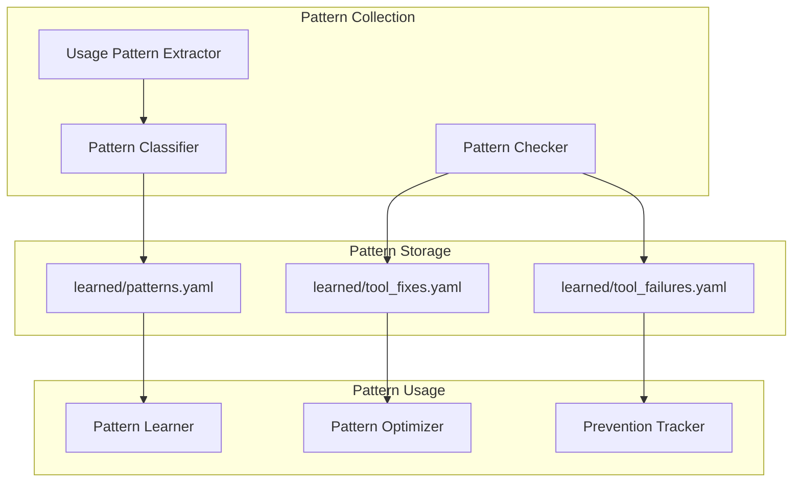
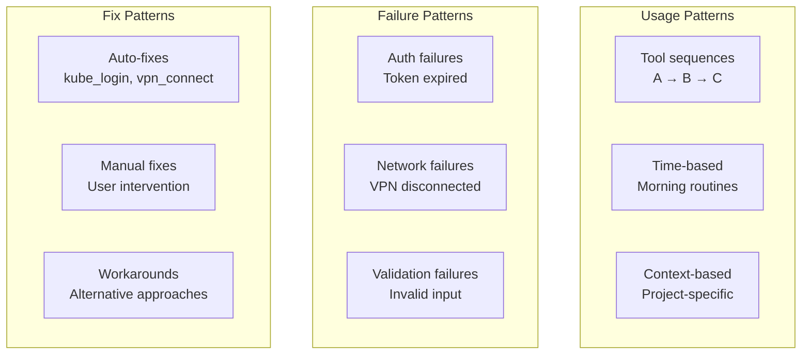
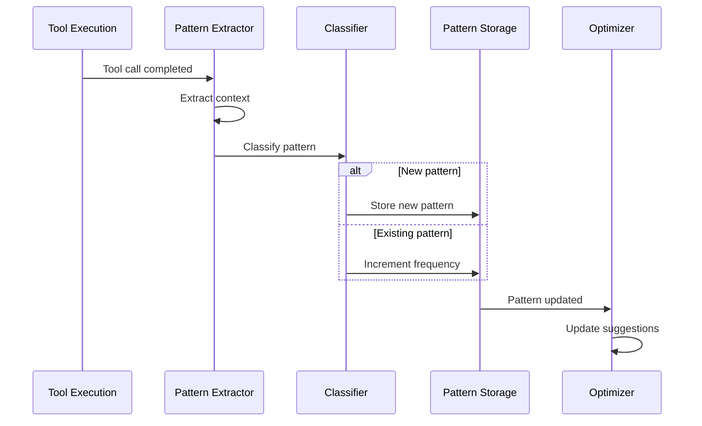

# Learned Patterns

> Pattern storage and usage optimization

## Diagram



## Pattern Types



## Pattern Learning Flow



## Pattern Schema

```yaml
# learned/patterns.yaml
patterns:
  - name: morning_briefing
    trigger: session_start
    conditions:
      time_window: "08:00-10:00"
      day_of_week: [mon, tue, wed, thu, fri]
    frequency: 15
    confidence: 0.85
    actions:
      - skill: coffee

  - name: mr_after_commit
    trigger: git_commit
    conditions:
      branch_pattern: "aap-*"
    frequency: 8
    confidence: 0.72
    actions:
      - skill: create_mr

# learned/tool_failures.yaml
failures:
  k8s_get_pods:
    "Unauthorized":
      count: 12
      last_seen: 2026-02-04T10:30:00
      auto_fix: kube_login
    "connection refused":
      count: 3
      last_seen: 2026-02-03T15:00:00
      auto_fix: vpn_connect

# learned/tool_fixes.yaml
fixes:
  - error_pattern: "Unauthorized"
    tool_pattern: "k8s_*"
    fix:
      action: kube_login
      success_rate: 0.95
  - error_pattern: "manifest unknown"
    tool_pattern: "bonfire_*"
    fix:
      action: use_full_sha
      description: "Use 40-char SHA instead of short"
```

## Components

| Component | File | Description |
|-----------|------|-------------|
| UsagePatternExtractor | `server/usage_pattern_extractor.py` | Extract patterns |
| UsagePatternClassifier | `server/usage_pattern_classifier.py` | Classify patterns |
| UsagePatternLearner | `server/usage_pattern_learner.py` | Learn from patterns |
| UsagePatternStorage | `server/usage_pattern_storage.py` | Persist patterns |

## Related Diagrams

- [Usage Pattern System](../01-server/usage-pattern-system.md)
- [Auto-Heal Decorator](../01-server/auto-heal-decorator.md)
- [Memory Architecture](./memory-architecture.md)
