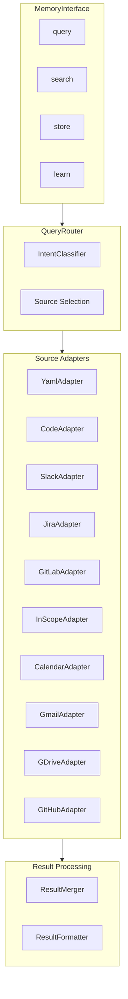
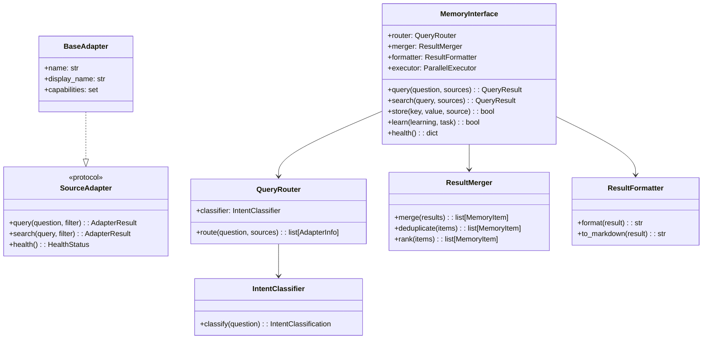
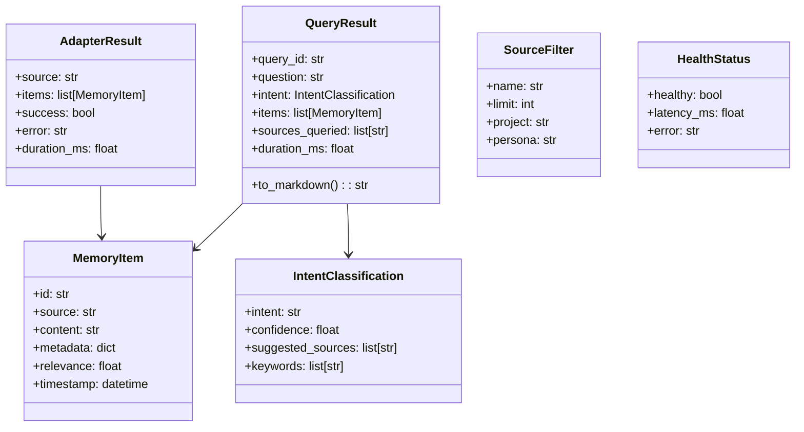

# Memory Abstraction Layer

> Unified interface for querying all memory sources

## Diagram



## Class Architecture



## Components

| Component | File | Description |
|-----------|------|-------------|
| MemoryInterface | `services/memory_abstraction/interface.py` | Main entry point |
| QueryRouter | `services/memory_abstraction/router.py` | Route queries to adapters |
| IntentClassifier | `services/memory_abstraction/classifier.py` | Classify query intent |
| ResultMerger | `services/memory_abstraction/merger.py` | Combine adapter results |
| ResultFormatter | `services/memory_abstraction/formatter.py` | Format for LLM output |
| SourceAdapter | `services/memory_abstraction/adapter_protocol.py` | Adapter protocol |
| AdapterRegistry | `services/memory_abstraction/registry.py` | Adapter discovery |
| Models | `services/memory_abstraction/models.py` | Data models |

## Data Models



## Adapter Registration

Use the `@memory_adapter` decorator:

```python
from services.memory_abstraction import memory_adapter, BaseAdapter

@memory_adapter(
    name="my_source",
    display_name="My Source",
    capabilities={"query", "search"},
    intent_keywords=["my", "custom", "source"],
    latency_class="fast",  # or "slow"
)
class MySourceAdapter(BaseAdapter):
    async def query(self, question: str, filter: SourceFilter) -> AdapterResult:
        # Implement query logic
        return AdapterResult(
            source=self.name,
            items=[...],
            success=True
        )

    async def health(self) -> HealthStatus:
        return HealthStatus(healthy=True, latency_ms=10.0)
```

## Usage Examples

```python
from services.memory_abstraction import MemoryInterface, SourceFilter

memory = MemoryInterface()

# Auto-route based on intent
result = await memory.query("What am I working on?")
# → Routes to YAML adapter (state/current_work)

result = await memory.query("Show billing code")
# → Routes to Code adapter (vector search)

result = await memory.query("How do I configure RDS?")
# → Routes to InScope adapter (slow, external)

# Query specific sources
result = await memory.query(
    "Find authentication code",
    sources=[
        SourceFilter(name="code", project="backend"),
        SourceFilter(name="gitlab", limit=5),
    ]
)

# Get markdown output for LLM
print(result.to_markdown())
```

## Latency Classes

| Class | Latency | Sources | Bootstrap |
|-------|---------|---------|-----------|
| **fast** | <2s | yaml, code, slack | Used in session startup |
| **slow** | >2s | jira, gitlab, inscope, calendar, gmail, gdrive | Explicit request only |

```python
# Query fast sources only (default)
result = await memory.query("What am I working on?")

# Include slow sources
result = await memory.query(
    "How do I configure RDS?",
    include_slow=True
)
```

## Intent Classification

The classifier maps questions to sources:

| Intent | Keywords | Sources |
|--------|----------|---------|
| `current_work` | "working on", "current", "active" | yaml |
| `code_search` | "where", "find", "code", "function" | code |
| `documentation` | "how", "configure", "RDS", "Clowder" | inscope |
| `communication` | "said", "discuss", "slack" | slack |
| `calendar` | "meeting", "schedule", "calendar" | calendar |
| `email` | "email", "gmail", "inbox" | gmail |

## Related Diagrams

- [Memory Architecture](./memory-architecture.md)
- [Unified Memory Query](./unified-memory-query.md)
- [Memory Operations](./memory-operations.md)
- [Session Bootstrap](../08-data-flows/session-bootstrap.md)
