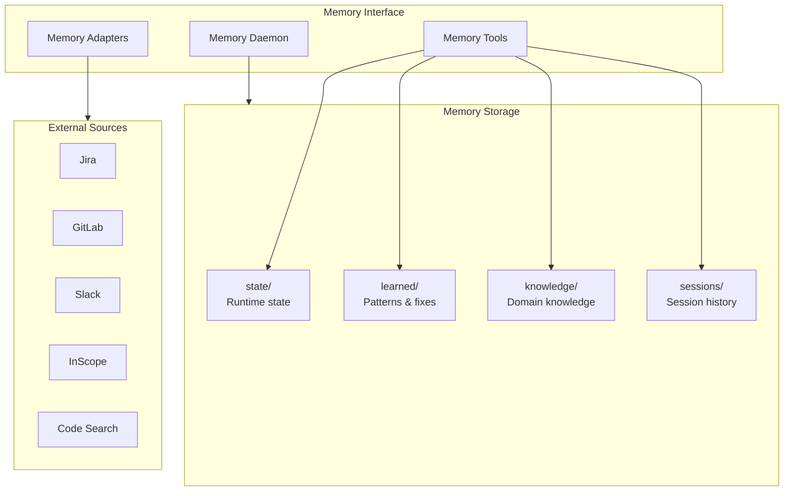
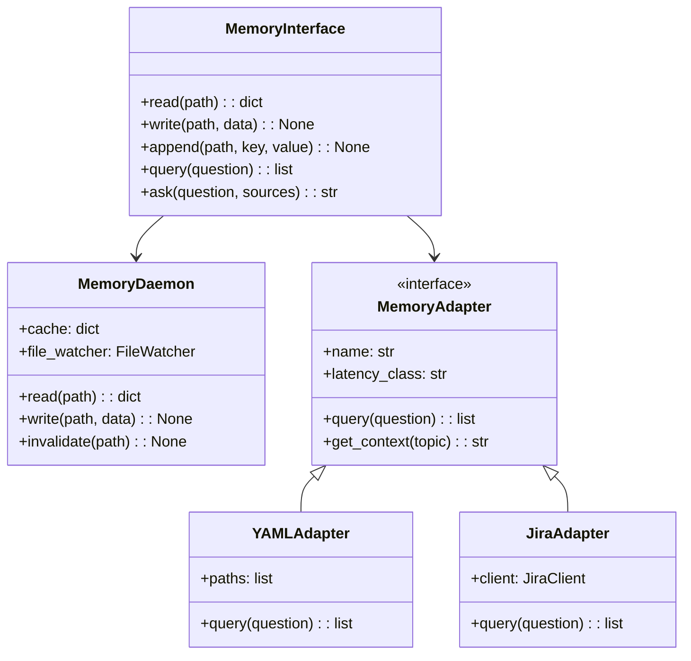
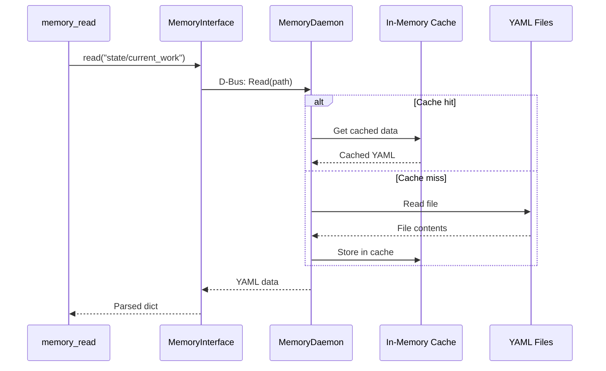

# Memory Architecture

> YAML-based persistent memory system

## Diagram

## Class Structure

## Memory Flow

## Components

| Component | File | Description |
|-----------|------|-------------|
| Memory tools | `tool_modules/aa_workflow/src/memory_tools.py` | MCP tools |
| Memory daemon | `services/memory/daemon.py` | Background service |
| Memory adapters | `tool_modules/*/src/adapter.py` | External sources |
| YAML storage | `memory/` | File storage |

## Related Diagrams

- [Memory Paths](./memory-paths.md)
- [Memory Daemon](../02-services/memory-daemon.md)
- [Adapter Pattern](../03-tools/adapter-pattern.md)
