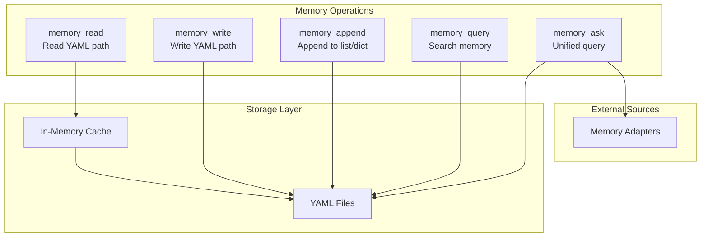
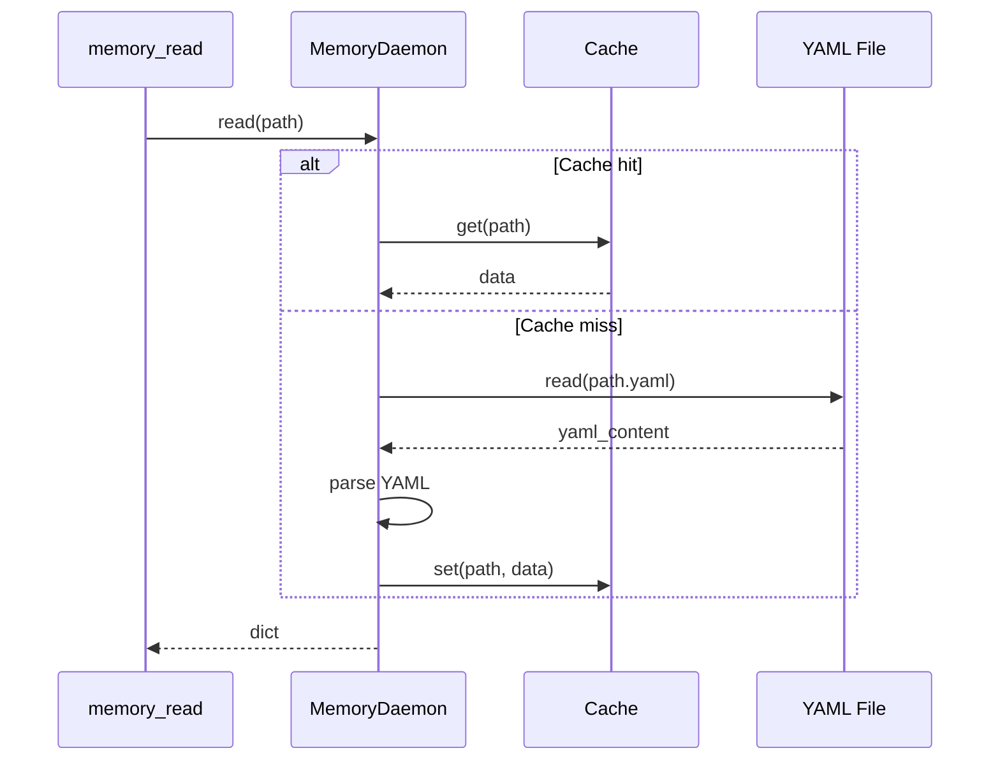
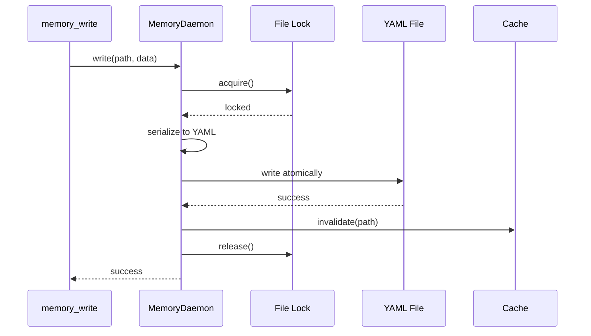
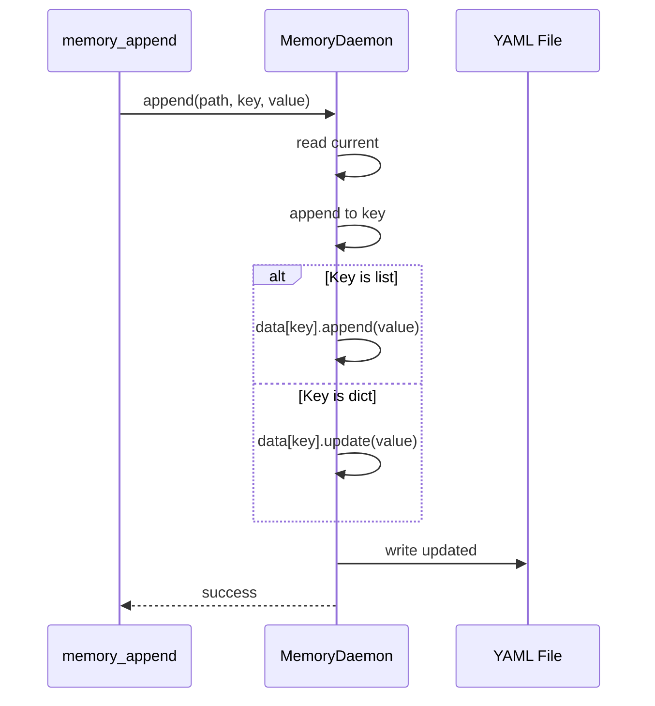
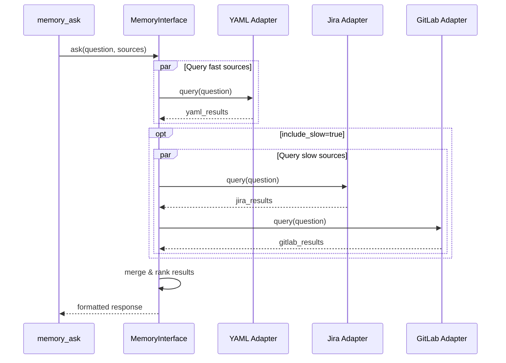

# Memory Operations

> Read, write, append, and query operations

## Diagram

## Operation Details

### memory_read

### memory_write

### memory_append

### memory_ask

## Operation Matrix

| Operation | Read | Write | External | Cached |
|-----------|------|-------|----------|--------|
| memory_read | ✓ | | | ✓ |
| memory_write | | ✓ | | invalidates |
| memory_append | ✓ | ✓ | | invalidates |
| memory_query | ✓ | | | ✓ |
| memory_ask | ✓ | | ✓ | partial |

## Components

| Component | File | Description |
|-----------|------|-------------|
| memory_read | `memory_tools.py` | Read operation |
| memory_write | `memory_tools.py` | Write operation |
| memory_append | `memory_tools.py` | Append operation |
| memory_ask | `memory_unified.py` | Unified query |

## Related Diagrams

- [Memory Architecture](./memory-architecture.md)
- [Memory Paths](./memory-paths.md)
- [Unified Memory Query](./unified-memory-query.md)
