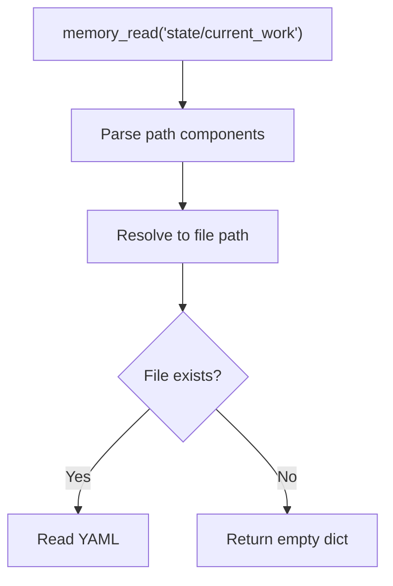

# Memory Paths

> Directory structure and path conventions

## Diagram

```mermaid
graph TB
    ROOT[memory/]

    subgraph State[state/ - Runtime State]
        CURRENT[current_work.yaml]
        ENVS[environments.yaml]
        KNOWLEDGE_STATE[knowledge.yaml]
        SHARED[shared_context.yaml]
        NOTIFICATIONS[notifications.yaml]
        ENV_HEALTH[environment_health.yaml]
        PROJECTS[projects/{name}/<br/>Per-project state]
    end

    subgraph Learned[learned/ - Patterns]
        PATTERNS[patterns.yaml]
        FAILURES[tool_failures.yaml]
        FIXES[tool_fixes.yaml]
    end

    subgraph Knowledge[knowledge/ - Domain]
        PERSONAS_K[personas/{persona}/<br/>Per-persona knowledge]
    end

    subgraph Sessions[sessions/ - History]
        SESSION_FILES[YYYY-MM-DD.yaml<br/>Daily session logs]
    end

    subgraph Style[style/ - Writing Style]
        STYLE_PROFILES[{user}_style_profile.yaml]
    end

    ROOT --> State
    ROOT --> Learned
    ROOT --> Knowledge
    ROOT --> Sessions
    ROOT --> Style
```

## Path Examples

| Path | Content | Example |
|------|---------|---------|
| `state/current_work.yaml` | Active issues, branches | `{active_issues: [AAP-123]}` |
| `state/environments.yaml` | Cluster configs | `{stage: {...}, prod: {...}}` |
| `state/knowledge.yaml` | Project knowledge state | `{last_scan: ...}` |
| `state/shared_context.yaml` | Shared session context | `{current_project: ...}` |
| `state/notifications.yaml` | Pending notifications | `{items: [...]}` |
| `state/projects/{name}/current_work.yaml` | Per-project work state | `{branch: feature/...}` |
| `learned/patterns.yaml` | Usage patterns | `{pattern: {frequency: 5}}` |
| `learned/tool_failures.yaml` | Error history | `{tool: {error: count}}` |
| `learned/tool_fixes.yaml` | Known fixes | `{error: {fix: ...}}` |
| `knowledge/personas/{persona}/{project}.yaml` | Persona project knowledge | `{architecture: {...}}` |
| `sessions/YYYY-MM-DD.yaml` | Daily session log | `{sessions: [...]}` |
| `style/{user}_style_profile.yaml` | Writing style profile | `{tone: ..., patterns: [...]}` |

## Directory Structure

```
memory/
├── state/
│   ├── current_work.yaml           # Global active issues/branches
│   ├── environments.yaml           # Environment health status
│   ├── environment_health.yaml     # Detailed health checks
│   ├── knowledge.yaml              # Knowledge scan state
│   ├── shared_context.yaml         # Shared session context
│   ├── notifications.yaml          # Pending notifications
│   └── projects/
│       ├── redhat-ai-workflow/
│       │   └── current_work.yaml   # Per-project work state
│       └── automation-analytics-backend/
│           └── current_work.yaml
├── learned/
│   ├── patterns.yaml               # Usage patterns
│   ├── tool_failures.yaml          # Tool error history
│   └── tool_fixes.yaml             # Known error fixes
├── knowledge/
│   └── personas/
│       ├── developer/              # Developer persona knowledge
│       │   ├── automation-analytics-backend.yaml
│       │   └── redhat-ai-workflow.yaml
│       └── devops/                 # DevOps persona knowledge
│           └── ...
├── sessions/
│   ├── 2026-02-04.yaml             # Today's session log
│   ├── 2026-02-03.yaml
│   └── ...
└── style/
    └── dave_style_profile.yaml     # User writing style
```

## File Examples

```yaml
# state/current_work.yaml
active_issues:
  - key: AAP-12345
    summary: Fix authentication bug
    branch: aap-12345-fix-auth
    status: In Progress

# sessions/2026-02-04.yaml
sessions:
  - id: abc123
    name: "Working on AAP-12345"
    started_at: "2026-02-04T09:00:00Z"
    persona: developer
    project: automation-analytics-backend
    tool_calls: 42

# style/dave_style_profile.yaml
tone: conversational
formality: medium
patterns:
  - use_contractions: true
  - oxford_comma: true
```

## Path Resolution



## Components

| Component | File | Description |
|-----------|------|-------------|
| memory_read | `memory_tools.py` | Read tool |
| memory_write | `memory_tools.py` | Write tool |
| MemoryDaemon | `services/memory/daemon.py` | File access |

## Related Diagrams

- [Memory Architecture](./memory-architecture.md)
- [Memory Operations](./memory-operations.md)
- [Session Logging](./session-logging.md)
