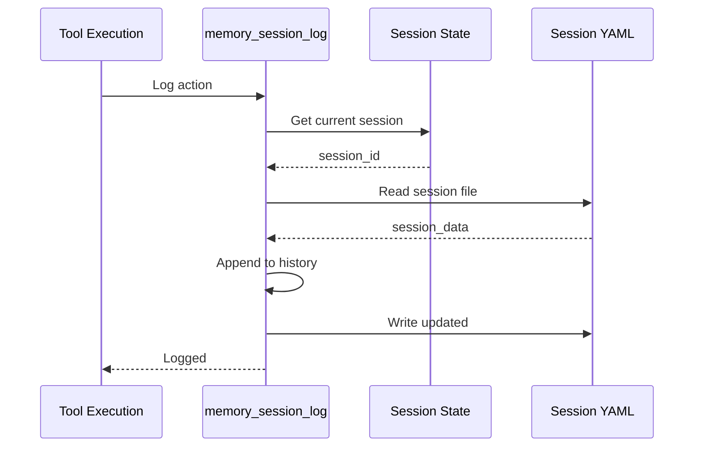
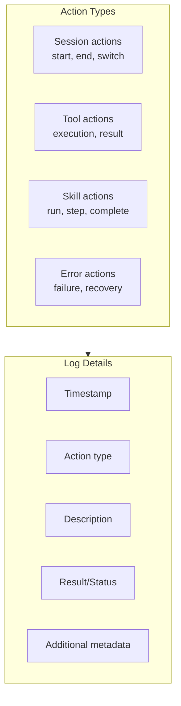
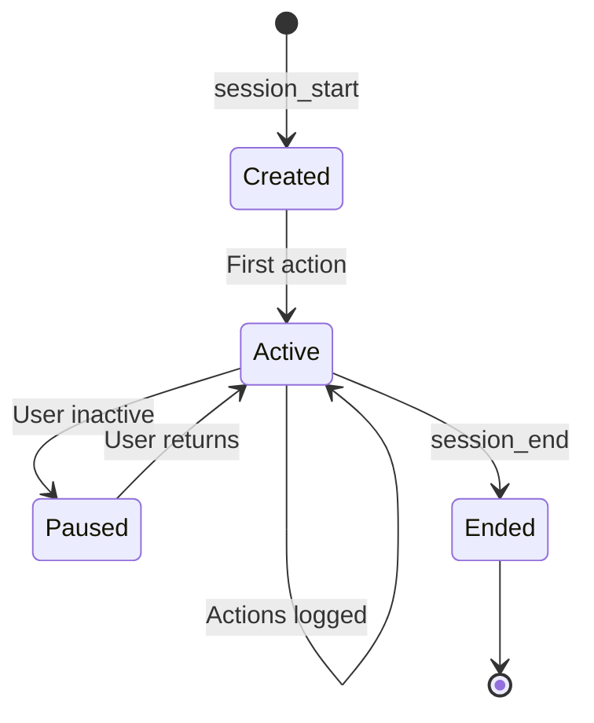
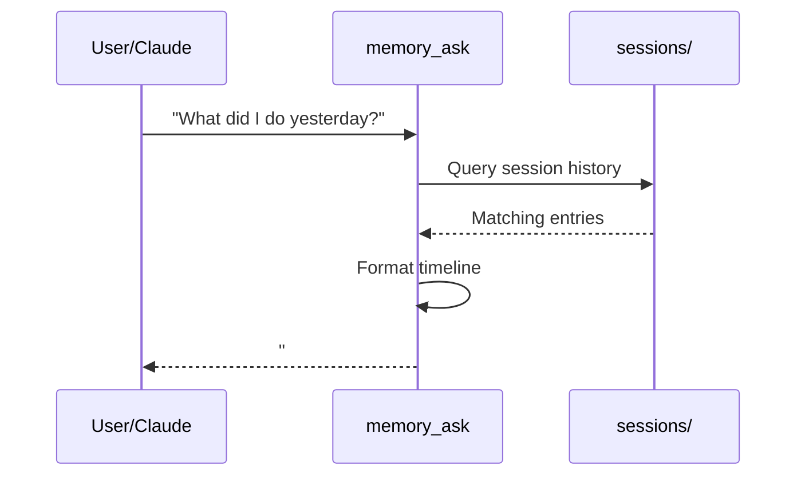

# Session Logging

> Session history and action logging

## Diagram

```mermaid
graph TB
    subgraph SessionStorage[sessions/]
        SESSION_FILES[{session_id}.yaml<br/>Session metadata]
        LOGS[logs/<br/>Action logs]
    end

    subgraph SessionData[Session Data]
        META[Metadata<br/>name, created, persona]
        HISTORY[History<br/>Actions, results]
        CONTEXT[Context<br/>Project, issues]
    end

    subgraph Logging[Logging Operations]
        SESSION_LOG[memory_session_log]
        SESSION_START[session_start]
        SESSION_END[session_end]
    end

    Logging --> SessionStorage
    SessionStorage --> SessionData
```

## Session File Structure

```yaml
# sessions/{session_id}.yaml
id: abc123-def456
name: "Fixing AAP-12345"
created: 2026-02-04T09:00:00
last_active: 2026-02-04T11:30:00

persona: developer
project: automation-analytics-backend

context:
  issue_key: AAP-12345
  branch: aap-12345-fix-auth

history:
  - timestamp: 2026-02-04T09:05:00
    action: session_start
    details: "Started with developer persona"

  - timestamp: 2026-02-04T09:10:00
    action: jira_view_issue
    details: "Viewed AAP-12345"
    result: success

  - timestamp: 2026-02-04T09:30:00
    action: git_checkout
    details: "Created branch aap-12345-fix-auth"
    result: success

  - timestamp: 2026-02-04T11:30:00
    action: git_commit
    details: "Committed fix"
    result: success
```

## Logging Flow



## Log Entry Types



## Session Lifecycle



## Log Queries



## Components

| Component | File | Description |
|-----------|------|-------------|
| memory_session_log | `memory_tools.py` | Log action |
| session_start | `session_tools.py` | Create session |
| Session files | `memory/sessions/` | YAML storage |

## Related Diagrams

- [Memory Architecture](./memory-architecture.md)
- [Session Management](../01-server/workspace-tools.md)
- [Session Bootstrap](../08-data-flows/session-bootstrap.md)
