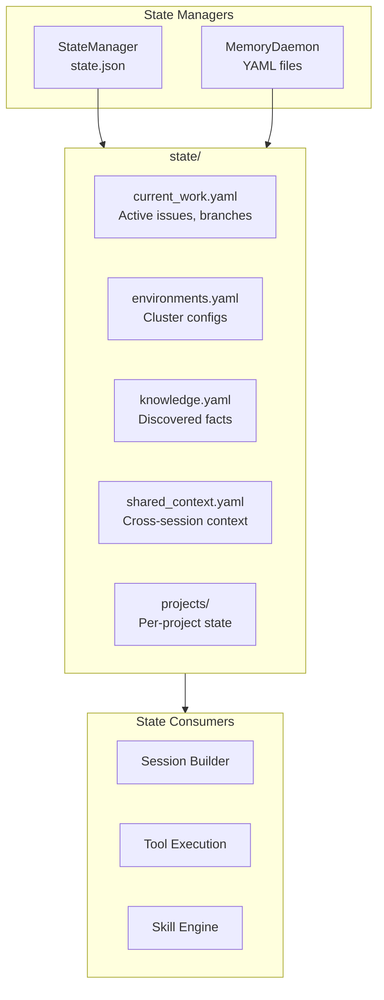
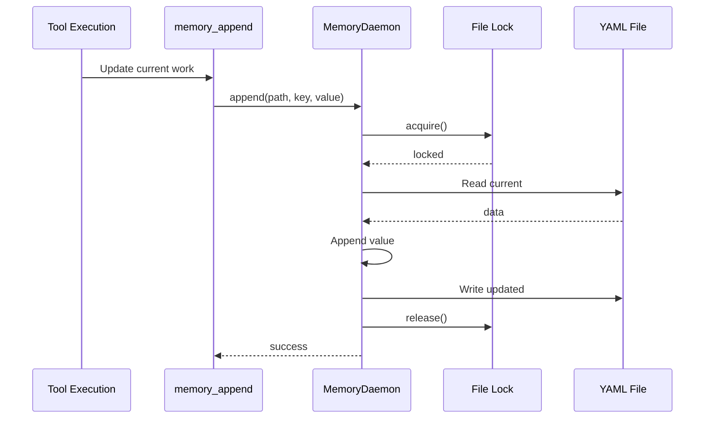
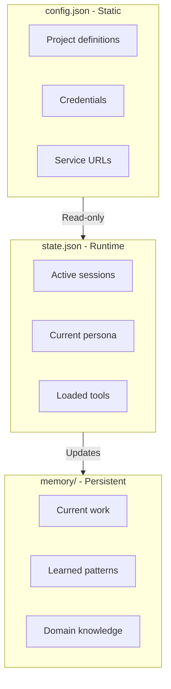

# State Persistence

> Runtime state storage and management

## Diagram



## State Files

```yaml
# state/current_work.yaml
active_issues:
  - key: AAP-12345
    summary: Fix authentication bug
    branch: aap-12345-fix-auth
    status: In Progress
    started: 2026-02-04T09:00:00

active_branches:
  - name: aap-12345-fix-auth
    issue: AAP-12345
    created: 2026-02-04T09:05:00
    last_commit: 2026-02-04T11:30:00

# state/environments.yaml
ephemeral:
  namespace: ephemeral-abc123
  reserved_until: 2026-02-04T17:00:00
  deployed_apps:
    - name: tower-analytics-clowdapp
      image: sha256:abc123...

stage:
  namespace: tower-analytics-stage
  last_deploy: 2026-02-03T14:00:00

# state/projects/automation-analytics-backend/current_work.yaml
branch: aap-12345-fix-auth
last_test_run: 2026-02-04T10:00:00
test_status: passed
```

## State Update Flow



## State vs Config



## Persistence Guarantees

| Storage | Durability | Consistency | Use Case |
|---------|------------|-------------|----------|
| state.json | Debounced write | Eventually consistent | Runtime state |
| memory/*.yaml | Immediate write | Strongly consistent | Persistent data |
| In-memory cache | None | Read-your-writes | Performance |

## Components

| Component | File | Description |
|-----------|------|-------------|
| StateManager | `server/state_manager.py` | state.json management |
| MemoryDaemon | `services/memory/daemon.py` | YAML file access |
| memory_write | `memory_tools.py` | Write tool |

## Related Diagrams

- [Memory Architecture](./memory-architecture.md)
- [State Manager](../01-server/state-manager.md)
- [Config System](../01-server/config-system.md)
