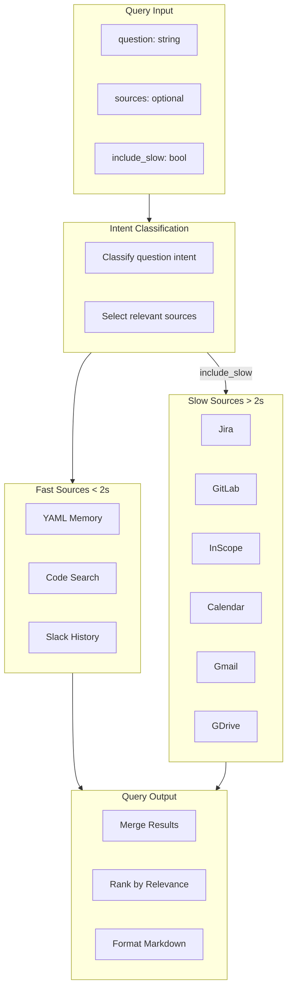
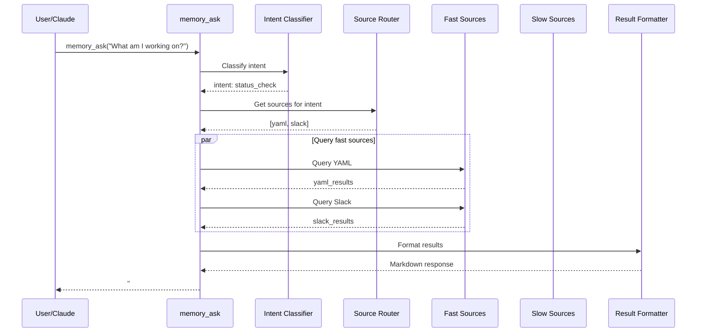
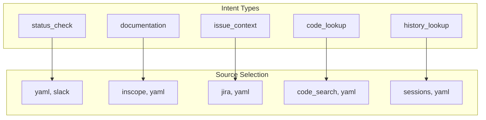

# Unified Memory Query

> memory_ask: intelligent context gathering

## Diagram



## Query Flow



## Source Selection



## Latency Classes

| Class | Sources | Latency | Use Case |
|-------|---------|---------|----------|
| Fast | yaml, code, slack | <2s | Bootstrap, quick queries |
| Slow | jira, gitlab, inscope, calendar, gmail, gdrive | >2s | Comprehensive search |

## Output Format

```markdown
## 🎯 Query: What am I working on?

**Intent:** status_check

### From YAML Memory
- Active issue: AAP-12345 (In Progress)
- Branch: aap-12345-fix-auth
- Last commit: 2h ago

### From Slack
- Recent discussion in #team about AAP-12345
- Mentioned by @colleague 1h ago

---
💡 Tip: Add `include_slow=true` to search Jira, GitLab
```

## Components

| Component | File | Description |
|-----------|------|-------------|
| memory_ask | `memory_unified.py` | Main tool |
| Intent classifier | `memory_unified.py` | Classify questions |
| Source router | `memory_unified.py` | Select sources |
| Adapters | `*/adapter.py` | Source implementations |

## Related Diagrams

- [Memory Architecture](./memory-architecture.md)
- [Adapter Pattern](../03-tools/adapter-pattern.md)
- [Session Bootstrap](../08-data-flows/session-bootstrap.md)
