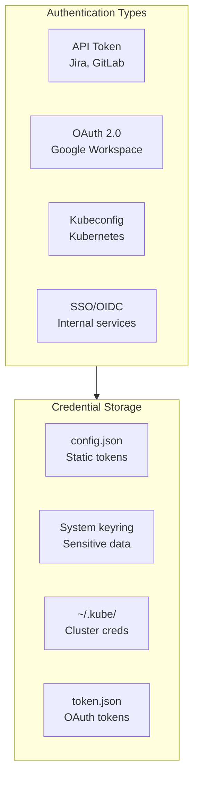
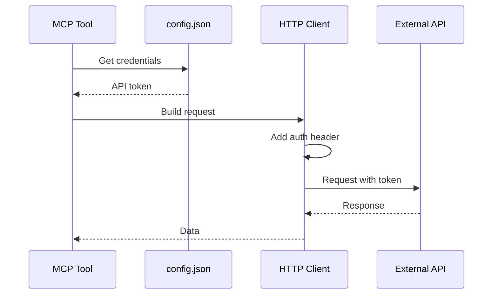
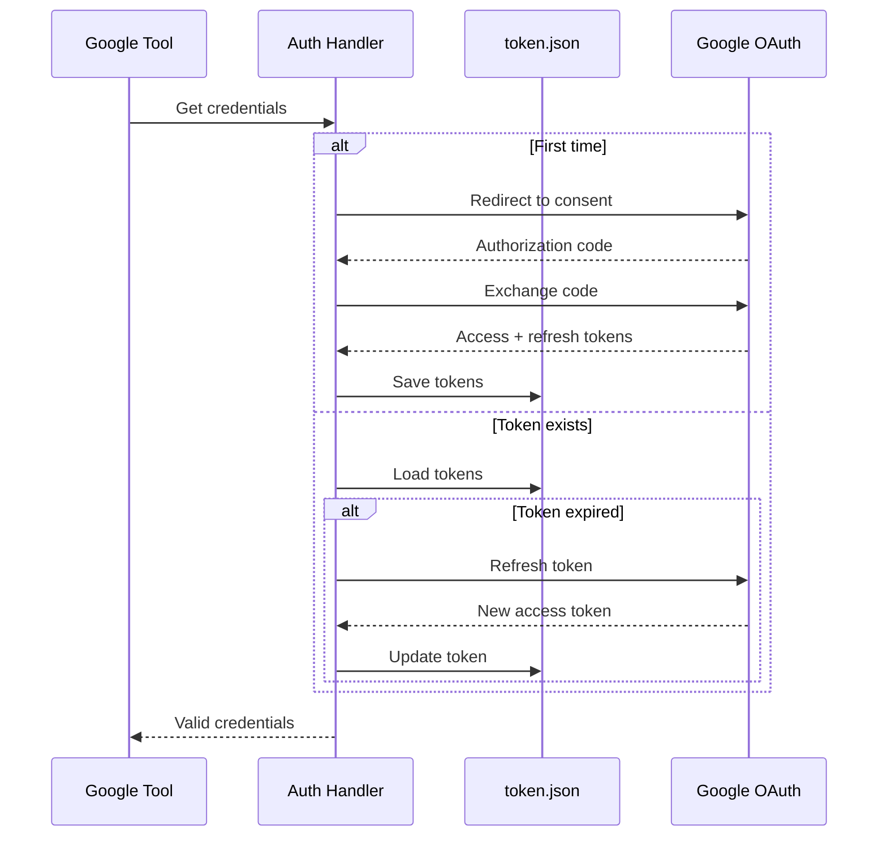
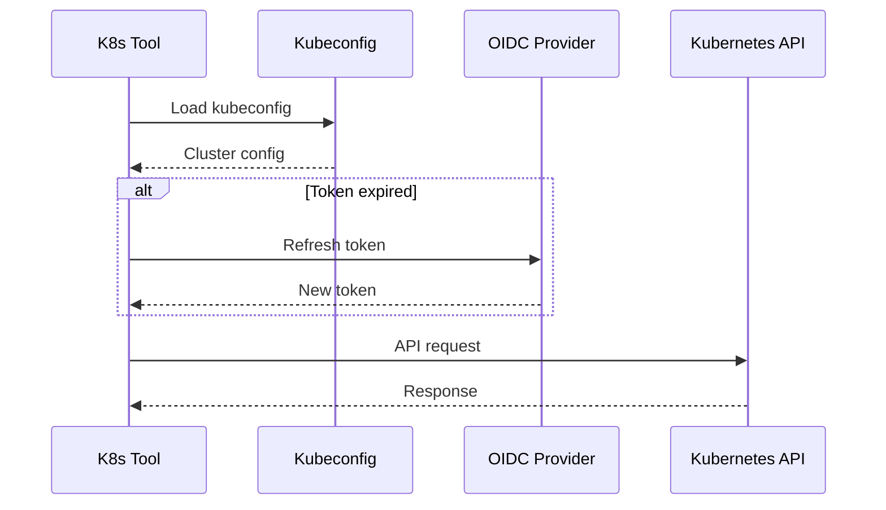
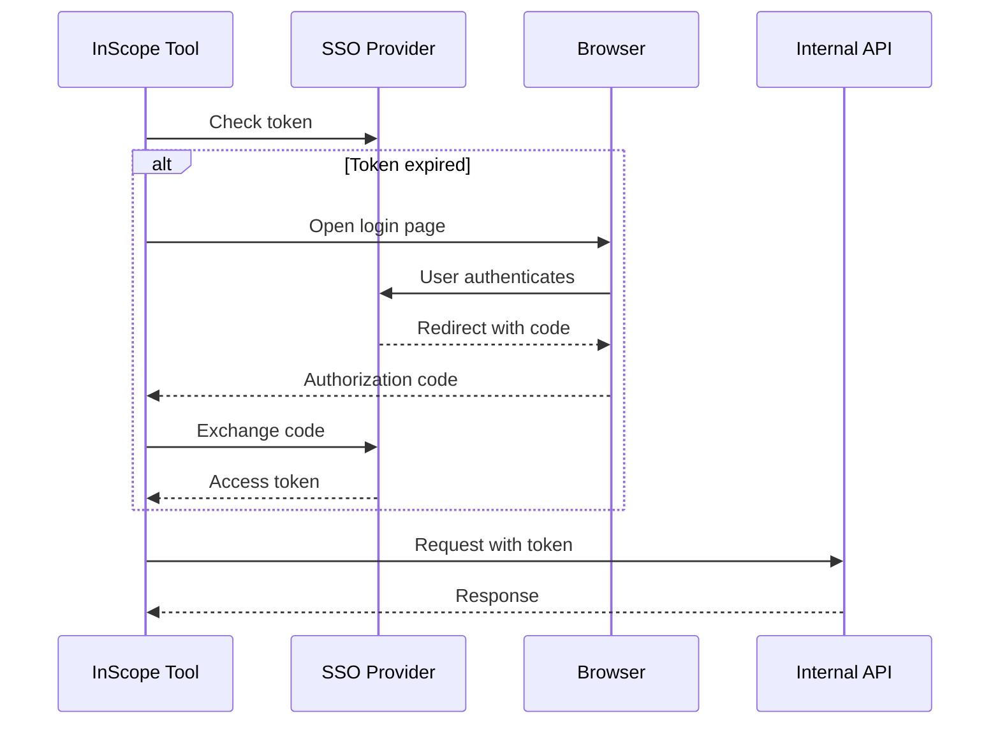
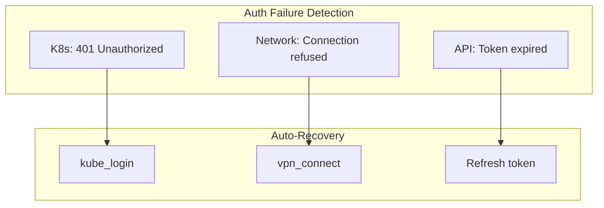

# Authentication Flows

> Authentication patterns across integrations

## Diagram

## API Token Flow

## OAuth 2.0 Flow

## Kubernetes Auth Flow

## SSO/OIDC Flow

## Auto-Heal for Auth

## Credential Matrix

| Service | Auth Type | Storage | Auto-Refresh |
|---------|-----------|---------|--------------|
| Jira | API Token | config.json | No |
| GitLab | PAT | config.json | No |
| Google | OAuth 2.0 | token.json | Yes |
| Kubernetes | OIDC | kubeconfig | Yes (auto-heal) |
| Slack | Bot Token | config.json | No |
| InScope | SSO | token cache | Yes |

## Components

| Component | File | Description |
|-----------|------|-------------|
| Config | `server/config.py` | Credential loading |
| Auto-heal | `server/auto_heal_decorator.py` | Auth recovery |
| Google auth | `tool_modules/aa_google_*/` | OAuth handling |

## Related Diagrams

- [Auto-Heal Decorator](../01-server/auto-heal-decorator.md)
- [Config System](../01-server/config-system.md)
- [Google Workspace](./google-workspace-integration.md)
