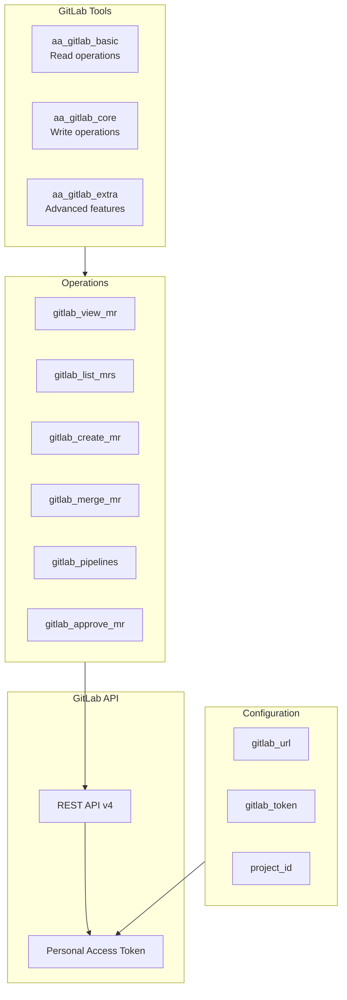
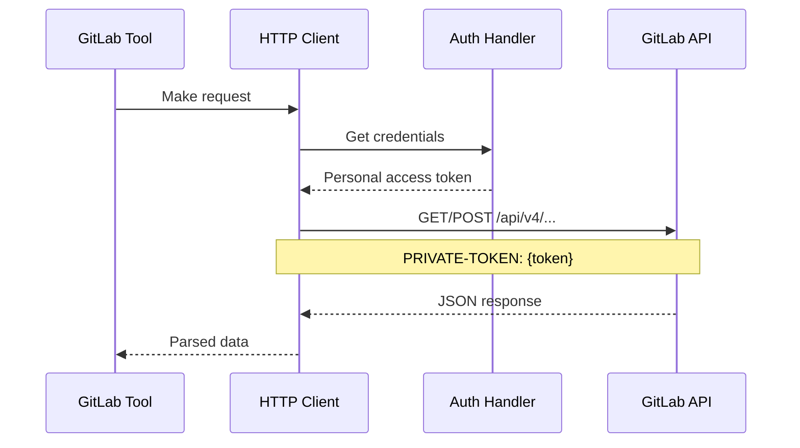
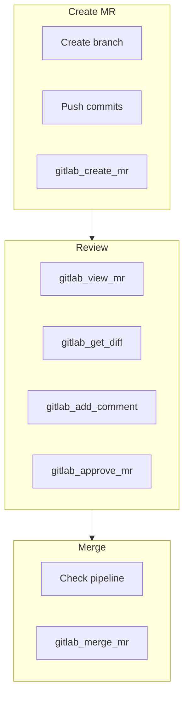

# GitLab Integration

> GitLab API integration architecture

## Diagram

## API Flow

## Tool Tiers

### Basic (Read-only)

| Tool | Description | Endpoint |
|------|-------------|----------|
| gitlab_view_mr | View MR details | GET /projects/{id}/merge_requests/{iid} |
| gitlab_list_mrs | List MRs | GET /projects/{id}/merge_requests |
| gitlab_pipelines | List pipelines | GET /projects/{id}/pipelines |
| gitlab_get_diff | Get MR diff | GET /projects/{id}/merge_requests/{iid}/changes |

### Core (Write)

| Tool | Description | Endpoint |
|------|-------------|----------|
| gitlab_create_mr | Create MR | POST /projects/{id}/merge_requests |
| gitlab_merge_mr | Merge MR | PUT /projects/{id}/merge_requests/{iid}/merge |
| gitlab_approve_mr | Approve MR | POST /projects/{id}/merge_requests/{iid}/approve |
| gitlab_add_comment | Add comment | POST /projects/{id}/merge_requests/{iid}/notes |

### Extra (Advanced)

| Tool | Description | Endpoint |
|------|-------------|----------|
| gitlab_rebase_mr | Rebase MR | PUT /projects/{id}/merge_requests/{iid}/rebase |
| gitlab_cancel_pipeline | Cancel pipeline | POST /projects/{id}/pipelines/{id}/cancel |
| gitlab_retry_pipeline | Retry pipeline | POST /projects/{id}/pipelines/{id}/retry |

## MR Workflow

## Components

| Component | File | Description |
|-----------|------|-------------|
| tools_basic | `tool_modules/aa_gitlab/src/tools_basic.py` | Read tools |
| tools_core | `tool_modules/aa_gitlab/src/tools_core.py` | Write tools |
| tools_extra | `tool_modules/aa_gitlab/src/tools_extra.py` | Advanced tools |
| adapter | `tool_modules/aa_gitlab/src/adapter.py` | Memory adapter |

## Related Diagrams

- [Tool Tiers](../03-tools/tool-tiers.md)
- [GitLab Tools](../03-tools/gitlab-tools.md)
- [Auth Flows](./auth-flows.md)
