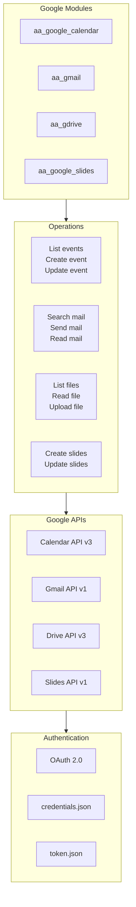
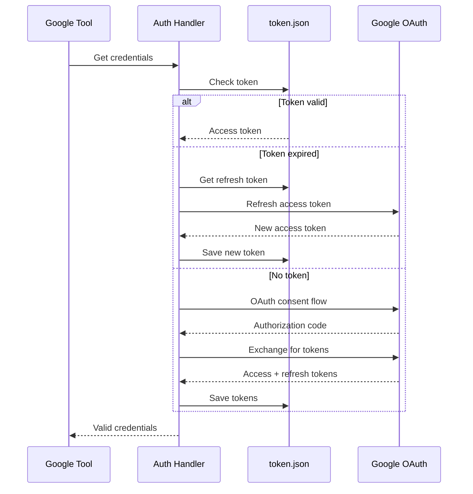

# Google Workspace Integration

> Calendar, Gmail, Drive, and Slides integration

## Diagram

## OAuth Flow

## Calendar Tools

| Tool | Description | API |
|------|-------------|-----|
| calendar_list_events | List upcoming events | events.list |
| calendar_create_event | Create event | events.insert |
| calendar_update_event | Update event | events.update |
| calendar_delete_event | Delete event | events.delete |

## Gmail Tools

| Tool | Description | API |
|------|-------------|-----|
| gmail_search | Search emails | messages.list |
| gmail_read | Read email | messages.get |
| gmail_send | Send email | messages.send |
| gmail_reply | Reply to email | messages.send |

## Drive Tools

| Tool | Description | API |
|------|-------------|-----|
| gdrive_list | List files | files.list |
| gdrive_read | Read file | files.get |
| gdrive_upload | Upload file | files.create |
| gdrive_share | Share file | permissions.create |

## Slides Tools

| Tool | Description | API |
|------|-------------|-----|
| slides_create | Create presentation | presentations.create |
| slides_add_slide | Add slide | presentations.batchUpdate |
| slides_update_text | Update text | presentations.batchUpdate |

## Components

| Component | File | Description |
|-----------|------|-------------|
| aa_google_calendar | `tool_modules/aa_google_calendar/` | Calendar tools |
| aa_gmail | `tool_modules/aa_gmail/` | Gmail tools |
| aa_gdrive | `tool_modules/aa_gdrive/` | Drive tools |
| aa_google_slides | `tool_modules/aa_google_slides/` | Slides tools |

## Related Diagrams

- [Google Tools](../03-tools/google-tools.md)
- [Auth Flows](./auth-flows.md)
- [Meet Daemon](../02-services/meet-daemon.md)
