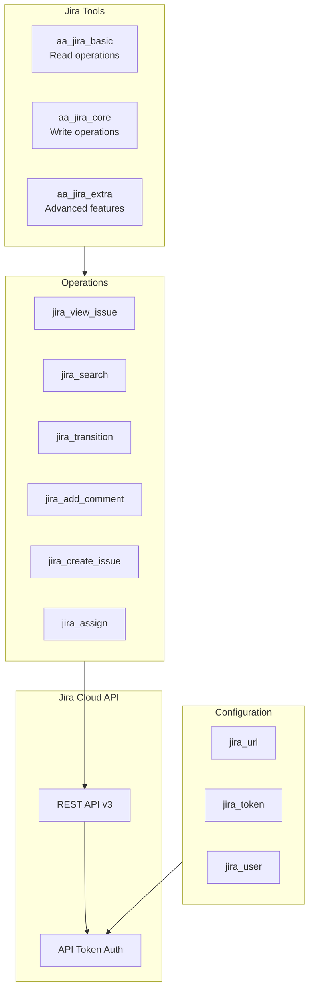
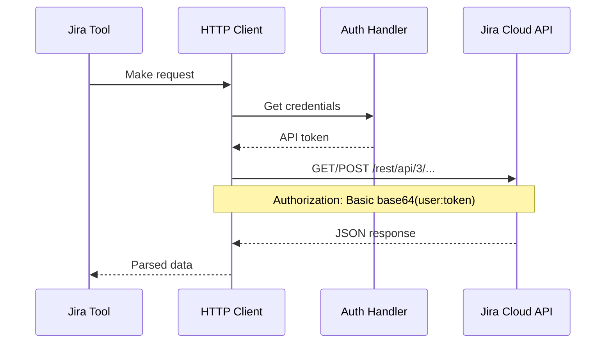
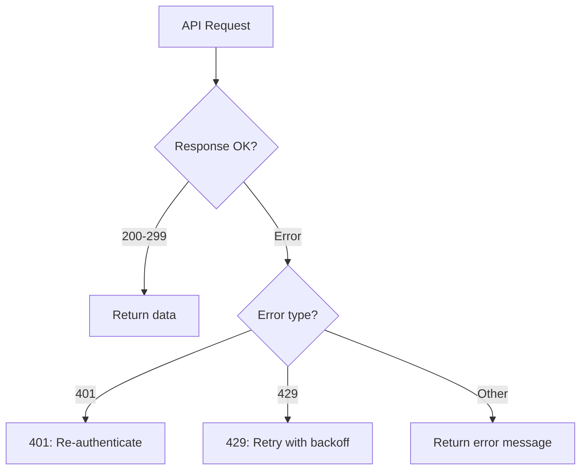

# Jira Integration

> Jira Cloud API integration architecture

## Diagram

## API Flow

## Tool Tiers

### Basic (Read-only)

| Tool | Description | Endpoint |
|------|-------------|----------|
| jira_view_issue | View issue details | GET /issue/{key} |
| jira_search | Search issues (JQL) | POST /search |
| jira_list_transitions | List available transitions | GET /issue/{key}/transitions |
| jira_get_comments | Get issue comments | GET /issue/{key}/comment |

### Core (Write)

| Tool | Description | Endpoint |
|------|-------------|----------|
| jira_transition | Change issue status | POST /issue/{key}/transitions |
| jira_add_comment | Add comment | POST /issue/{key}/comment |
| jira_assign | Assign issue | PUT /issue/{key}/assignee |
| jira_update_fields | Update fields | PUT /issue/{key} |

### Extra (Advanced)

| Tool | Description | Endpoint |
|------|-------------|----------|
| jira_create_issue | Create new issue | POST /issue |
| jira_link_issues | Link issues | POST /issueLink |
| jira_bulk_update | Bulk operations | POST /issue/bulk |

## Error Handling

## Components

| Component | File | Description |
|-----------|------|-------------|
| tools_basic | `tool_modules/aa_jira/src/tools_basic.py` | Read tools |
| tools_core | `tool_modules/aa_jira/src/tools_core.py` | Write tools |
| tools_extra | `tool_modules/aa_jira/src/tools_extra.py` | Advanced tools |
| adapter | `tool_modules/aa_jira/src/adapter.py` | Memory adapter |

## Related Diagrams

- [Tool Tiers](../03-tools/tool-tiers.md)
- [Jira Tools](../03-tools/jira-tools.md)
- [Auth Flows](./auth-flows.md)
