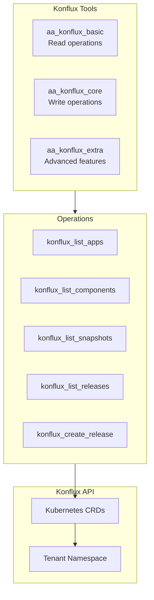
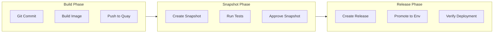
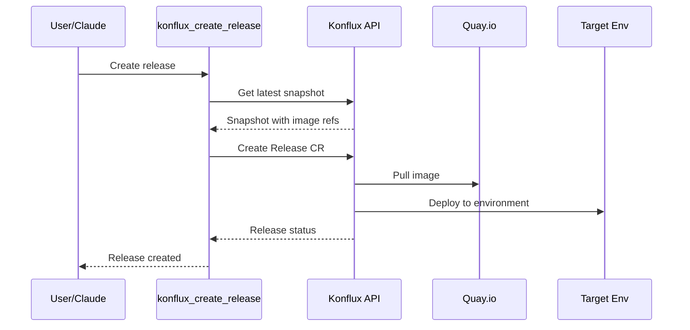

# Konflux Integration

> Konflux release pipeline integration

## Diagram

## Release Pipeline

## Tool Tiers

### Basic (Read-only)

| Tool | Description | Resource |
|------|-------------|----------|
| konflux_list_apps | List applications | Application CRD |
| konflux_list_components | List components | Component CRD |
| konflux_list_snapshots | List snapshots | Snapshot CRD |
| konflux_list_releases | List releases | Release CRD |
| konflux_get_release | Get release details | Release CRD |

### Core (Write)

| Tool | Description | Resource |
|------|-------------|----------|
| konflux_create_release | Create release | Release CRD |
| konflux_approve_snapshot | Approve snapshot | Snapshot CRD |

### Extra (Advanced)

| Tool | Description | Resource |
|------|-------------|----------|
| konflux_rollback | Rollback release | Release CRD |
| konflux_promote | Promote to env | ReleasePlan CRD |

## Release Flow

## Components

| Component | File | Description |
|-----------|------|-------------|
| tools_basic | `tool_modules/aa_konflux/src/tools_basic.py` | Read tools |
| tools_core | `tool_modules/aa_konflux/src/tools_core.py` | Write tools |
| tools_extra | `tool_modules/aa_konflux/src/tools_extra.py` | Advanced tools |

## Related Diagrams

- [Konflux Tools](../03-tools/konflux-tools.md)
- [Deployment Skills](../04-skills/deployment-skills.md)
- [Release Persona](../05-personas/persona-definitions.md)
