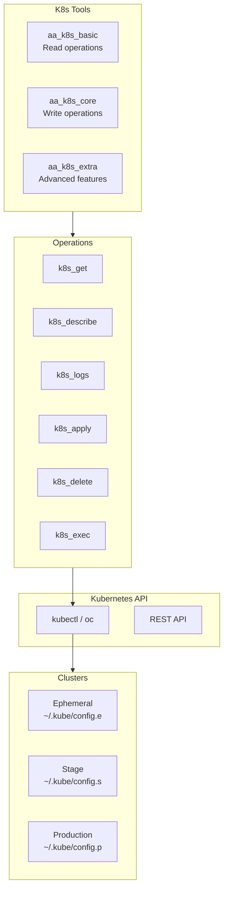
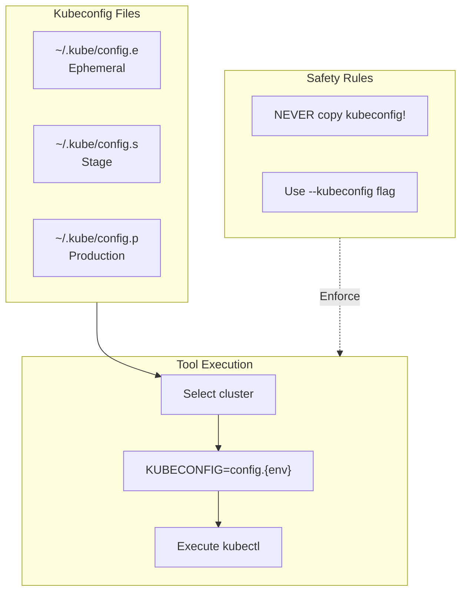
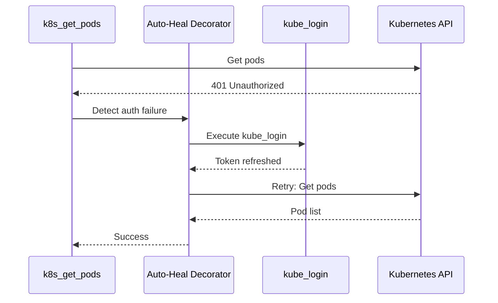

# Kubernetes Integration

> Multi-cluster Kubernetes API integration

## Diagram

## Multi-Cluster Access

## Tool Tiers

### Basic (Read-only)

| Tool | Description | Command |
|------|-------------|---------|
| k8s_get | Get resources | kubectl get {resource} |
| k8s_describe | Describe resource | kubectl describe {resource} |
| k8s_logs | Get pod logs | kubectl logs {pod} |
| k8s_get_events | Get events | kubectl get events |

### Core (Write)

| Tool | Description | Command |
|------|-------------|---------|
| k8s_apply | Apply manifest | kubectl apply -f |
| k8s_delete | Delete resource | kubectl delete {resource} |
| k8s_scale | Scale deployment | kubectl scale --replicas |
| k8s_rollout | Manage rollouts | kubectl rollout |

### Extra (Advanced)

| Tool | Description | Command |
|------|-------------|---------|
| k8s_exec | Execute in pod | kubectl exec |
| k8s_port_forward | Port forward | kubectl port-forward |
| k8s_cp | Copy files | kubectl cp |

## Auto-Heal Integration

## Components

| Component | File | Description |
|-----------|------|-------------|
| tools_basic | `tool_modules/aa_k8s/src/tools_basic.py` | Read tools |
| tools_core | `tool_modules/aa_k8s/src/tools_core.py` | Write tools |
| tools_extra | `tool_modules/aa_k8s/src/tools_extra.py` | Advanced tools |

## Related Diagrams

- [K8s Tools](../03-tools/k8s-tools.md)
- [Auto-Heal Decorator](../01-server/auto-heal-decorator.md)
- [Bonfire Tools](../03-tools/bonfire-tools.md)
