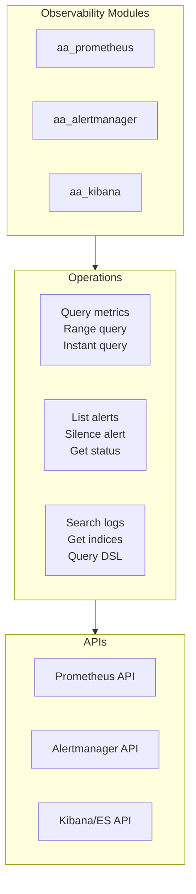
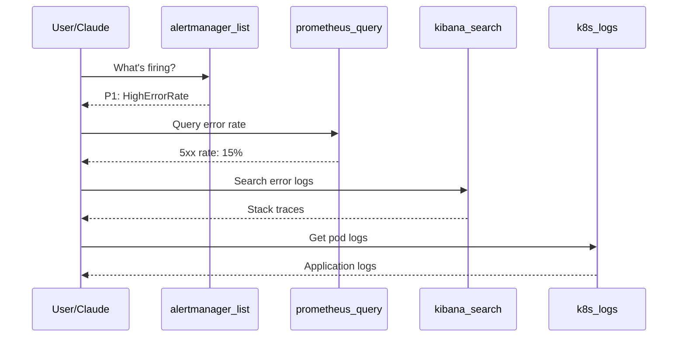
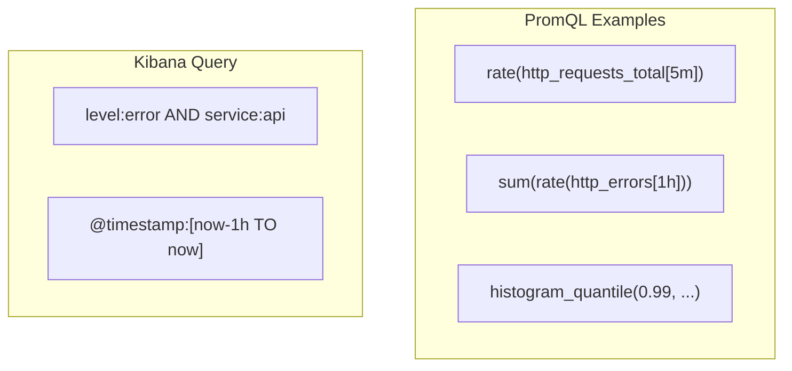

# Observability Integration

> Prometheus, Alertmanager, and Kibana integration

## Diagram

## Incident Response Flow

## Prometheus Tools

| Tool | Description | Endpoint |
|------|-------------|----------|
| prometheus_query | Instant query | /api/v1/query |
| prometheus_query_range | Range query | /api/v1/query_range |
| prometheus_alerts | Get alerts | /api/v1/alerts |
| prometheus_targets | Get targets | /api/v1/targets |

## Alertmanager Tools

| Tool | Description | Endpoint |
|------|-------------|----------|
| alertmanager_list | List alerts | /api/v2/alerts |
| alertmanager_silence | Create silence | /api/v2/silences |
| alertmanager_status | Get status | /api/v2/status |

## Kibana Tools

| Tool | Description | Endpoint |
|------|-------------|----------|
| kibana_search | Search logs | /_search |
| kibana_indices | List indices | /_cat/indices |
| kibana_query | DSL query | /_search |

## Query Examples

## Components

| Component | File | Description |
|-----------|------|-------------|
| aa_prometheus | `tool_modules/aa_prometheus/` | Metrics tools |
| aa_alertmanager | `tool_modules/aa_alertmanager/` | Alert tools |
| aa_kibana | `tool_modules/aa_kibana/` | Log tools |

## Related Diagrams

- [Observability Tools](../03-tools/observability-tools.md)
- [Incident Persona](../05-personas/persona-definitions.md)
- [Auto-Heal Decorator](../01-server/auto-heal-decorator.md)
