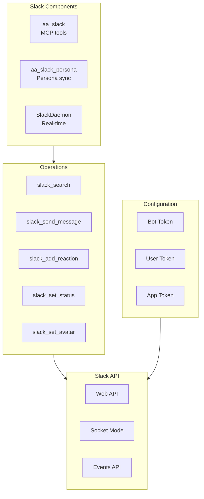
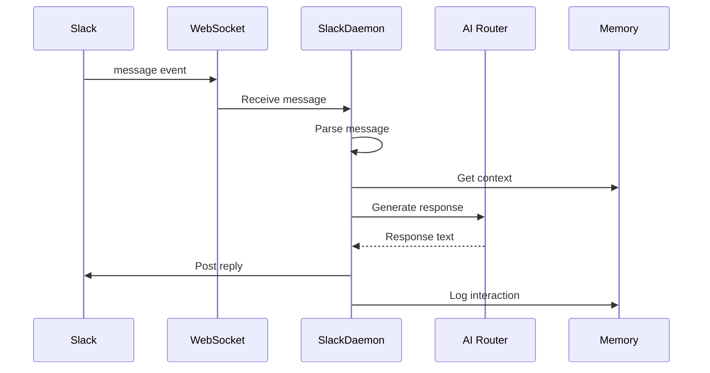
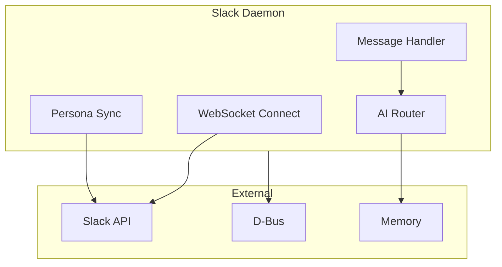
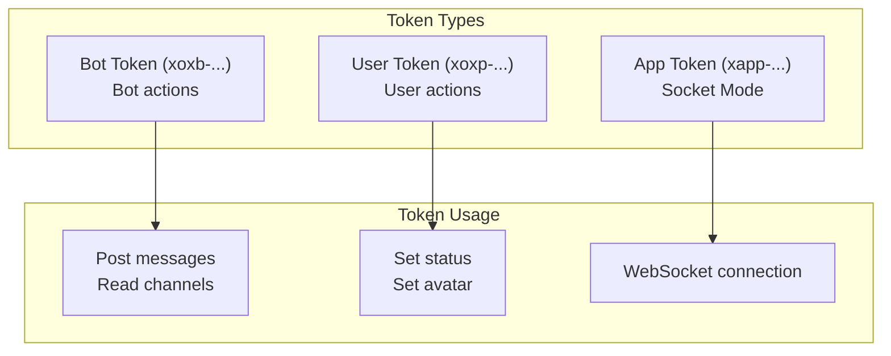

# Slack Integration

> Slack API and real-time messaging integration

## Diagram

## Real-Time Flow

## Tool Categories

### Message Tools

| Tool | Description | API |
|------|-------------|-----|
| slack_search | Search messages | search.messages |
| slack_send_message | Send message | chat.postMessage |
| slack_add_reaction | Add reaction | reactions.add |
| slack_get_thread | Get thread | conversations.replies |

### Persona Tools

| Tool | Description | API |
|------|-------------|-----|
| slack_set_status | Set status | users.profile.set |
| slack_set_avatar | Set avatar | users.setPhoto |
| slack_get_presence | Get presence | users.getPresence |

## Daemon Architecture

## Authentication

## Components

| Component | File | Description |
|-----------|------|-------------|
| aa_slack | `tool_modules/aa_slack/` | MCP tools |
| aa_slack_persona | `tool_modules/aa_slack_persona/` | Persona sync |
| SlackDaemon | `services/slack/daemon.py` | Real-time daemon |

## Related Diagrams

- [Slack Tools](../03-tools/slack-tools.md)
- [Slack Daemon](../02-services/slack-daemon.md)
- [Slack D-Bus](../02-services/slack-dbus.md)
