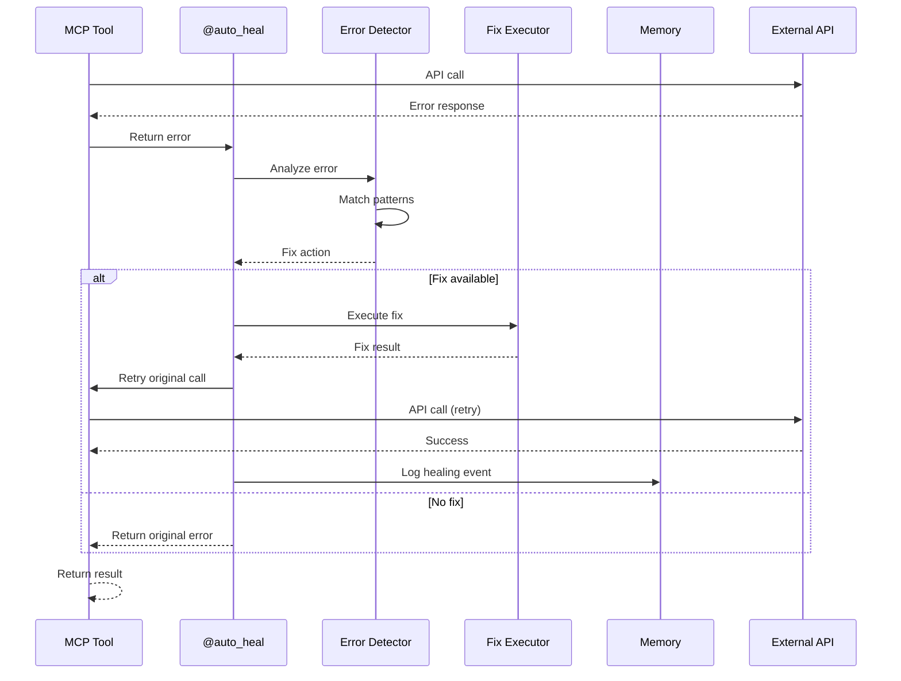
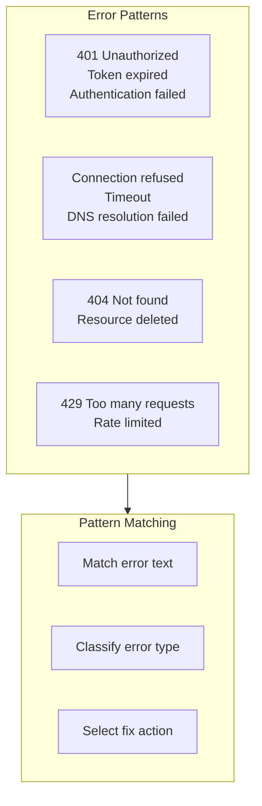
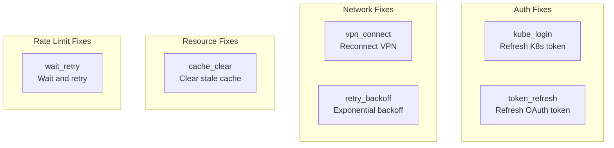
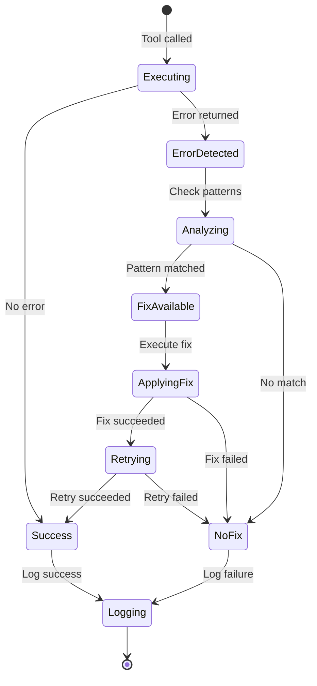

# Auto-Heal Flow

> Automatic error detection and recovery

## Diagram



## Error Detection



## Fix Actions



## State Machine



## Healing Log

```yaml
# memory/learned/tool_fixes.yaml
healing_events:
  - timestamp: 2026-02-04T10:30:00
    tool: k8s_get_pods
    error: "Unauthorized"
    fix_applied: kube_login
    result: success
    retry_count: 1

  - timestamp: 2026-02-04T11:00:00
    tool: gitlab_view_mr
    error: "Connection refused"
    fix_applied: vpn_connect
    result: success
    retry_count: 1
```

## Components

| Component | File | Description |
|-----------|------|-------------|
| auto_heal | `server/auto_heal_decorator.py` | Decorator |
| Error patterns | `auto_heal_decorator.py` | Pattern definitions |
| Fix actions | `auto_heal_decorator.py` | Fix implementations |

## Related Diagrams

- [Auto-Heal Decorator](../01-server/auto-heal-decorator.md)
- [Learned Patterns](../06-memory/learned-patterns.md)
- [Skill Error Handling](../04-skills/skill-error-handling.md)
