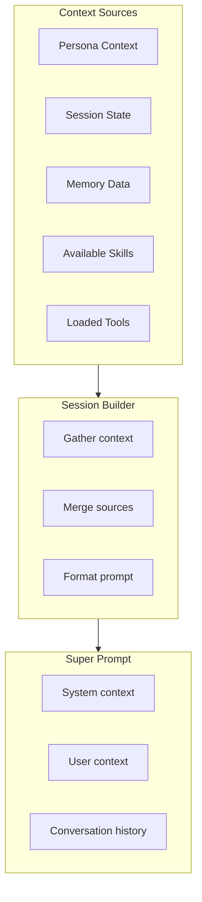
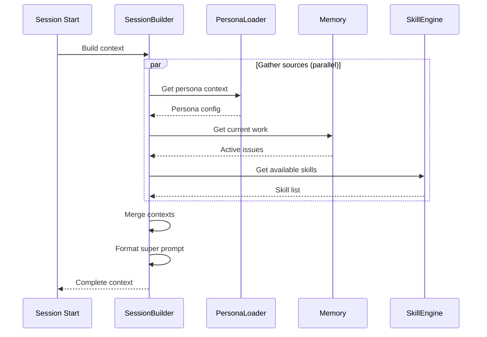
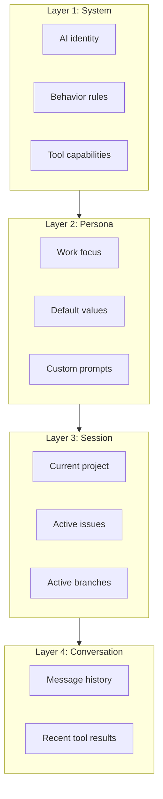
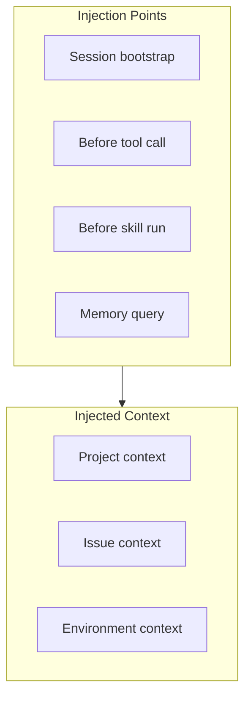

# Context Gathering

> How context is assembled for LLM interactions

## Diagram



## Context Assembly Flow



## Context Layers



## Super Prompt Structure

```markdown
## System Context
You are an AI assistant for software development workflows.

### Available Tools
- jira_view_issue: View Jira issue details
- git_status: Check git status
- ...

### Behavior Rules
- Use skills for common workflows
- Never discard uncommitted work
- ...

## Persona Context
**Current Persona:** developer
**Focus:** Code development and review

### Defaults
- Default branch: main
- Commit format: {issue_key} - {type}({scope}): {description}

## Session Context
**Project:** automation-analytics-backend
**Active Issue:** AAP-12345 (In Progress)
**Branch:** aap-12345-fix-auth

## Conversation History
[Previous messages and tool results]
```

## Context Injection Points



## Components

| Component | File | Description |
|-----------|------|-------------|
| SessionBuilder | `server/session_builder.py` | Context assembly |
| UsageContextInjector | `server/usage_context_injector.py` | Context injection |
| PersonaLoader | `server/persona_loader.py` | Persona context |

## Related Diagrams

- [Session Bootstrap](./session-bootstrap.md)
- [Persona Context](../05-personas/persona-context.md)
- [Session Builder](../01-server/session-builder.md)
