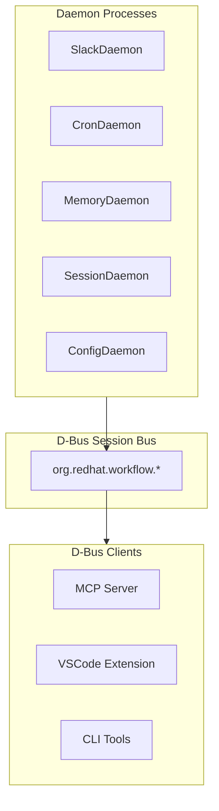
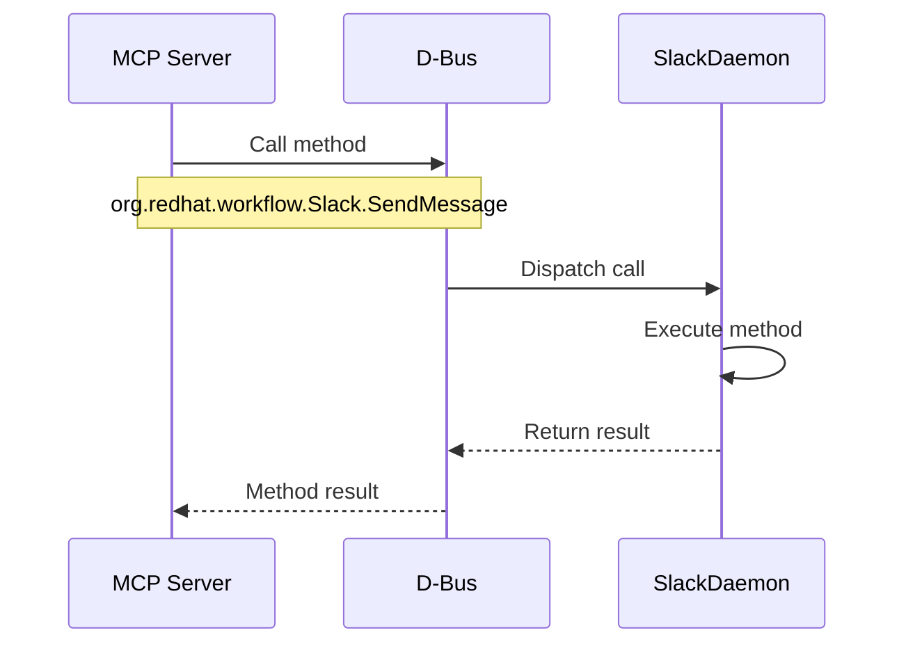
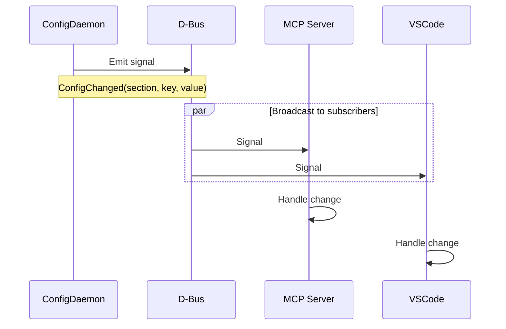
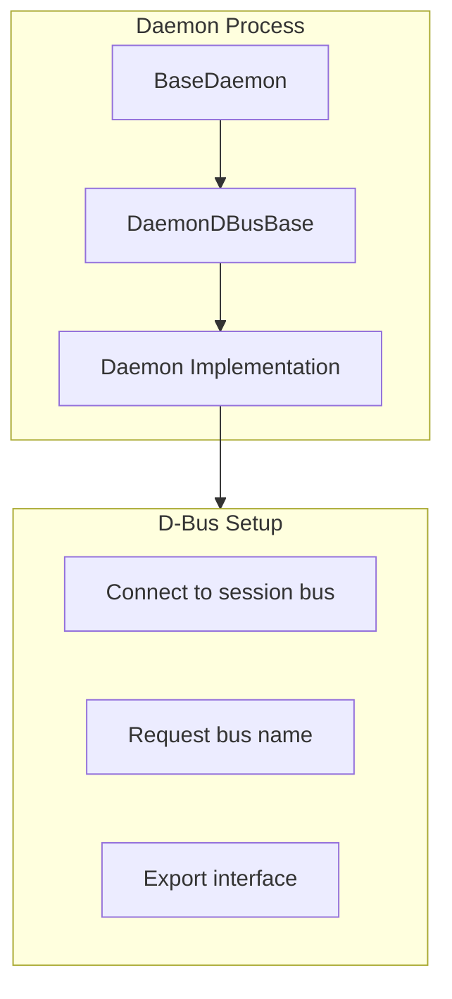

# D-Bus Communication

> Inter-process communication between daemons

## Diagram



## Service Names

| Daemon | D-Bus Name | Interface |
|--------|------------|-----------|
| Slack | `org.redhat.workflow.Slack` | `org.redhat.workflow.SlackInterface` |
| Cron | `org.redhat.workflow.Cron` | `org.redhat.workflow.CronInterface` |
| Memory | `org.redhat.workflow.Memory` | `org.redhat.workflow.MemoryInterface` |
| Session | `org.redhat.workflow.Session` | `org.redhat.workflow.SessionInterface` |
| Config | `org.redhat.workflow.Config` | `org.redhat.workflow.ConfigInterface` |

## Method Call Flow



## Signal Flow



## Common Methods

### SlackDaemon

```python
# Methods
SendMessage(channel: str, text: str) -> str
GetStatus() -> dict
SetPersona(status: str, emoji: str) -> bool

# Signals
MessageReceived(channel: str, user: str, text: str)
```

### CronDaemon

```python
# Methods
ListJobs() -> list
AddJob(name: str, schedule: str, command: str) -> str
RemoveJob(job_id: str) -> bool
TriggerJob(job_id: str) -> dict

# Signals
JobStarted(job_id: str, name: str)
JobCompleted(job_id: str, result: str)
```

### MemoryDaemon

```python
# Methods
Read(path: str) -> str  # YAML string
Write(path: str, data: str) -> bool
Invalidate(path: str) -> bool

# Signals
MemoryChanged(path: str)
```

## D-Bus Integration Pattern



## Components

| Component | File | Description |
|-----------|------|-------------|
| DaemonDBusBase | `services/base/dbus.py` | D-Bus mixin |
| BaseDaemon | `services/base/daemon.py` | Base class |
| Daemon implementations | `services/*/daemon.py` | Specific daemons |

## Related Diagrams

- [Base Daemon](../02-services/base-daemon.md)
- [Slack D-Bus](../02-services/slack-dbus.md)
- [Daemon Overview](../02-services/daemon-overview.md)
