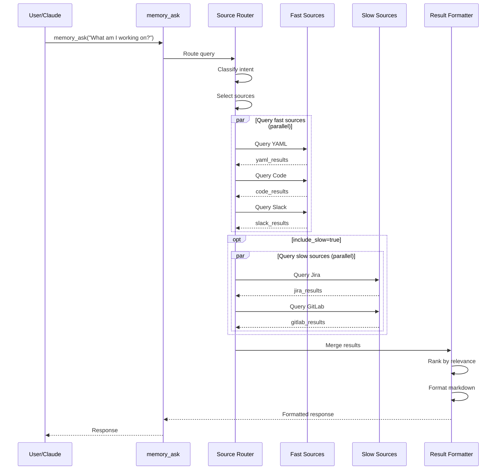
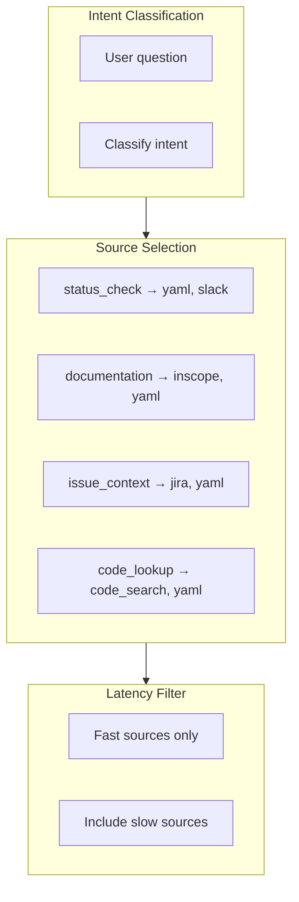
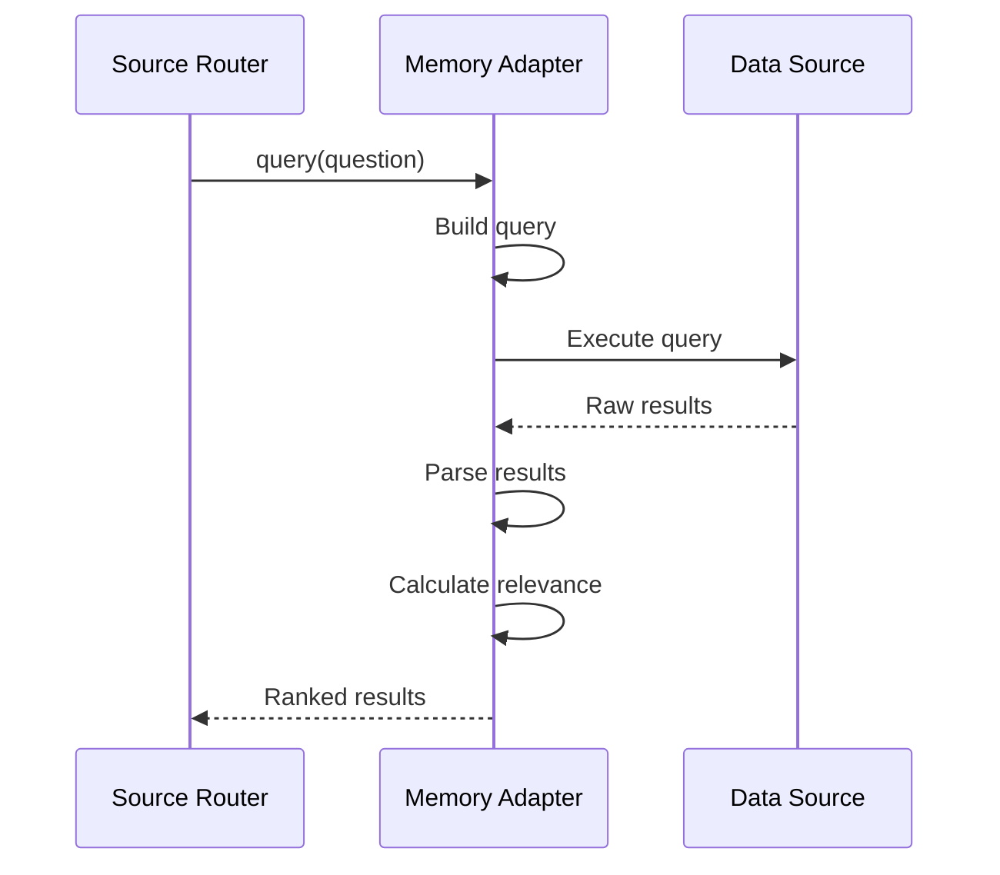
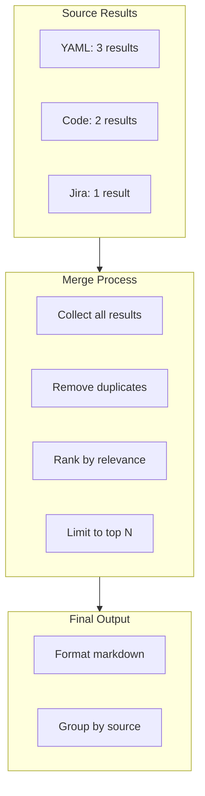
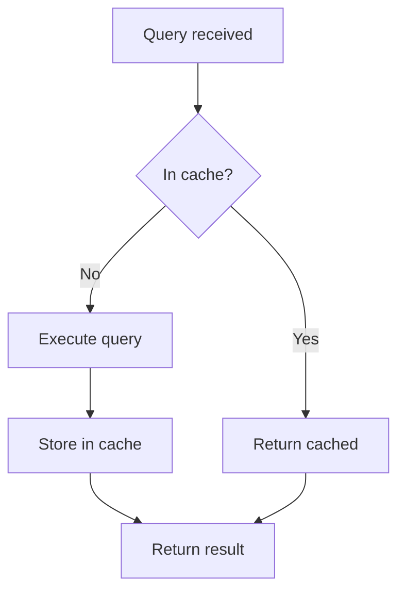

# Memory Query Flow

> Data flow for memory queries

## Diagram

## Source Selection

## Adapter Query Flow

## Result Merging

## Query Caching

## Components

| Component | File | Description |
|-----------|------|-------------|
| memory_ask | `memory_unified.py` | Main tool |
| Source router | `memory_unified.py` | Query routing |
| Adapters | `*/adapter.py` | Source implementations |

## Related Diagrams

- [Unified Memory Query](../06-memory/unified-memory-query.md)
- [Adapter Pattern](../03-tools/adapter-pattern.md)
- [Memory Architecture](../06-memory/memory-architecture.md)
