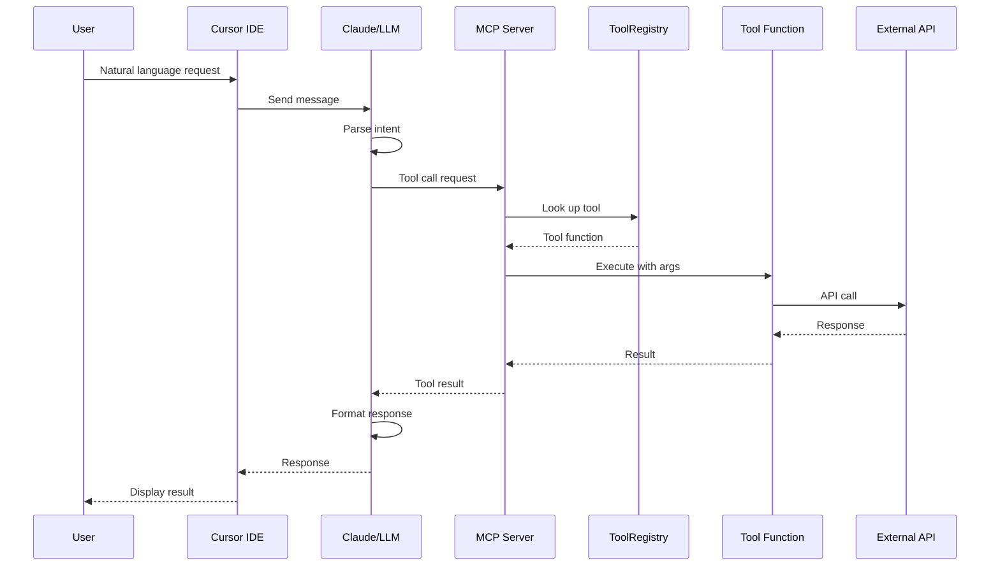
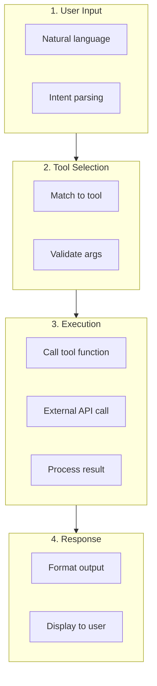
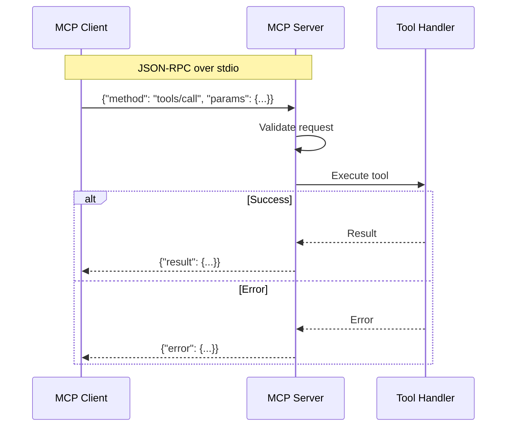
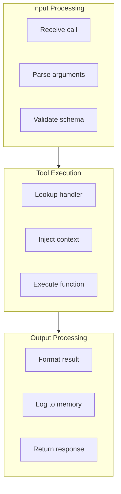

# Request Lifecycle

> End-to-end flow of an MCP tool request

## Diagram

## Request Phases

## MCP Protocol Flow

## Tool Execution Detail

## Components

| Component | File | Description |
|-----------|------|-------------|
| MCP Server | `server/main.py` | Request handling |
| ToolRegistry | `server/tool_registry.py` | Tool lookup |
| Tool handlers | `tool_modules/*/src/*.py` | Tool functions |

## Related Diagrams

- [MCP Server Core](../01-server/mcp-server-core.md)
- [Tool Registry](../01-server/tool-registry.md)
- [Skill Execution Flow](../04-skills/skill-execution-flow.md)
