# Session Bootstrap

> Session initialization and context loading

## Diagram


## Bootstrap Phases


## Intent Classification

```mermaid
flowchart TB
    subgraph Input[Classification Input]
        SESSION_NAME[Session name]
        PROJECT[Project context]
        RECENT[Recent activity]
    end

    subgraph Keywords[Intent Keywords]
        CODE["code, MR, review → code_lookup"]
        DEPLOY["deploy, ephemeral → deployment"]
        DEBUG["alert, incident → troubleshooting"]
        DOCS["how, what, docs → documentation"]
    end

    subgraph Output[Classification Output]
        INTENT[Detected intent]
        CONF[Confidence score]
        PERSONA[Suggested persona]
    end

    Input --> Keywords
    Keywords --> Output
```



## Context Building


## Bootstrap Output

```markdown
## 🎯 Bootstrap Context

**Session ID:** abc123-def456
**Detected Intent:** code_lookup (85% confidence)
**Auto-loading Persona:** developer

### Current Work
- **Active Issue:** AAP-12345 (In Progress)
- **Branch:** aap-12345-fix-auth
- **Last Commit:** 2h ago

### Recommended Actions
- Use `jira_view_issue` to check issue details
- Use `git_status` to see uncommitted changes
- Use `create_mr` when ready to submit

---
💡 Tip: Add `include_slow=true` to query Jira, GitLab
```

## Components

| Component | File | Description |
|-----------|------|-------------|
| session_start | `session_tools.py` | Bootstrap tool |
| SessionBuilder | `session_builder.py` | Context building |
| Intent classifier | `session_builder.py` | Intent detection |

## Related Diagrams

- [Session Management](../01-server/workspace-tools.md)
- [Persona Loading Flow](../05-personas/persona-loading-flow.md)
- [Unified Memory Query](../06-memory/unified-memory-query.md)
