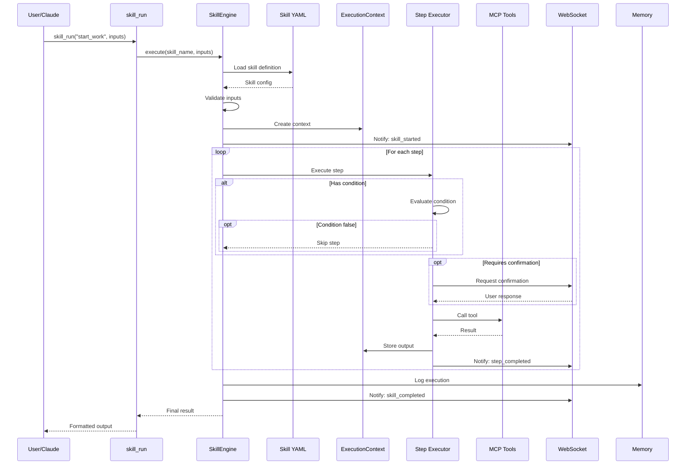
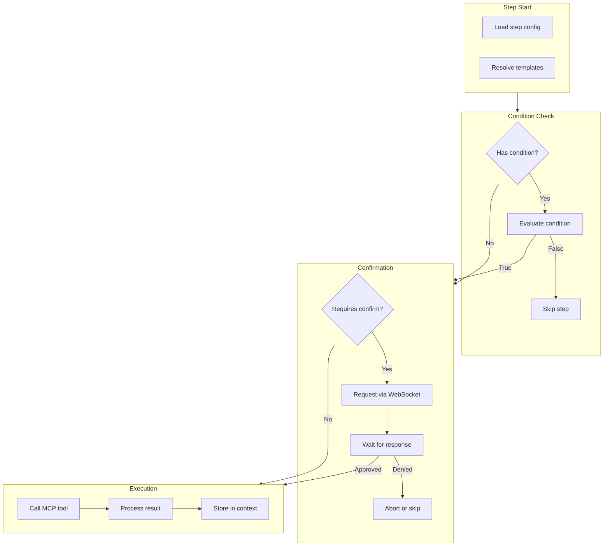
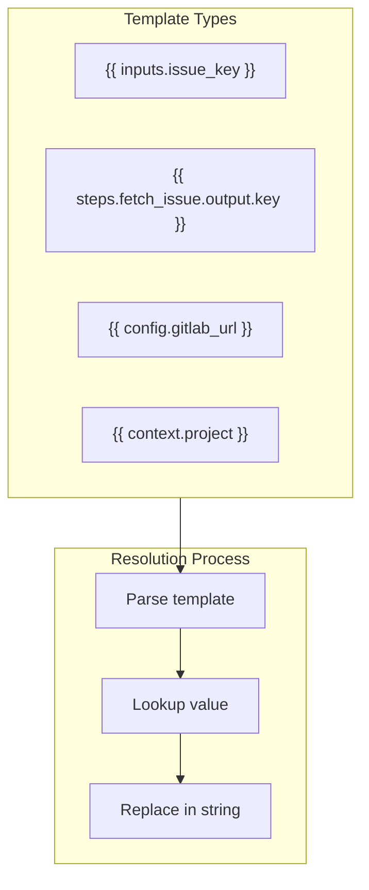
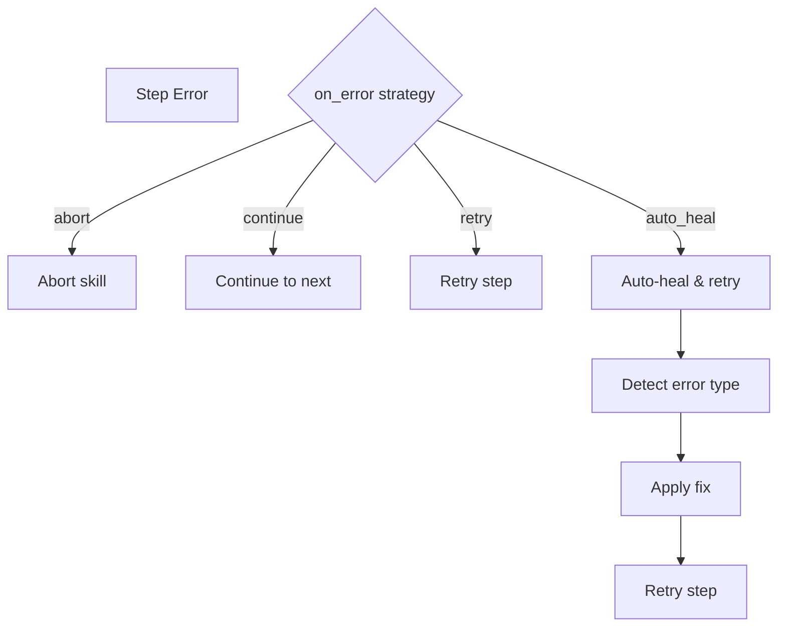

# Skill Execution Flow

> Complete flow of skill execution

## Diagram

## Step Execution Detail

## Template Resolution

## Error Handling

## Components

| Component | File | Description |
|-----------|------|-------------|
| SkillEngine | `tool_modules/aa_workflow/src/skill_engine.py` | Main engine |
| skill_run | `tool_modules/aa_workflow/src/tools_core.py` | MCP tool |
| WebSocket | `server/websocket_server.py` | Notifications |

## Related Diagrams

- [Skill Engine Architecture](../04-skills/skill-engine-architecture.md)
- [Skill State Machine](../04-skills/skill-state-machine.md)
- [Skill Error Handling](../04-skills/skill-error-handling.md)
