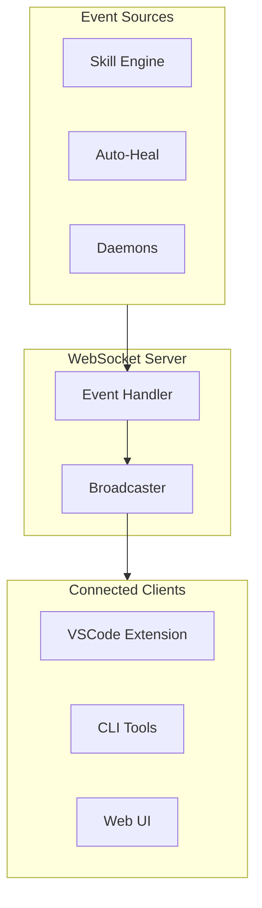
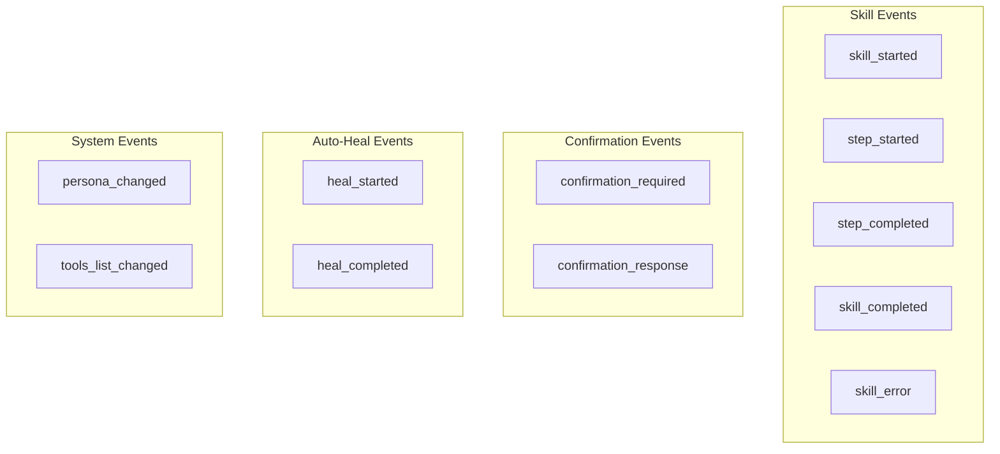
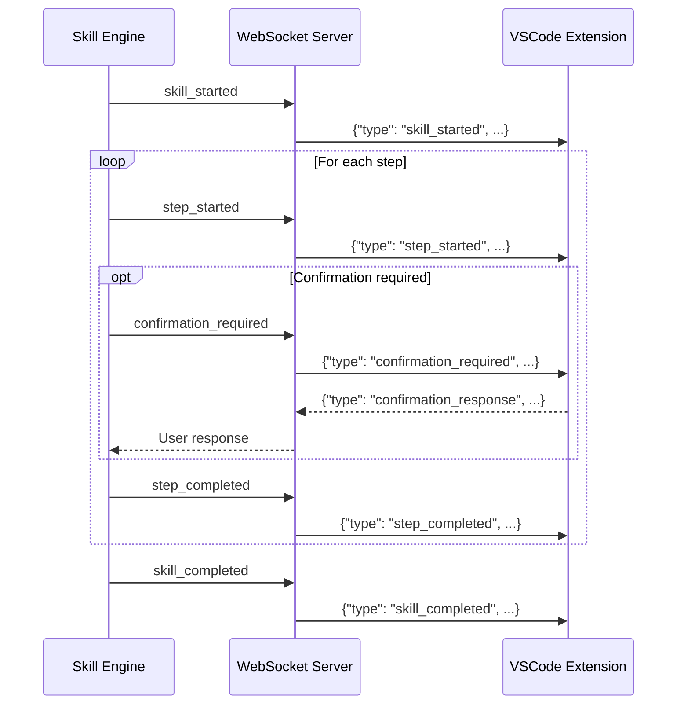
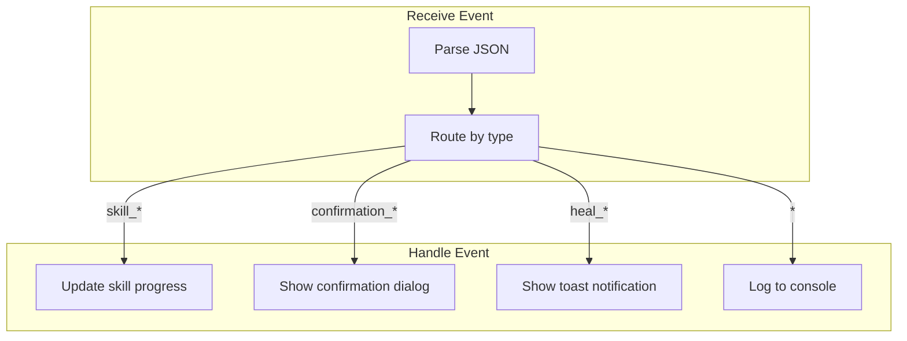

# WebSocket Events

> Real-time event flow to clients

## Diagram



## Event Types



## Event Flow



## Event Schemas

```typescript
// Skill started
{
  "type": "skill_started",
  "skill_name": "start_work",
  "session_id": "abc123",
  "timestamp": "2026-02-04T10:30:00Z"
}

// Step completed
{
  "type": "step_completed",
  "skill_name": "start_work",
  "step_name": "fetch_issue",
  "step_index": 0,
  "total_steps": 5,
  "result": "success",
  "output": {...}
}

// Confirmation required
{
  "type": "confirmation_required",
  "skill_name": "start_work",
  "step_name": "create_branch",
  "message": "Create branch aap-12345-fix-auth?",
  "options": ["yes", "no", "skip"],
  "timeout_seconds": 60
}

// Auto-heal event
{
  "type": "heal_started",
  "tool_name": "k8s_get_pods",
  "error": "Unauthorized",
  "fix_action": "kube_login"
}
```

## Client Handling



## Components

| Component | File | Description |
|-----------|------|-------------|
| WebSocket Server | `server/websocket_server.py` | Event broadcasting |
| VSCode handler | `extensions/aa_workflow_vscode/` | Client handling |
| Skill Engine | `skill_engine.py` | Event emission |

## Related Diagrams

- [WebSocket Server](../01-server/websocket-server.md)
- [Skill Execution Flow](./skill-execution-flow.md)
- [Auto-Heal Flow](./auto-heal-flow.md)
