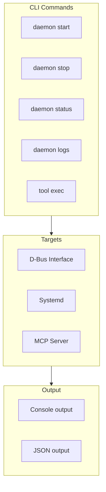
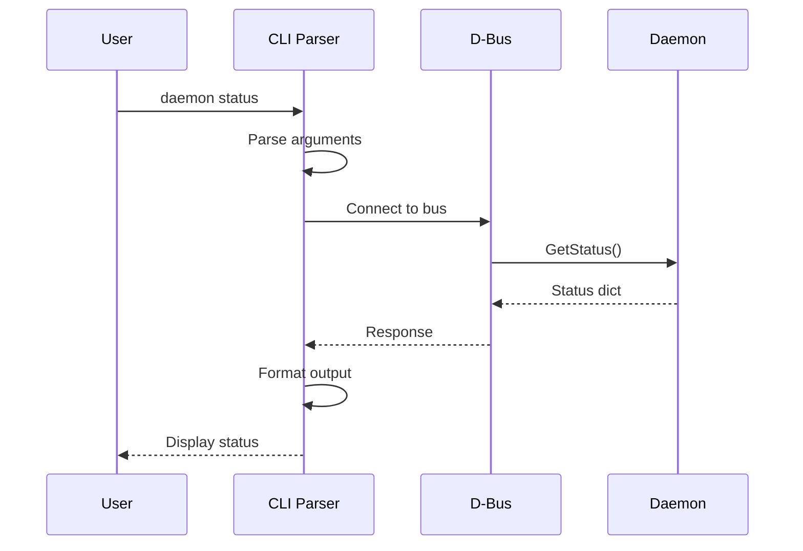
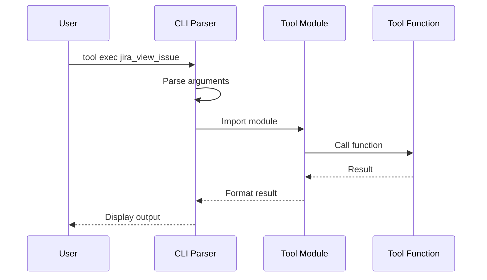

# CLI Interface

> Command-line interface for daemon control

## Diagram



## Command Structure

```bash
# Daemon management
python -m services.slack start
python -m services.slack stop
python -m services.slack status

# Tool execution
python -m tool_modules.aa_jira tool jira_view_issue --issue_key AAP-12345

# Skill execution
python -m tool_modules.aa_workflow skill run start_work --inputs '{"issue_key": "AAP-12345"}'

# Memory operations
python -m tool_modules.aa_workflow memory read state/current_work
python -m tool_modules.aa_workflow memory write state/current_work --data '...'
```

## Daemon CLI Flow



## Tool CLI Flow



## CLI Options

### Daemon Commands

| Command | Description | Example |
|---------|-------------|---------|
| start | Start daemon | `python -m services.slack start` |
| stop | Stop daemon | `python -m services.slack stop` |
| status | Get status | `python -m services.slack status` |
| restart | Restart daemon | `python -m services.slack restart` |

### Tool Commands

| Command | Description | Example |
|---------|-------------|---------|
| list | List tools | `python -m tool_modules.aa_jira list` |
| exec | Execute tool | `python -m tool_modules.aa_jira exec jira_view_issue` |
| help | Tool help | `python -m tool_modules.aa_jira help jira_view_issue` |

### Global Options

| Option | Description |
|--------|-------------|
| `--json` | Output as JSON |
| `--verbose` | Verbose output |
| `--quiet` | Suppress output |
| `--config` | Config file path |

## Output Formats

```bash
# Default (human-readable)
$ python -m services.slack status
Slack Daemon: running
  PID: 12345
  Uptime: 2h 15m
  Messages processed: 142

# JSON output
$ python -m services.slack status --json
{
  "status": "running",
  "pid": 12345,
  "uptime_seconds": 8100,
  "messages_processed": 142
}
```

## Components

| Component | File | Description |
|-----------|------|-------------|
| Daemon CLI | `services/*/__main__.py` | Daemon entry points |
| Tool CLI | `tool_modules/*/__main__.py` | Tool entry points |
| argparse | stdlib | Argument parsing |

## Related Diagrams

- [Systemd Services](./systemd-services.md)
- [D-Bus Communication](../08-data-flows/dbus-communication.md)
- [Daemon Overview](../02-services/daemon-overview.md)
