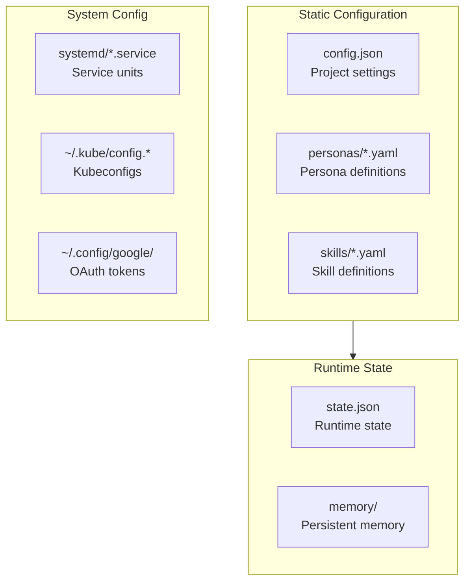
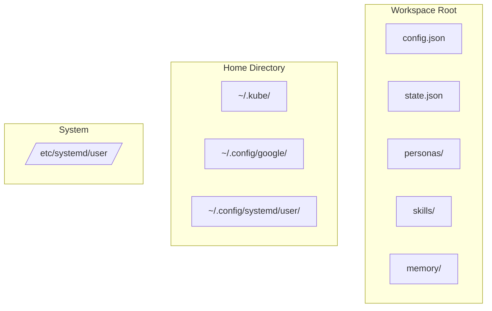
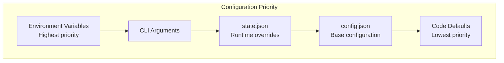

# Configuration Files

> Configuration file locations and structure

## Diagram



## config.json Structure

```json
{
  "projects": {
    "automation-analytics-backend": {
      "gitlab_project_id": 12345,
      "jira_project": "AAP",
      "default_branch": "main",
      "namespaces": {
        "stage": "tower-analytics-stage",
        "prod": "tower-analytics-prod"
      }
    }
  },
  "credentials": {
    "jira_url": "https://issues.redhat.com",
    "jira_token": "...",
    "gitlab_url": "https://gitlab.cee.redhat.com",
    "gitlab_token": "..."
  },
  "settings": {
    "default_persona": "developer",
    "auto_heal_enabled": true,
    "websocket_port": 8765
  }
}
```

## state.json Structure

```json
{
  "current_session": "abc123",
  "current_persona": "developer",
  "loaded_modules": [
    "aa_workflow",
    "aa_git_basic",
    "aa_gitlab_core"
  ],
  "sessions": {
    "abc123": {
      "name": "Fixing AAP-12345",
      "project": "automation-analytics-backend",
      "created": "2026-02-04T09:00:00Z"
    }
  }
}
```

## File Locations



## Configuration Hierarchy



## Environment Variables

| Variable | Description | Example |
|----------|-------------|---------|
| `WORKFLOW_CONFIG` | Config file path | `/path/to/config.json` |
| `WORKFLOW_STATE` | State file path | `/path/to/state.json` |
| `KUBECONFIG` | Kubeconfig path | `~/.kube/config.e` |
| `JIRA_TOKEN` | Jira API token | Override config |
| `GITLAB_TOKEN` | GitLab PAT | Override config |

## Components

| Component | File | Description |
|-----------|------|-------------|
| ConfigManager | `server/config_manager.py` | Config loading |
| StateManager | `server/state_manager.py` | State management |
| paths | `server/paths.py` | Path resolution |

## Related Diagrams

- [Config System](../01-server/config-system.md)
- [State Manager](../01-server/state-manager.md)
- [Memory Paths](../06-memory/memory-paths.md)
