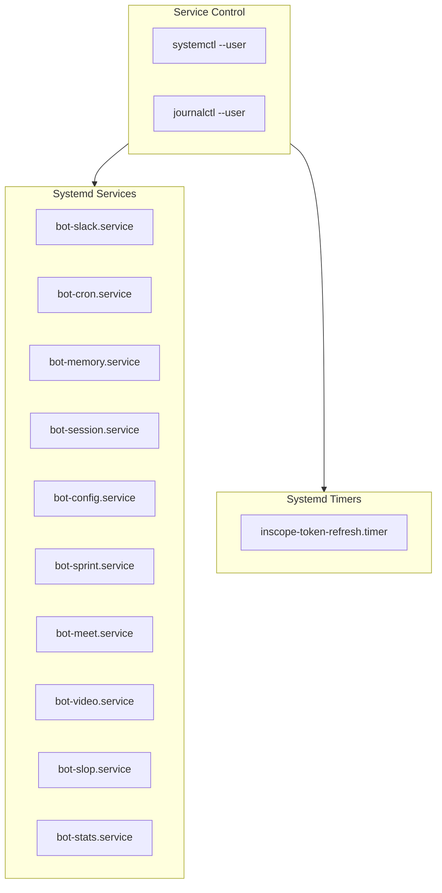
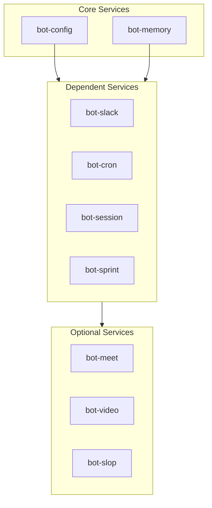
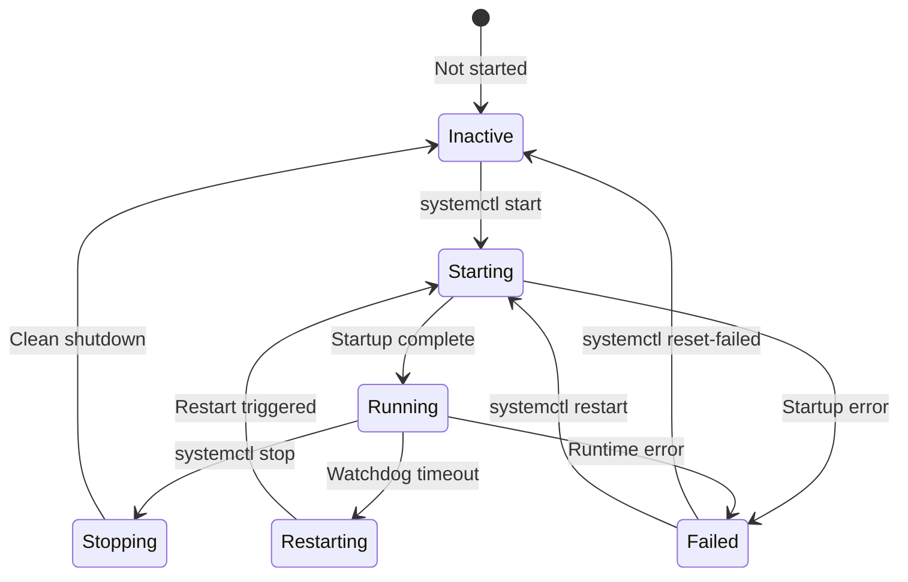

# Systemd Services

> Service management with systemd

## Diagram



## Service Dependencies



## Service Unit File

```ini
# systemd/bot-slack.service
[Unit]
Description=AI Workflow Slack Daemon
After=network.target dbus.service
Wants=bot-config.service bot-memory.service

[Service]
Type=notify
ExecStart=/usr/bin/python -m services.slack
Restart=on-failure
RestartSec=5
WatchdogSec=30

Environment=PYTHONPATH=/home/user/src/redhat-ai-workflow
WorkingDirectory=/home/user/src/redhat-ai-workflow

[Install]
WantedBy=default.target
```

## Service States



## Management Commands

```bash
# Start service
systemctl --user start bot-slack

# Stop service
systemctl --user stop bot-slack

# Restart service
systemctl --user restart bot-slack

# Check status
systemctl --user status bot-slack

# View logs
journalctl --user -u bot-slack -f

# Enable at login
systemctl --user enable bot-slack

# List all bot services
systemctl --user list-units 'bot-*'
```

## Components

| Service | File | Description |
|---------|------|-------------|
| bot-slack | `systemd/bot-slack.service` | Slack daemon |
| bot-cron | `systemd/bot-cron.service` | Cron daemon |
| bot-memory | `systemd/bot-memory.service` | Memory daemon |
| bot-session | `systemd/bot-session.service` | Session daemon |

## Related Diagrams

- [Daemon Overview](../02-services/daemon-overview.md)
- [Base Daemon](../02-services/base-daemon.md)
- [CLI Interface](./cli-interface.md)
