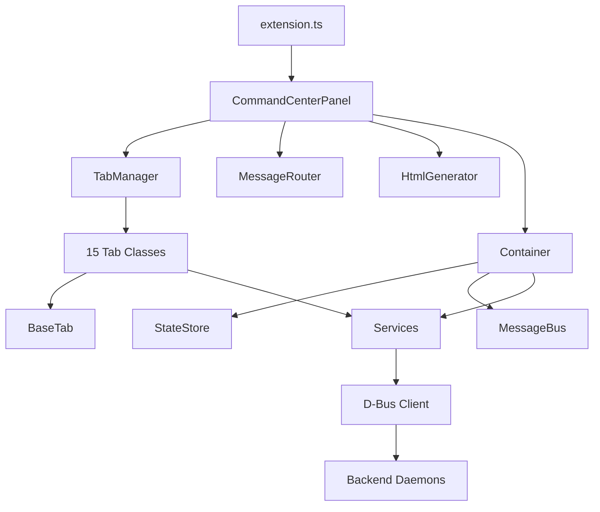
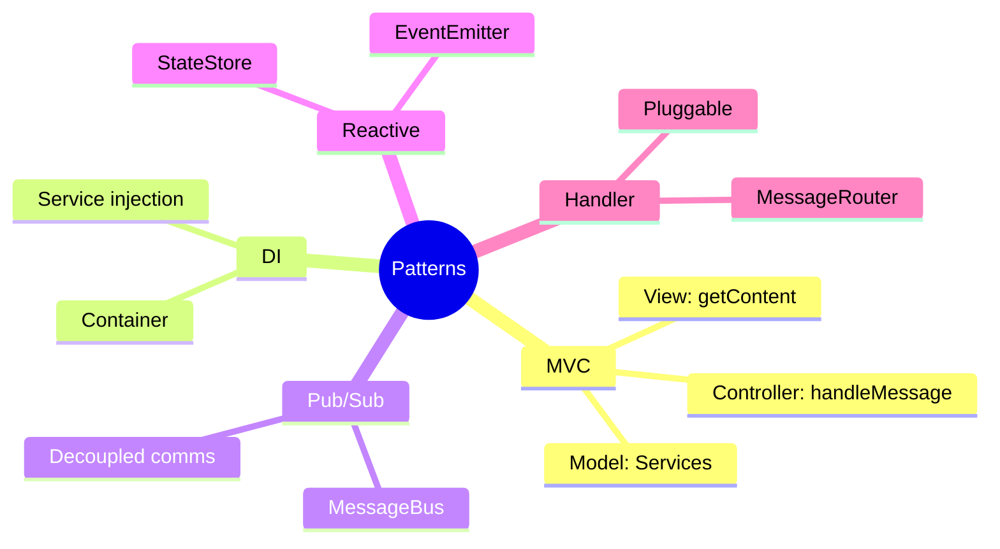

# VSCode Extension Architecture Diagrams

This directory contains architecture diagrams for the refactored VSCode extension (`aa_workflow_vscode`).

All diagrams use [Mermaid](https://mermaid.js.org/) syntax for rendering in GitHub, GitLab, and most modern markdown viewers.

## Diagrams

| File | Description |
|------|-------------|
| [architecture-overview.md](./architecture-overview.md) | High-level component overview and responsibilities |
| [tab-architecture.md](./tab-architecture.md) | Tab class hierarchy, BaseTab interface, MVC pattern |
| [message-flow.md](./message-flow.md) | Webview ↔ Extension communication patterns |
| [service-architecture.md](./service-architecture.md) | DI container, services, state management |
| [data-flow.md](./data-flow.md) | Complete data flow, loading, refresh logic |

## Architecture Summary

### Component Overview



### Design Patterns



### File Structure

```
src/
├── extension.ts              # Entry point
├── commandCenter.ts          # Main panel orchestrator
├── panels/
│   ├── TabManager.ts         # Tab lifecycle
│   ├── HtmlGenerator.ts      # HTML generation
│   └── messageRouter.ts      # Message routing
├── tabs/
│   ├── BaseTab.ts            # Abstract base class
│   ├── OverviewTab.ts        # Overview dashboard
│   ├── SessionsTab.ts        # Session management
│   └── ...                   # 15 total tabs
├── services/
│   ├── Container.ts          # DI container
│   ├── MessageBus.ts         # UI communication
│   └── ...                   # Domain services
├── state/
│   └── StateStore.ts         # Centralized state
├── webview/
│   ├── scripts/base.js       # Common utilities
│   └── styles/unified.css    # Single CSS file
└── dbusClient.ts             # D-Bus communication
```

### Benefits of Refactoring

| Benefit | Description |
|---------|-------------|
| **Separation of Concerns** | UI in tabs, business logic in services, state in StateStore |
| **Testability** | Services testable without VSCode mocks |
| **Maintainability** | Self-contained tabs, clear data flow |
| **Extensibility** | Easy to add new tabs and services |

## Viewing Diagrams

### GitHub / GitLab
Mermaid diagrams render automatically when viewing markdown files.

### VS Code
Install the [Markdown Preview Mermaid Support](https://marketplace.visualstudio.com/items?itemName=bierner.markdown-mermaid) extension.

### Local Preview
Use the [Mermaid Live Editor](https://mermaid.live/) to preview and edit diagrams.

### CLI
```bash
# Install mermaid-cli
npm install -g @mermaid-js/mermaid-cli

# Generate PNG/SVG
mmdc -i diagram.md -o diagram.png
```
