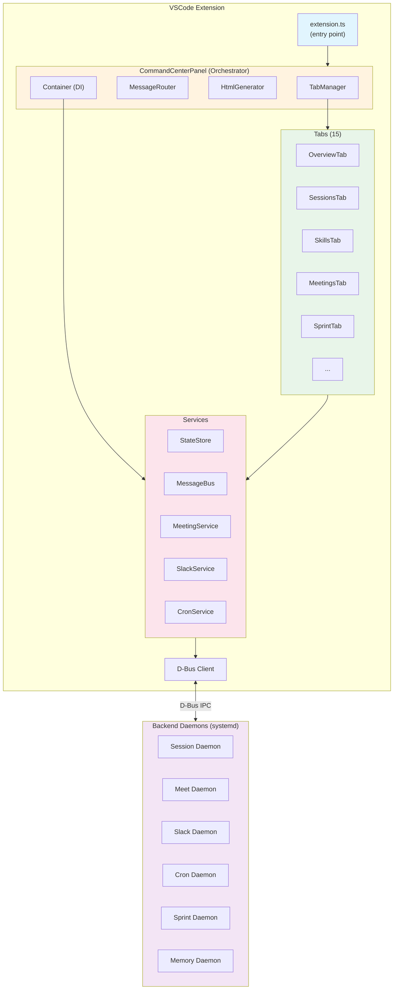
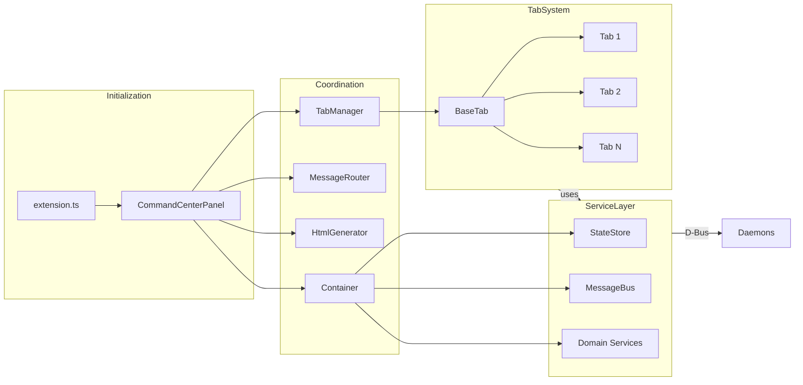
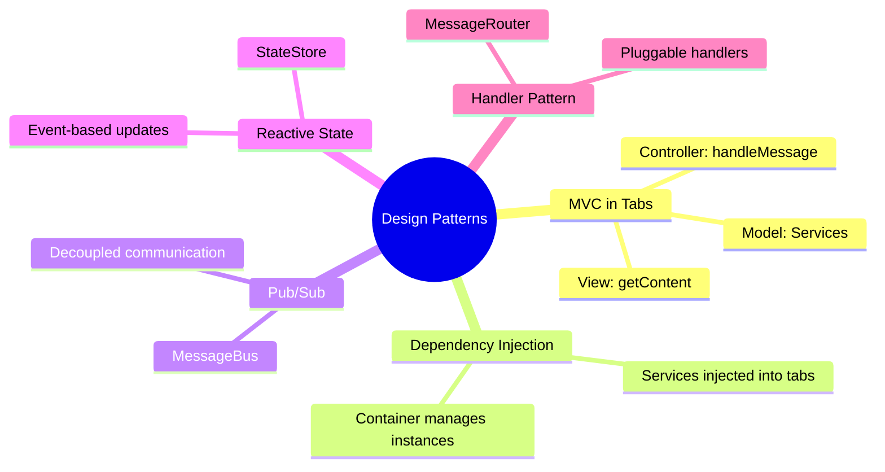

# VSCode Extension Architecture Overview

## High-Level Architecture

## Component Relationships

## Component Responsibilities

| Component | Responsibility |
|-----------|----------------|
| **extension.ts** | Entry point, registers commands, initializes panel |
| **CommandCenterPanel** | Main orchestrator, coordinates all components |
| **TabManager** | Tab lifecycle, switching, data loading |
| **MessageRouter** | Routes webview messages to handlers |
| **Container** | Dependency injection for services |
| **BaseTab** | Abstract base class for all tabs |
| **Services** | Business logic, decoupled from UI |
| **StateStore** | Centralized reactive state management |
| **MessageBus** | Pub/sub for UI communication |
| **D-Bus Client** | Communication with backend daemons |

## Key Design Patterns

