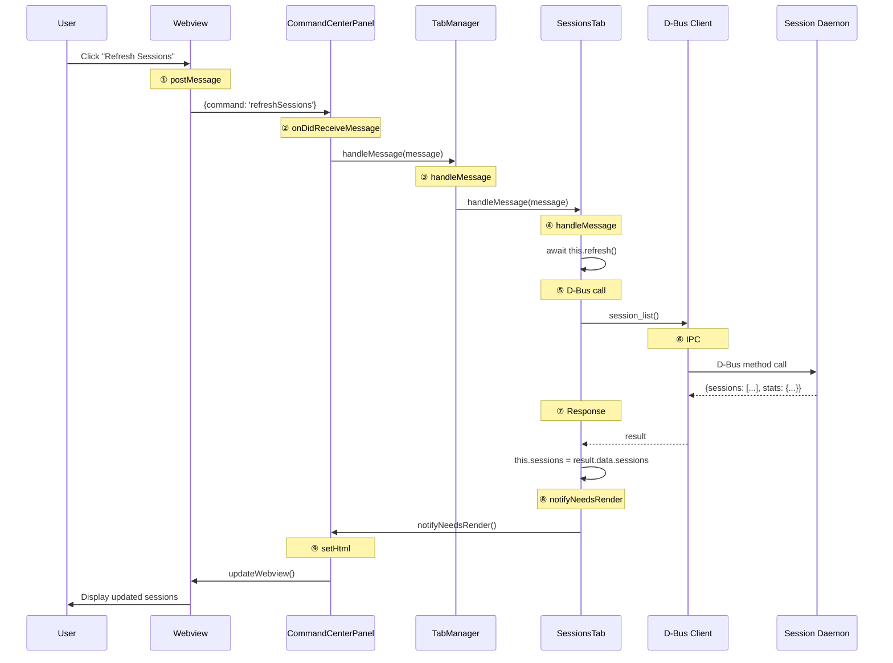
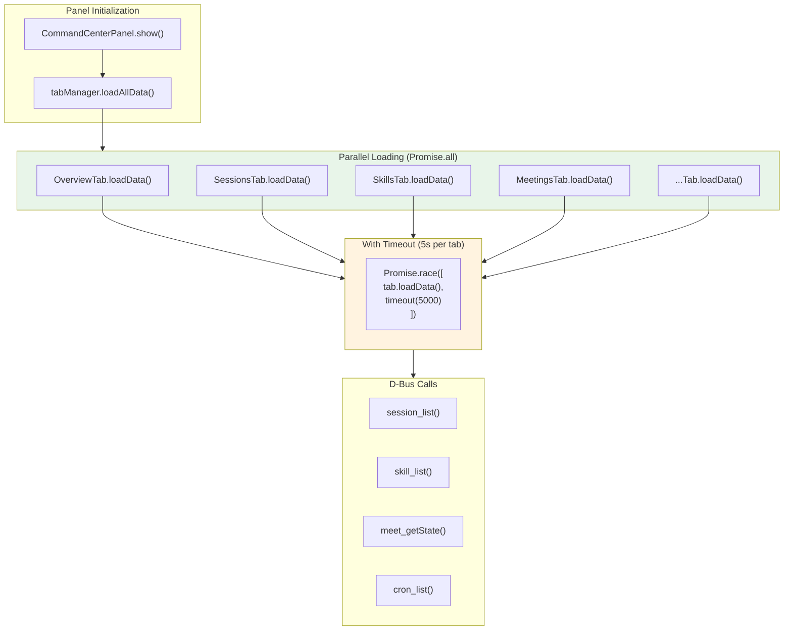
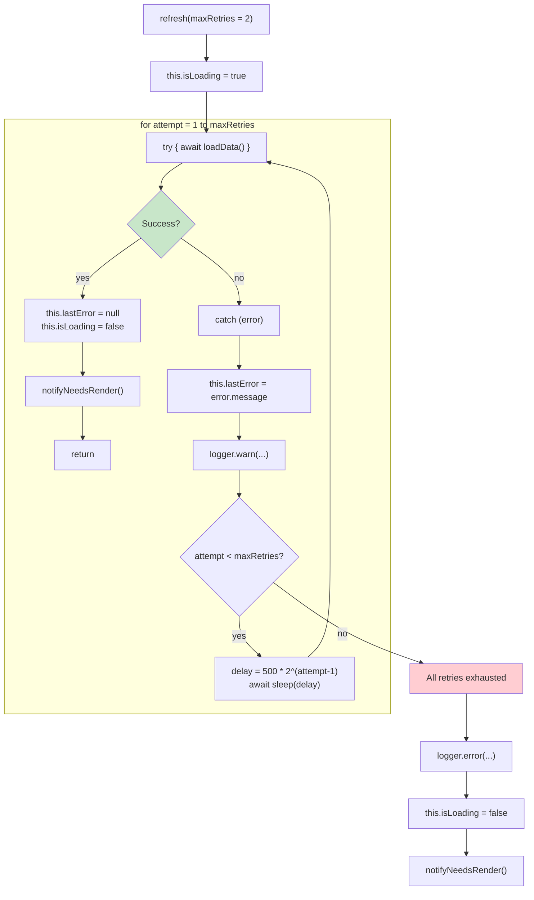
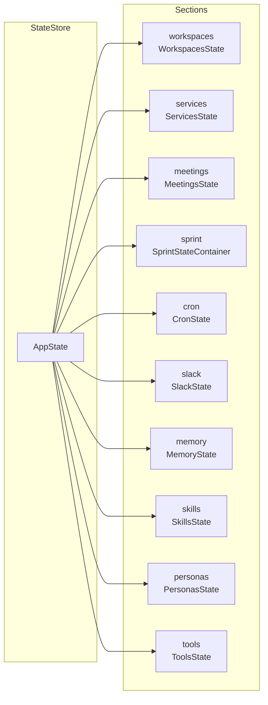
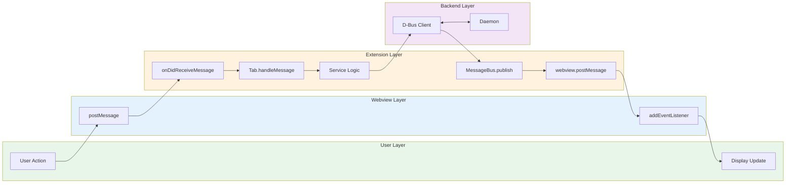

# Data Flow Architecture

## Complete Data Flow



## Tab Data Loading Flow



## Refresh with Retry Logic



## Retry Timing

```mermaid
gantt
    title Retry with Exponential Backoff
    dateFormat X
    axisFormat %L ms
    
    section Attempt 1
    loadData()     :a1, 0, 100
    
    section Backoff 1
    sleep(500ms)   :b1, 100, 600
    
    section Attempt 2
    loadData()     :a2, 600, 700
    
    section Backoff 2
    sleep(1000ms)  :b2, 700, 1700
    
    section Attempt 3
    loadData()     :a3, 1700, 1800
```



## State Change Propagation

```mermaid
flowchart TB
    subgraph Update["State Update"]
        call["stateStore.setWorkspaces({<br/>  workspaces: newWorkspaces,<br/>  count: 5<br/>})"]
    end
    
    subgraph Emit["Event Emission"]
        emit1["emit('workspaces:changed', data, oldValue)"]
        emit2["emit('state:changed', 'workspaces', data)"]
    end
    
    subgraph Listeners["Event Listeners"]
        l1["UI Update Listener<br/>→ this.updateWebview()"]
        l2["Badge Update Listener<br/>→ updateStatusBar(count)"]
        l3["Logging Listener<br/>→ logger.log(...)"]
    end
    
    call --> emit1 & emit2
    emit1 --> l1 & l2
    emit2 --> l3
```

## State Sections



## Data Flow Summary


