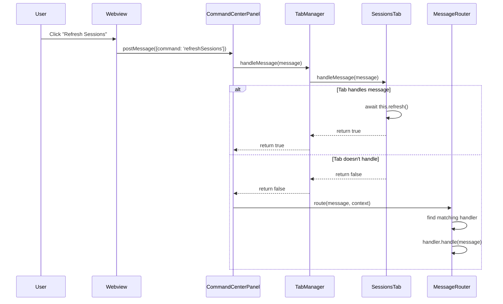
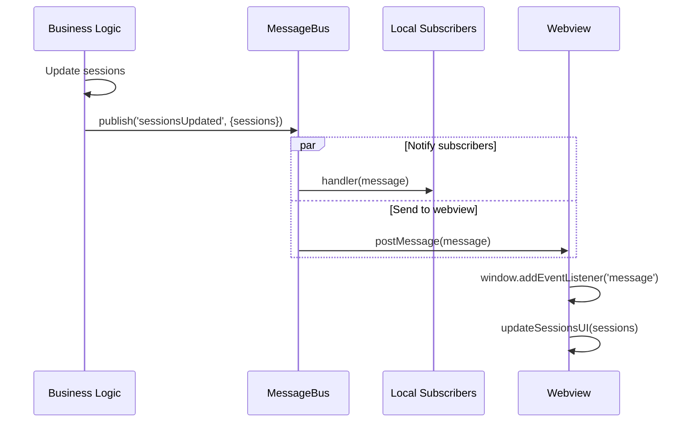
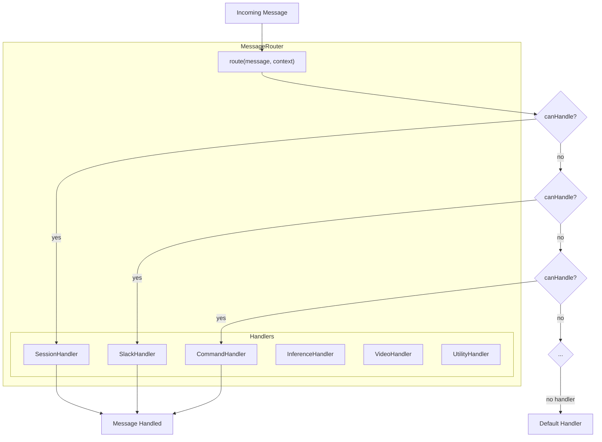
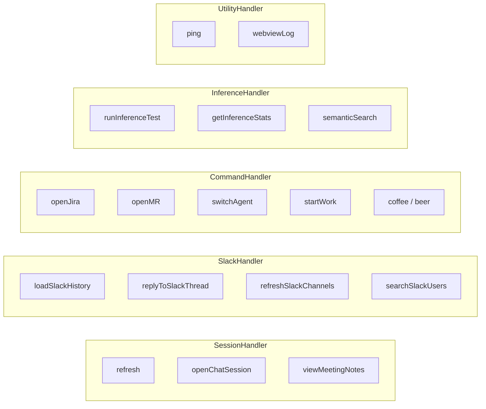
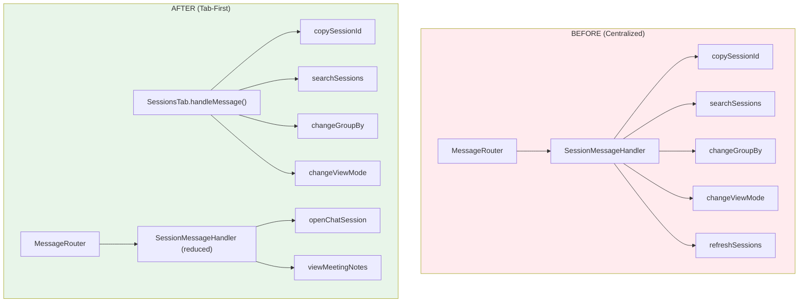
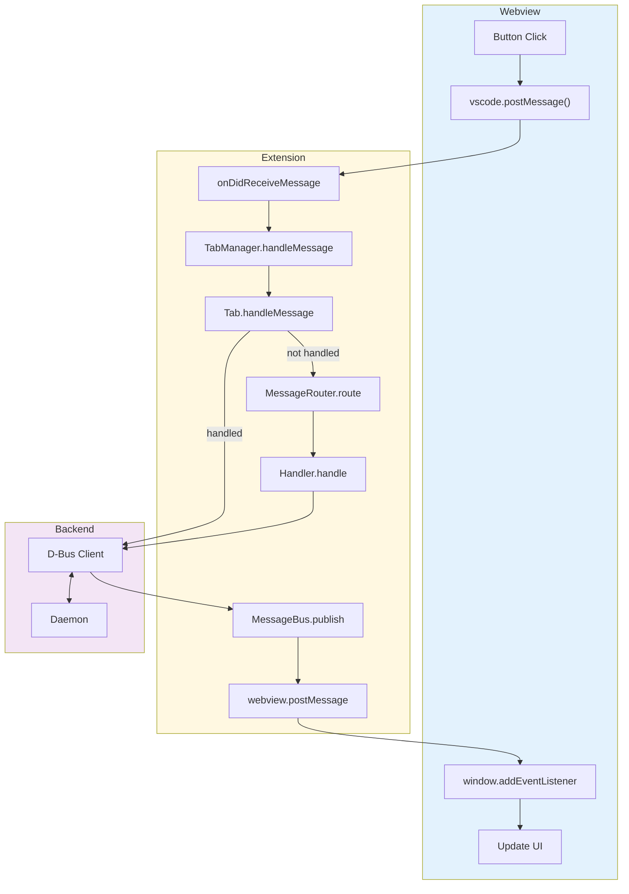

# Message Flow Architecture

## Webview to Extension Communication

## Extension to Webview Communication

## Message Router Pattern

## Handler Commands

## Tab-First Message Handling

## Complete Message Flow

