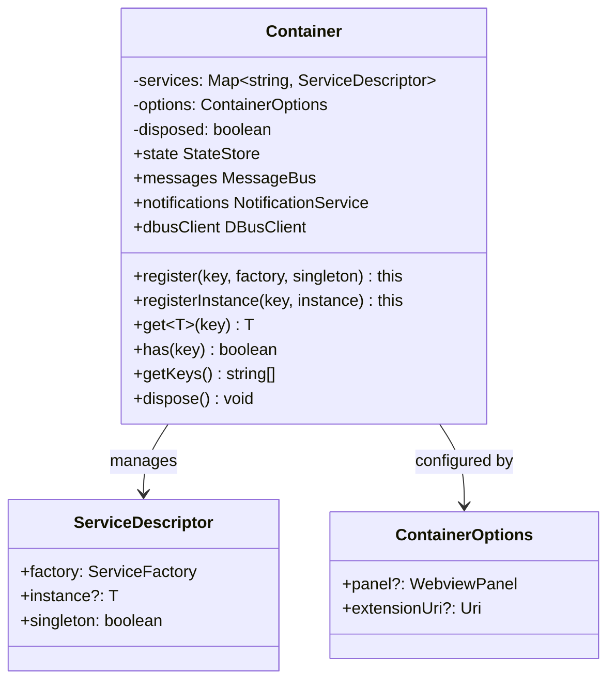
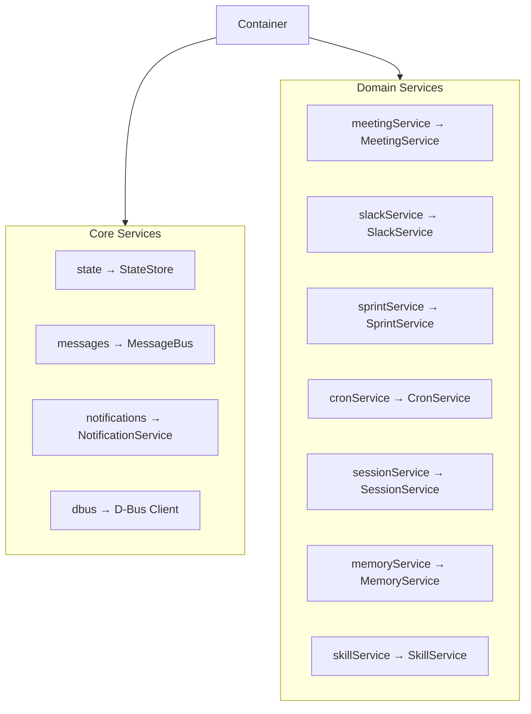
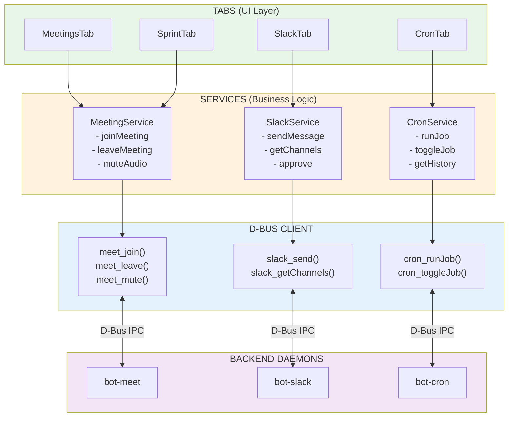
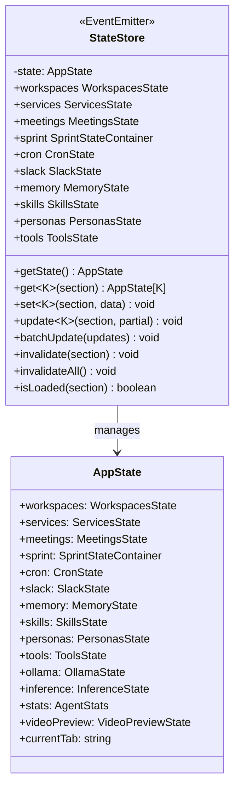
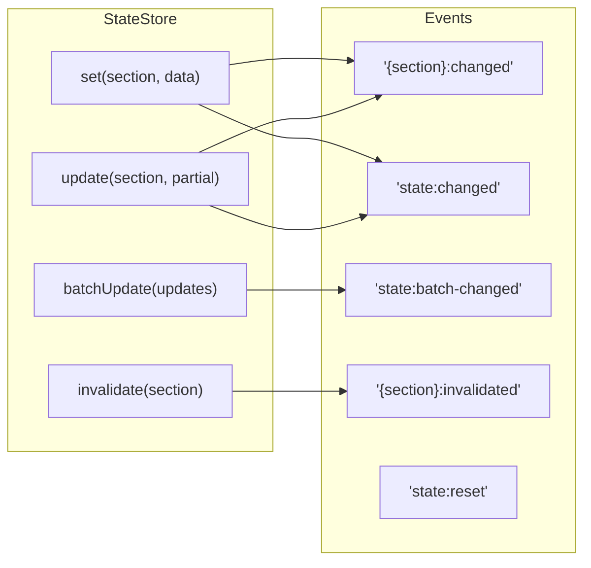
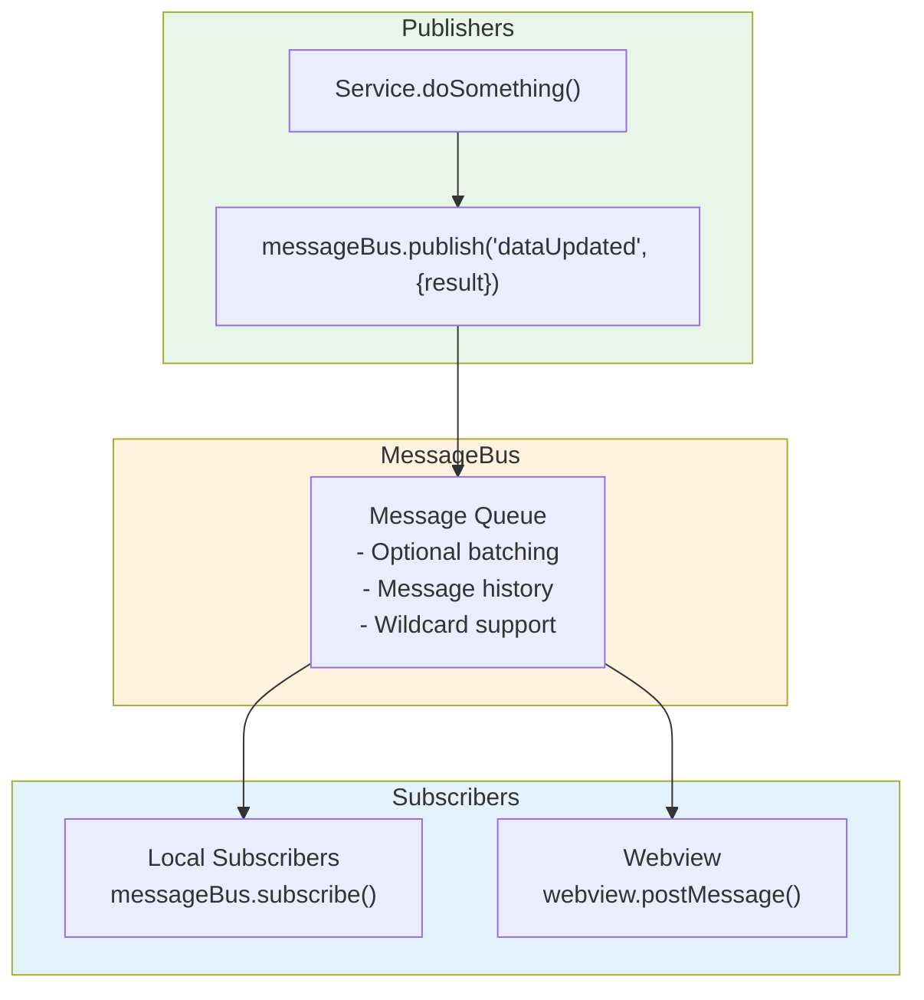
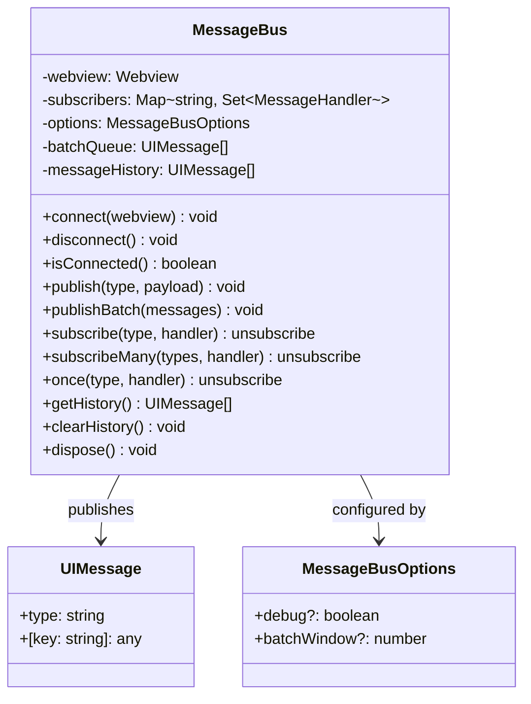
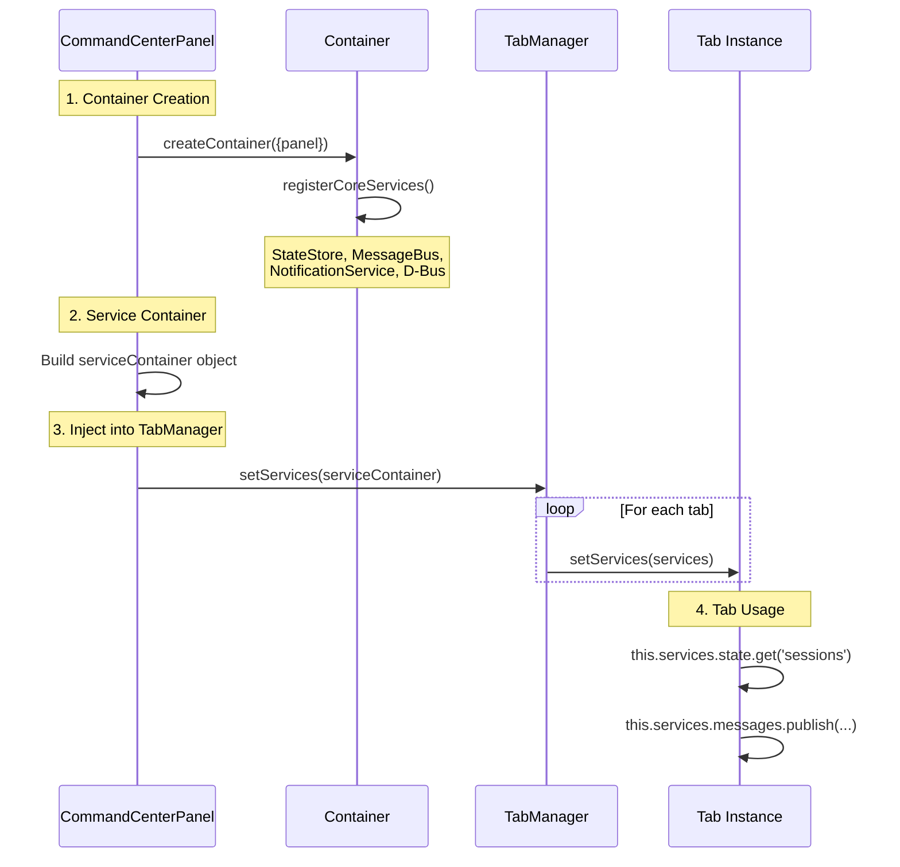
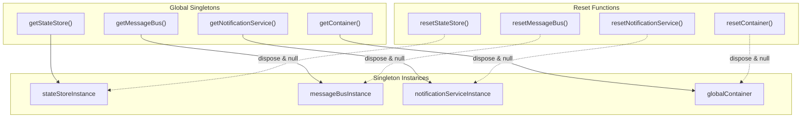

# Service Architecture

## Dependency Injection Container

## Service Keys

## Service Layer Architecture

## StateStore Architecture

## StateStore Events

## MessageBus Architecture

## MessageBus Class

## Service Injection Flow

## Singleton Pattern

