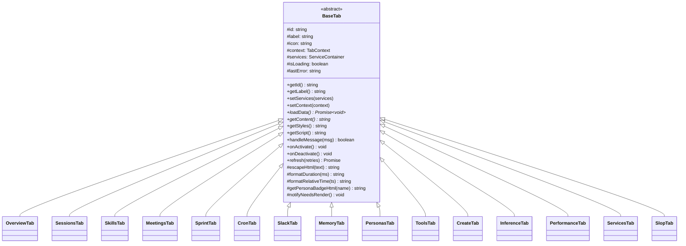
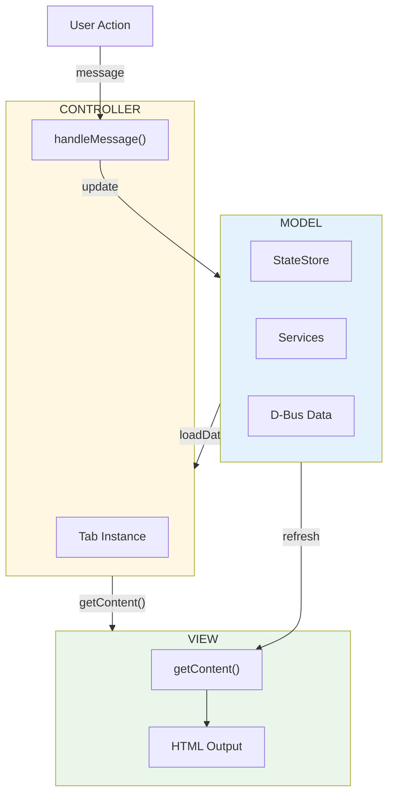
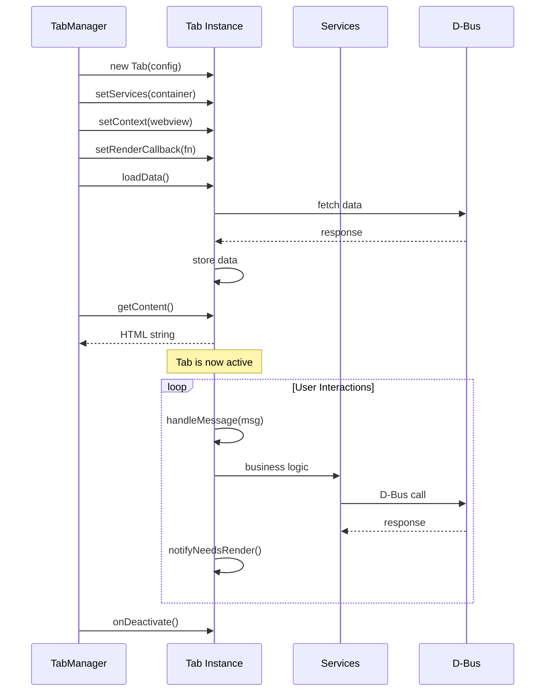
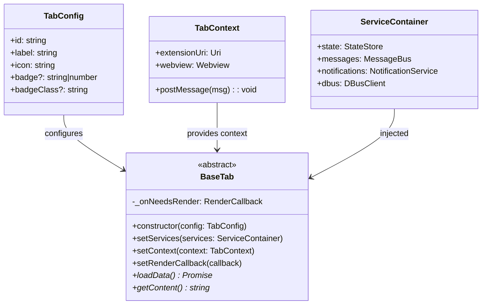

# Tab Architecture

## Tab Class Hierarchy



## Tab MVC Pattern



## Tab Lifecycle



## Tab Registration Flow

```mermaid
flowchart TB
    subgraph TabManager
        constructor["constructor()"]
        register["registerDefaultTabs()"]
        
        constructor --> register
        
        register --> t1["new OverviewTab()"]
        register --> t2["new CreateTab()"]
        register --> t3["new SprintTab()"]
        register --> t4["new SessionsTab()"]
        register --> t5["new PersonasTab()"]
        register --> t6["new SkillsTab()"]
        register --> t7["new ToolsTab()"]
        register --> t8["new MemoryTab()"]
        register --> t9["new MeetingsTab()"]
        register --> t10["new SlackTab()"]
        register --> t11["new InferenceTab()"]
        register --> t12["new CronTab()"]
        register --> t13["new ServicesTab()"]
        register --> t14["new PerformanceTab()"]
        register --> t15["new SlopTab()"]
    end
    
    subgraph Registration["registerTab(tab)"]
        step1["tabs.set(tab.getId(), tab)"]
        step2["tab.setContext(context)"]
        step3["tab.setRenderCallback(callback)"]
        step4["tab.setServices(services)"]
        
        step1 --> step2 --> step3 --> step4
    end
    
    t1 & t2 & t3 & t4 & t5 --> Registration
    t6 & t7 & t8 & t9 & t10 --> Registration
    t11 & t12 & t13 & t14 & t15 --> Registration
```

## BaseTab Interface


