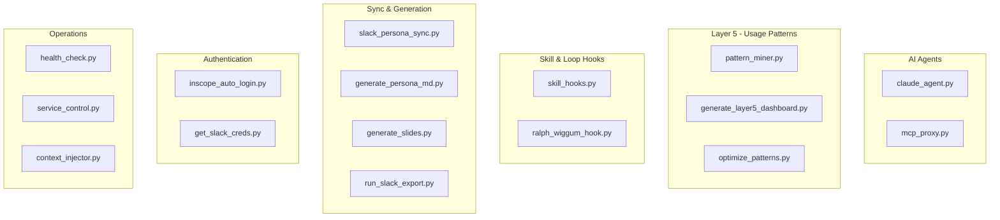

# Scripts Directory

> Utility scripts for automation, development, and system maintenance

## Diagram



## Script Categories

| Category | Scripts | Description |
|----------|---------|-------------|
| AI Agents | 2 | Claude agent and MCP proxy |
| Layer 5 | 3 | Usage pattern analysis tools |
| Hooks | 2 | Skill execution and loop hooks |
| Sync | 4 | Persona sync and generation |
| Auth | 2 | SSO and credential helpers |
| Operations | 3 | Health checks and service control |

## Script Reference

### AI Agents

| Script | Description |
|--------|-------------|
| [claude_agent.py](./claude-agent.md) | Claude-powered AI agent for Slack bot and automation |
| [mcp_proxy.py](./mcp-proxy.md) | Hot-reload proxy for MCP server development |

### Layer 5 - Usage Patterns

| Script | Description |
|--------|-------------|
| [pattern_miner.py](./pattern-miner.md) | Auto-discover error patterns from tool failures |
| [generate_layer5_dashboard.py](./layer5-dashboard.md) | Generate Layer 5 pattern dashboard |
| [optimize_patterns.py](./pattern-optimizer.md) | Optimize and deduplicate patterns |

### Hooks

| Script | Description |
|--------|-------------|
| [skill_hooks.py](./skill-hooks.md) | Event-driven notifications during skill execution |
| [ralph_wiggum_hook.py](./ralph-loop.md) | Stop hook for autonomous task loops (Ralph Loop) |

### Sync & Generation

| Script | Description |
|--------|-------------|
| slack_persona_sync.py | Sync Slack user personas |
| generate_persona_md.py | Generate persona markdown from YAML |
| generate_slides.py | Generate Google Slides presentations |
| run_slack_export.py | Export Slack messages for style analysis |

### Authentication

| Script | Description |
|--------|-------------|
| inscope_auto_login.py | Automated SSO login for InScope |
| get_slack_creds.py | Retrieve Slack credentials |

### Operations

| Script | Description |
|--------|-------------|
| [health_check.py](./health-check.md) | Unified health check for all services |
| service_control.py | Start/stop/restart services |
| context_injector.py | Inject context into Claude prompts |

## Common Patterns

### Running Scripts

Most scripts are run directly:
```bash
# From project root
python scripts/health_check.py
python scripts/pattern_miner.py
```

### Script with uv

For scripts with dependencies:
```bash
uv run python scripts/claude_agent.py
```

### Cron Integration

Many scripts are scheduled via cron daemon:
```yaml
# config.json schedules
jobs:
  - name: "pattern_mining"
    skill: "suggest-patterns"
    cron: "0 2 * * *"  # Daily at 2 AM
```

## Related Diagrams

- [Daemon Overview](../02-services/daemon-overview.md)
- [Usage Pattern System](../01-server/usage-pattern-system.md)
- [Skill Engine](../04-skills/skill-engine-architecture.md)
