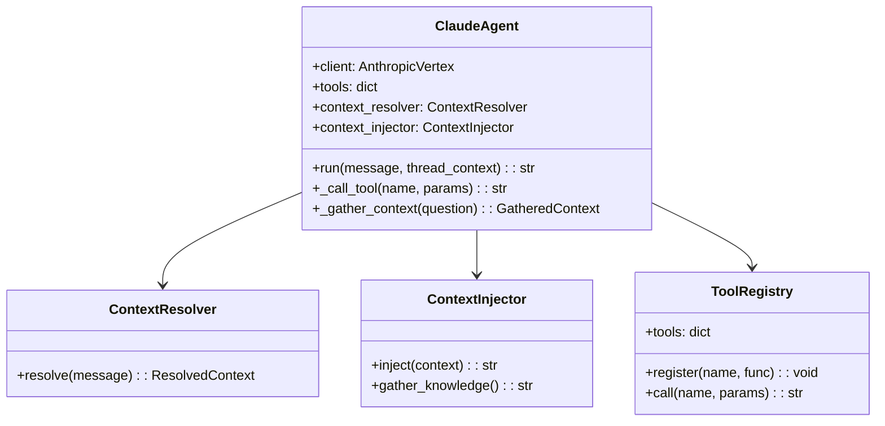
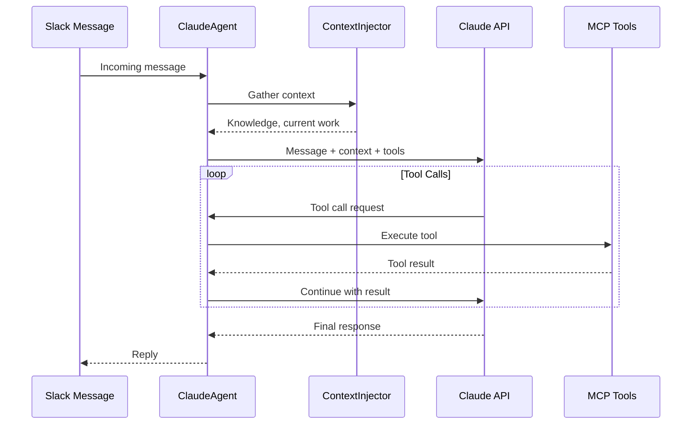

# Claude Agent

> AI-powered agent for Slack bot and autonomous task execution

## Diagram



## Agent Flow



## Components

| Component | File | Description |
|-----------|------|-------------|
| ClaudeAgent | `scripts/claude_agent.py` | Main agent class |
| ContextResolver | `scripts/common/context_resolver.py` | Resolve message context |
| ContextInjector | `scripts/context_injector.py` | Inject knowledge into prompts |

## Features

- **Anthropic Vertex AI**: Uses Claude via Google Cloud Vertex AI
- **Tool Calling**: Calls MCP tools based on Claude's decisions
- **Context Injection**: Gathers relevant knowledge before responding
- **Thread Context**: Maintains conversation thread for multi-turn dialogs
- **Rate Limiting**: Prevents excessive API calls

## Usage

```python
from scripts.claude_agent import ClaudeAgent

agent = ClaudeAgent()

# Simple message
response = await agent.run("What am I working on?")

# With thread context
response = await agent.run(
    "What's the status?",
    thread_context=[
        {"role": "user", "content": "Check AAP-12345"},
        {"role": "assistant", "content": "Looking up..."}
    ]
)
```

## Configuration

Environment variables:
```bash
GOOGLE_CLOUD_PROJECT=your-project-id
GOOGLE_CLOUD_REGION=us-east5
ANTHROPIC_MODEL=claude-sonnet-4-20250514
```

## Integration

The Claude Agent is used by:
- **Slack Daemon**: Responds to @mentions and DMs
- **Sprint Daemon**: Autonomous sprint work
- **Skill Engine**: AI-driven skill execution

## Related Diagrams

- [Slack Daemon](../02-services/slack-daemon.md)
- [Sprint Daemon](../02-services/sprint-daemon.md)
- [MCP Proxy](./mcp-proxy.md)
