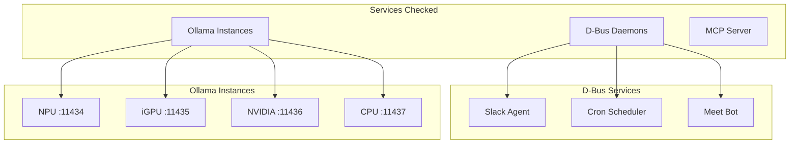
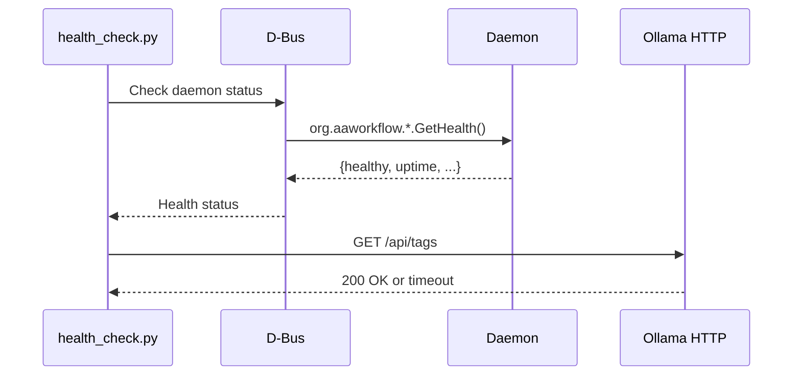

# Health Check

> Unified health check for all AI Workflow services

## Diagram



## Health Check Flow



## Components

| Component | File | Description |
|-----------|------|-------------|
| health_check.py | `scripts/health_check.py` | Main health check script |
| check_daemon_health | `scripts/common/dbus_base.py` | D-Bus health helper |

## Usage

```bash
# Check all services
python scripts/health_check.py

# JSON output for automation
python scripts/health_check.py --json

# Check specific service
python scripts/health_check.py --service slack

# Attempt to fix unhealthy services
python scripts/health_check.py --fix

# Continuous monitoring
python scripts/health_check.py --watch
```

## Exit Codes

| Code | Meaning |
|------|---------|
| 0 | All services healthy |
| 1 | One or more services unhealthy |
| 2 | Error running health check |

## Output Example

```
=== AI Workflow Health Check ===

D-Bus Services:
  ✅ slack    - healthy (uptime: 2h 15m)
  ✅ cron     - healthy (uptime: 2h 15m)
  ⚠️  meet    - degraded (no active meeting)

Ollama Instances:
  ✅ npu     :11434 - healthy (3 models loaded)
  ✅ igpu    :11435 - healthy (1 model loaded)
  ❌ nvidia  :11436 - unreachable
  ✅ cpu     :11437 - healthy (fallback)

Overall: DEGRADED (1 issue)
```

## JSON Output

```json
{
  "timestamp": "2026-02-05T10:30:00Z",
  "overall": "degraded",
  "services": {
    "slack": {"status": "healthy", "uptime": 8100},
    "cron": {"status": "healthy", "uptime": 8100},
    "meet": {"status": "degraded", "reason": "no active meeting"}
  },
  "ollama": {
    "npu": {"status": "healthy", "port": 11434},
    "nvidia": {"status": "unreachable", "port": 11436}
  }
}
```

## Auto-Fix Mode

With `--fix` flag, attempts to restart unhealthy services:

```bash
python scripts/health_check.py --fix
# → Restarting slack daemon...
# → systemctl --user restart bot-slack
# → Waiting 5s for startup...
# → ✅ slack now healthy
```

## Related Diagrams

- [Daemon Overview](../02-services/daemon-overview.md)
- [Systemd Services](../09-deployment/systemd-services.md)
- [Ollama Tools](../03-tools/ollama-tools.md)
